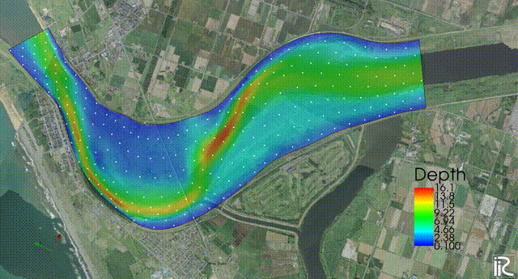
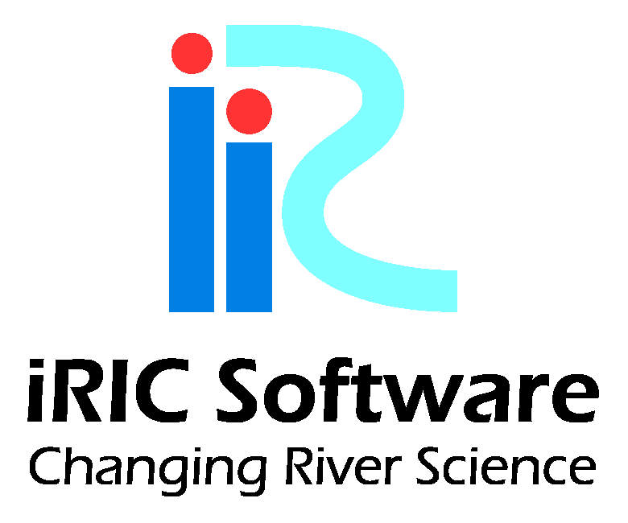

はじめに
========================================================================================================================

GELATO(GEneralized LAgrangian Tracking with Optimization)はiRICに実装されている様々な流れの計算ソルバーの計算結果
を用いて、その上にユーザーが指定する様々な物質を乗せてその軌跡を追跡、可視化するツールである。
対象とする輸送物質は完全に流れに乗って移動する場合以外に、物質自体が巡行能力を持つような場合
(典型的な例としては魚)その能力・特性を指定することによって、その動きを表現することが
可能となっている。

GELATOではトレーサー粒子の流体内の任意の位置における濃度（密度）を判断して
必要に応じて分裂（Clone)もしくは結合(Amalgamate)する機能を持つ。これによって通常はトレーサー
粒子がなかなか入りこめない剥離域やでの表示や、粒子が蓄積されて極端に見にくくなった領域での
すっきりとした可視化が可能となる。

さらに、GELATOでは分裂や結合を考慮した重み付き粒子濃度の表示も可能となっており、これにより
実質的なラグランジェ的手法による濃度解析が可能となっている。

なお、GELATOでは流れの計算ソルバーではソルバー内でモデル化されている格子スケール以下の乱れの
影響をランダムウォークモデルを導入することにより再抽出し、格子以下乱れスケールの影響を
粒子の追跡に反映させることが可能となっており、これによってより現実的な粒子追跡や濃度拡散
の検討が可能となっている。

GELATOでの追跡対象トレーサーは基本的には以下の3種類である。

(1) 通常のトレーサー（粒子の位置のみ追跡する）

(2) 特別トレーサー（自分指針の位置とその軌跡も記録し表示する）

(3) 魚トレーサー（自分自身に推進力を持たせた魚類のトレーサー）

この他に棒状の形状で、自身の移動の他に回転も追跡できる

(4) 流木トレーサー

も可能であるが、(4)流木トレーサーはGELATOとは別のNaysDw2(2次元流木追跡ソルバ、
Nays Drift Wood 2D)によって行われる。

GELATOでの計算は以下の手順で行われる。

- 流れの計算ソルバーによる流れの計算(Nays2DH、Nays2dFlood、Nays2d+など)

- 流れの計算結果の保存(CGNSファイル)

- GELATOの起動

- トレーサーの投入条件および追跡条件の設定

- 上記CGNSファイルを用いてのレーサーの追跡計算

- 計算結果の表示

