Calculation Condition
************************************************************************************************************************

Basic Settings
========================================================================================================================

This section describes the basic settings related to the overall calculation of GELATO.

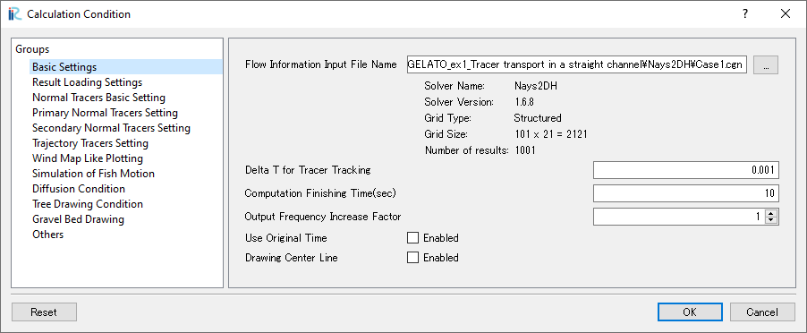

   : Basic Settings

.. _Flow Information Input File Name:

Flow Information Input File Name
------------------------------------------------------------------------------------------------------------------------

| The path to the CGNS file containing the flow calculation result used by GELATO.
| In GELATO ver2.x, this is specified from the dialog displayed when the solver is launched, so there is no need to select it again. (:numref:`read_cgnsfile`)

| If you want to change it, click :guilabel:`...` and select :guilabel:`Case1.cgn` from the folder containing the flow calculation result, or enter the path directly.

Delta T for Tracer Tracking
------------------------------------------------------------------------------------------------------------------------

| The time step for tracer and other substance transport analysis in GELATO. (= tracking time interval)
| If a value larger than the output time interval is entered, it will be set to the same value as the output time interval.

.. note::
    | It is desirable to enter a value that can divide the output time interval evenly for the tracking time interval.
    | The number of tracking calculations performed within the output time interval will be the rounded value of :guilabel:`output time interval`/:guilabel:`tracking time interval`, but since tracking in GELATO is based on the tracking time interval, if the tracking time interval does not divide the output time interval evenly, the output time interval and tracking time interval may not match.
    | For example, if the output time interval is 5[sec] and the tracking time interval is 2[sec], the number of tracking calculations performed within the output time interval will be 3, which is the rounded value of :math:`\frac{5}{2} = 2.5`, and the tracer will be tracked for 6 seconds at an output time of 5[sec] and for 12 seconds at an output time of 10[sec].

.. _Computation Finishing Time:

Computation Finishing Time(sec)
------------------------------------------------------------------------------------------------------------------------

| Tracking calculations will be performed up to the time specified here.
| If :guilabel:`Use the time of the calculation result` is checked, specify the time in the flow calculation result; if unchecked, specify the elapsed time from the first time step, so be aware of this. The following images show the end time and the output calculation result.

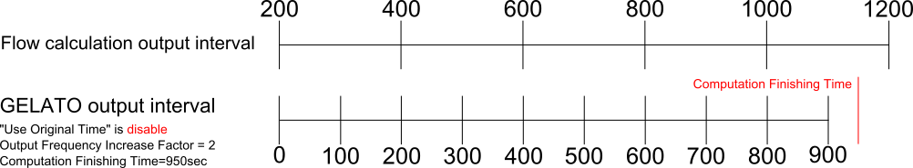

   : End time and output calculation result (when not using the time of the calculation result)

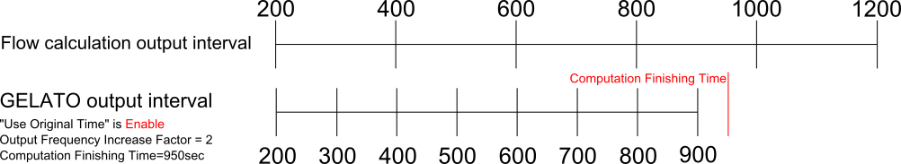

   : End time and output calculation result (when using the time of the calculation result)

Output Frequency Increase Factor
------------------------------------------------------------------------------------------------------------------------

| Specify how many times the calculation result of GELATO will be output within the output interval of the loaded flow calculation result.

| For example, if the Output Frequency Increase Factor is 2 and there are three time steps in the loaded calculation result at 0[sec], 10[sec], and 20[sec], the output results of GELATO will be at 0[sec], 5[sec], 10[sec], 15[sec], and 20[sec].

Use Original Time
------------------------------------------------------------------------------------------------------------------------

| When this parameter is enabled, the time of the calculation result output by GELATO will use the time of the flow calculation result.
| If disabled, the time of the calculation result in GELATO will start from 0 regardless of the initial time of the loaded calculation result.

.. warning::
   When this parameter is enabled, all time-related parameters must be specified in the time of the loaded calculation result.

Drawing Center Line
------------------------------------------------------------------------------------------------------------------------

| When this parameter is enabled, a longitudinal line passing through the center in the transverse direction will be drawn in the calculation result.

Result Loading Settings
========================================================================================================================

| This section describes the settings for loading calculation result used for tracer tracking and for copying calculation result as references in GELATO.

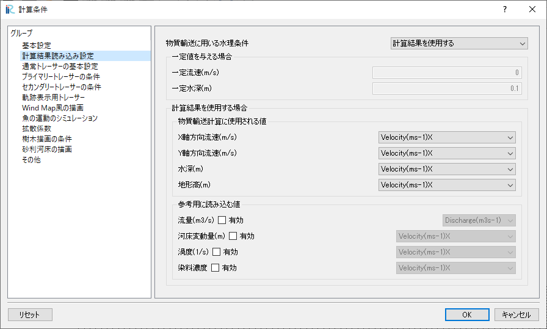

   : Result Loading Settings

.. _Flow Conditions Used for Tracking:

Flow Conditions Used for Tracking
------------------------------------------------------------------------------------------------------------------------

| Select the method of providing hydraulic conditions for tracer and other substance transport analysis from the following options:

    (0) Use Simulated Value
        Use the hydraulic conditions read from the flow calculation result specified in :ref:`Flow Information Input File Name`.
    (1) Give Constant Value
        Provide :guilabel:`Constant Velocity(m/s)` and :guilabel:`Constant Depth(m)` as hydraulic conditions.

Parameters to set when giving constant values
------------------------------------------------------------------------------------------------------------------------

Constant Velocity(m/s)
^^^^^^^^^^^^^^^^^^^^^^^^^^^^^^^^^^^^^^^^^^^^^^^^^^^^^^^^^^^^^^^^^^^^^^^^^^^^^^^^^^^^^^^^^^^^^^^^^^^^^^^^^^^^^^^^^^^^^^^^

| If :guilabel:`Give Constant Value` is selected in :ref:`Flow Conditions Used for Tracking`, the value specified here will be used as the flow velocity.

Constant Depth(m)
^^^^^^^^^^^^^^^^^^^^^^^^^^^^^^^^^^^^^^^^^^^^^^^^^^^^^^^^^^^^^^^^^^^^^^^^^^^^^^^^^^^^^^^^^^^^^^^^^^^^^^^^^^^^^^^^^^^^^^^^

| If :guilabel:`Give Constant Value` is selected in :ref:`Flow Conditions Used for Tracking`, the value specified here will be used as the water depth.

Use Simulated Value
------------------------------------------------------------------------------------------------------------------------

| The following parameters are set when :guilabel:`Use Simulated Value` is selected in :ref:`Flow Conditions Used for Tracking`.
| The names of the values contained in the CGNS file of the flow calculation result will be displayed in the pull-down menu, and you can select from them.
| In addition to the parameters required for calculation, you can also select values to be copied from the flow calculation result to the GELATO calculation result as references.

Required Result for Calculation
^^^^^^^^^^^^^^^^^^^^^^^^^^^^^^^^^^^^^^^^^^^^^^^^^^^^^^^^^^^^^^^^^^^^^^^^^^^^^^^^^^^^^^^^^^^^^^^^^^^^^^^^^^^^^^^^^^^^^^^^

- Velocity_X(m/s)
- Velocity_Y(m/s)
- Depth(m)
- Elevation(m)

Parameters to copy as references
^^^^^^^^^^^^^^^^^^^^^^^^^^^^^^^^^^^^^^^^^^^^^^^^^^^^^^^^^^^^^^^^^^^^^^^^^^^^^^^^^^^^^^^^^^^^^^^^^^^^^^^^^^^^^^^^^^^^^^^^

- Discharge(m3/s)
- Elevation Change(m)
- Vorticity(s-1)
- Dye Concentration

.. note::
   For parameters to be copied as references, you can select any real number value at the grid points as a reference value by selecting a value that does not match the parameter name, but note that it will be output in CGNS with the parameter name.

Normal Tracers Basic Setting
========================================================================================================================

| This section describes the common parameters for normal tracers (primary tracers and secondary tracers).
| These parameters can only be edited if :ref:`Whether to Trace The Primary Tracer` is enabled for primary or secondary tracers.

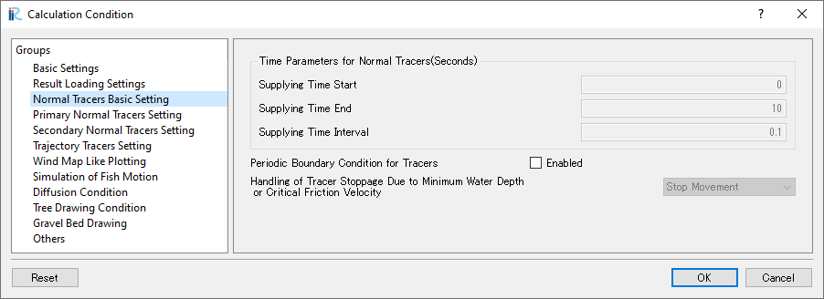

   : Normal Tracers Basic Setting

Time Parameters for Normal Tracers(Seconds)
------------------------------------------------------------------------------------------------------------------------

| Set the parameters for the period and interval of normal tracer dispersion.

- Supplying Time Start(sec)
- Supplying Time End(sec)
- Supplying Time Interval(sec)

Periodic Boundary Condition for Tracers
------------------------------------------------------------------------------------------------------------------------

| When enabled, tracers that flow out from the upstream or downstream end will move to the opposite end.
| In the transverse direction, they will enter at the same position where they flowed out.

.. _Handling of Tracer Stoppage Due to Minimum Water Depth or Critical Friction Velocity:

Handling of Tracer Stoppage Due to Minimum Water Depth or Critical Friction Velocity
------------------------------------------------------------------------------------------------------------------------

Select the handling of tracers when the water depth at their position is below the critical depth or the flow velocity is below the critical friction velocity from the following options:

- Stop Movement
- Disappear

Primary and Secondary Normal Tracers Setting
========================================================================================================================

| This section describes the settings for primary and secondary tracers.
| Different settings can be specified for each, but the parameters for primary and secondary tracers are the same, so they are explained together.
| These values can only be edited if :ref:`Whether to Trace The Primary Tracer` is enabled.

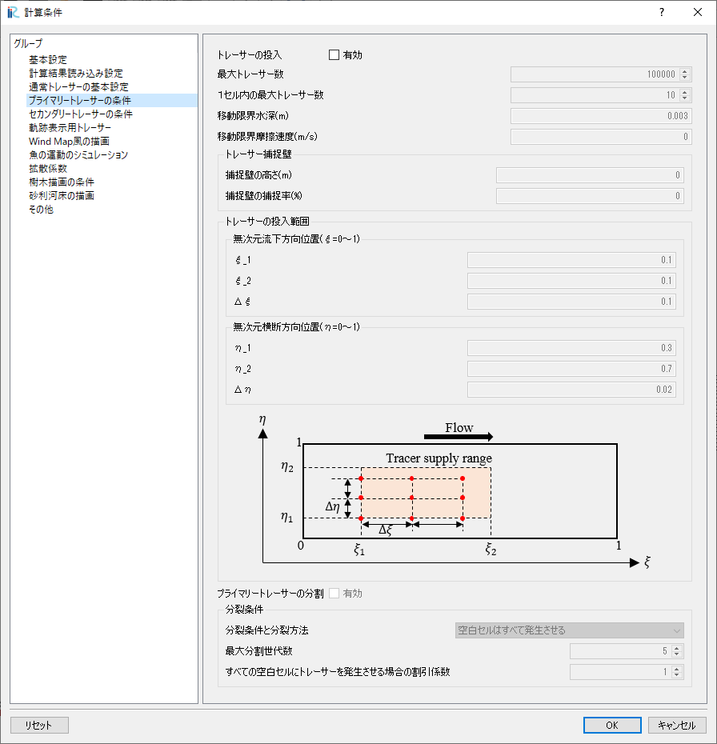

   : Primary and Secondary Normal Tracers Setting

.. _Whether to Trace The Primary Tracer:

Whether to Trace The Primary Tracer
------------------------------------------------------------------------------------------------------------------------

| Enable this if you want to track tracers.

Maximum Number of Total Tracer Particles
------------------------------------------------------------------------------------------------------------------------

| Specify the maximum number of tracers that can be tracked.
| If the total number of tracers in the calculation range (including those that cannot move) reaches this number, no new tracers will be added.

Maximum Number of Tracer Particles in one Cell
------------------------------------------------------------------------------------------------------------------------

| Specify the maximum number of tracers that can exist in one cell.
| If the number of tracers in a cell has already reached this value, any tracers that move into the cell will be removed.

.. _Critical Depth for Tracer Moving(m) and Critical Shear Velocity Below Which The Tracer Stops(m/s):

Critical Depth for Tracer Moving(m) and Critical Shear Velocity Below Which The Tracer Stops(m/s)
------------------------------------------------------------------------------------------------------------------------

| Tracers cannot move in locations where the depth is less than this value. The handling of tracers in such locations is set in :ref:`Handling of Tracer Stoppage Due to Minimum Water Depth or Critical Friction Velocity`.

.. _Tracer Capturing Wall:

Tracer Capturing Wall
------------------------------------------------------------------------------------------------------------------------

| This section describes the parameters related to the Tracer Capturing Wall, where the value of :guilabel:`Tracer Trap` is mapped as trap cells in the calculation grid.
| Different settings can be specified for each type of tracer.

- Capturing Wall Height(m)
- Capturing Rate of The Wall(%)

| The capturing rate changes as follows depending on the relationship between the height of the capturing wall and the water depth.

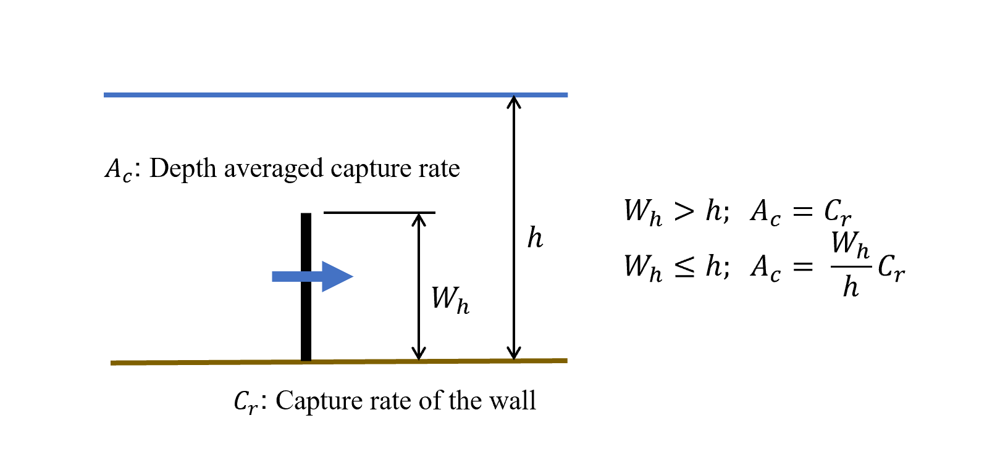

   : Capturing rate of the Tracer Capturing Wall

.. _Tracers Supply Range:

Tracers Supply Range
------------------------------------------------------------------------------------------------------------------------

| This section describes the parameters related to the range for supplying tracers.
| Normal tracers specify the start position ( :math:`\xi_1`, :math:`\eta_1` ), end position ( :math:`\xi_2`, :math:`\eta_2` ), and supply interval ( :math:`\Delta \xi`, :math:`\Delta \eta` ) in the longitudinal ( :math:`\xi` ) and transverse ( :math:`\eta` ) directions.
| The positions are specified in the dimensionless coordinates of :guilabel:`0 to 1` when the calculation grid is expressed in general coordinates.

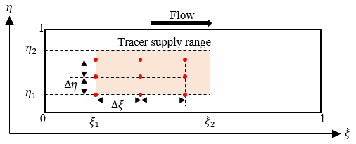

   : Tracers Supply Range

.. note::
   In general coordinates, :math:`\xi` and :math:`\eta` are created assuming that the grid size is constant, so if the grid size is not constant, the physical coordinates will not be evenly spaced as shown below. It is desirable to have a uniform grid spacing as much as possible.

    .. figure:: images/01/tracer_supply_range_general.png
        :width: 400pt

        : Image of general coordinates when the grid is not evenly spaced

Tracer Cloning for Primary Normal Tracers
------------------------------------------------------------------------------------------------------------------------

| When enabled, tracers will split according to the conditions specified in :ref:`Cloning Method`.

.. _Cloning Method:

Cloning Method
------------------------------------------------------------------------------------------------------------------------

| Select the conditions under which tracers will split from the following options:

All Empty Cells
    A new tracer will be generated at the center of a cell that contains no tracers.
Cells With Only one Tracer
    If there is exactly one tracer in a cell, that tracer will split into two tracers with half the mass.
Specified Cells With one Tracer
    If there is exactly one tracer in a cell mapped as a :guilabel:`Tracer Trapping Cell`, that tracer will split into two tracers with half the mass.

Maximum Cloning Generations
------------------------------------------------------------------------------------------------------------------------

| Specify the maximum number of generations for tracer splitting.
| Tracers are considered the first generation when newly added, and each subsequent split increases the generation count by one.

Cloning Reduction Factor for Empty Cells Cloning
------------------------------------------------------------------------------------------------------------------------
| If :ref:`Cloning Method` is set to :guilabel:`Specified Cells With one Tracer`, specify the reduction factor for generating tracers in all empty cells.
| When this value is set to 2 or more, tracers will be generated every n cells, prioritizing the j-direction.
| For example, if the reduction factor is set to 3 in a :math:`10*10` grid, tracers will be generated as shown in the following image.

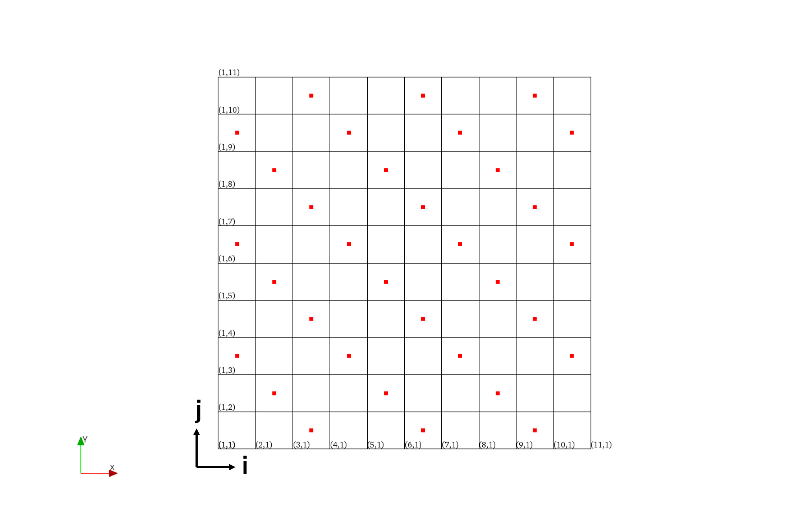

   : Tracer generation with a reduction factor of 3

Trajectory Tracers Setting
========================================================================================================================
| This section describes the settings for trajectory tracers.
| These values can only be edited if :ref:`Whether to Trace The Trajectory Tracer` is enabled.

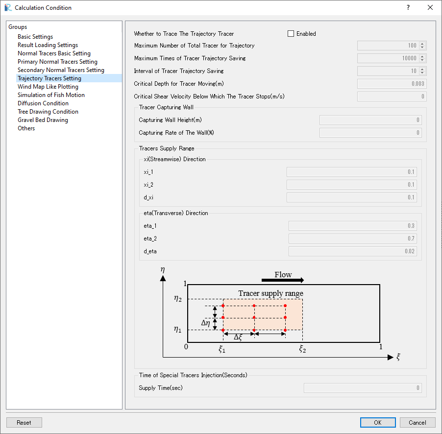

   : Trajectory Tracers Setting

.. _Whether to Trace The Trajectory Tracer:

Whether to Trace The Trajectory Tracer
------------------------------------------------------------------------------------------------------------------------
| Enable this if you want to track trajectory tracers.

Maximum Number of Total Tracer for Trajectory
------------------------------------------------------------------------------------------------------------------------
| Specify the maximum number of trajectory tracers that can be tracked.
| If the total number of tracers in the calculation range reaches this number, no new tracers will be added.

Times of Tracer Trajectory Saving
------------------------------------------------------------------------------------------------------------------------
| Specify the maximum number of times to save the trajectory of tracers (number of nodes in the polyline).
| If this value is exceeded, the trajectory drawing will stop at that point.
| The maximum number is 1,000,000 times.

Interval of Tracer Trajectory Saving
------------------------------------------------------------------------------------------------------------------------
| Specify how many times to track tracers before saving their current location as a node in the trajectory polyline.
| Reducing this value will make the trajectory drawing smoother, but it will increase the amount of data saved, so be careful.

.. note::
   | For example, if you perform a calculation for 3600 seconds with a tracking time interval of 0.001 seconds, and set the saving interval to 1 and the maximum saving times to 1,000,000, the number of times the trajectory is saved will be 3,600,000 times, exceeding the maximum saving times.
   | In that case, increase the saving interval to avoid the issue.

Critical Depth for Tracer Moving(m) and Critical Shear Velocity Below Which The Tracer Stops(m/s)
------------------------------------------------------------------------------------------------------------------------
| Same as the :ref:`Critical Depth for Tracer Moving(m) and Critical Shear Velocity Below Which The Tracer Stops(m/s)` for normal tracers, so omitted.

Tracer Capturing Wall
------------------------------------------------------------------------------------------------------------------------
| Same as the :ref:`Tracer Capturing Wall` for normal tracers, so omitted.

Tracers Supply Range
------------------------------------------------------------------------------------------------------------------------
| Same as the :ref:`Tracers Supply Range` for normal tracers, so omitted.

Supply Time(sec)
------------------------------------------------------------------------------------------------------------------------
| Specify the supply time for tracers to display their trajectory.
| Trajectory tracers are supplied only once.

Wind Map Like Plotting
========================================================================================================================
| This section describes the settings for Wind Map-like plotting.
| These values can only be edited if :ref:`Drawing Wind Map` is enabled.

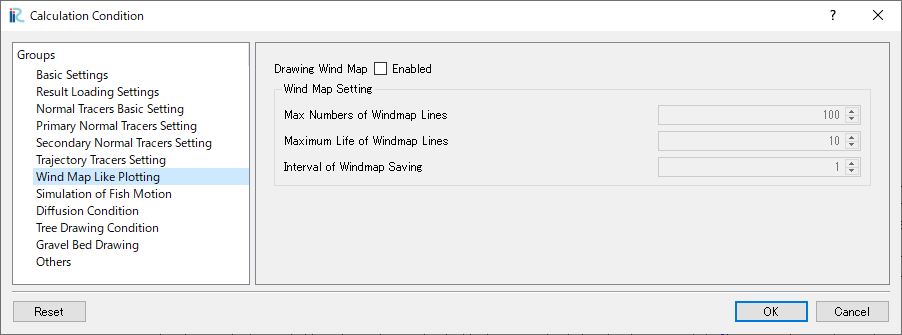

   : Wind Map Like Plotting

.. _Drawing Wind Map:

Drawing Wind Map
------------------------------------------------------------------------------------------------------------------------
| Enable this if you want to draw a Wind Map.

Max Numbers of Windmap Lines
------------------------------------------------------------------------------------------------------------------------
| Specify the maximum number of lines to draw for Wind Map-like plotting.

Maximum Life of Windmap Lines
------------------------------------------------------------------------------------------------------------------------
| Specify the maximum lifespan of each line for Wind Map-like plotting.
| The drawn Wind Map lines will have a random lifespan up to this maximum value.

Interval of Windmap Saving
------------------------------------------------------------------------------------------------------------------------
| Specify how often to save the current location of the Wind Map line polyline as a node.
| It is desirable to specify a value that can evenly divide the number of tracking calculations between GELATO outputs.

Simulation of Fish Motion
========================================================================================================================
| This section describes the settings for simulating fish motion.
| These values can only be edited if :ref:`Fish Simulation` is enabled.
| The fish motion characteristics list can be edited even if :ref:`Fish Simulation` is disabled, but it will only be applied when enabled.

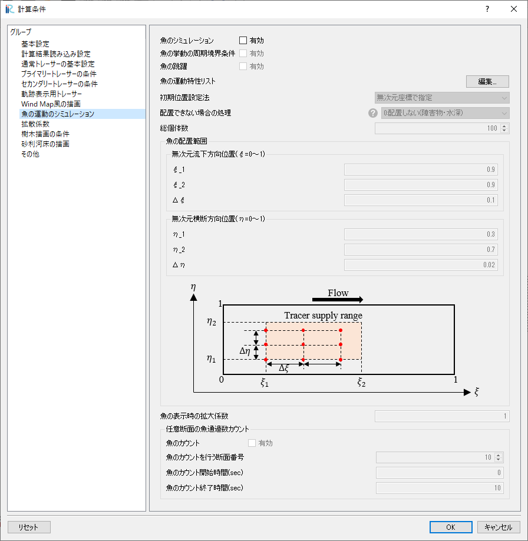

   : Simulation of Fish Motion

.. _Fish Simulation:

Fish Simulation
------------------------------------------------------------------------------------------------------------------------
| Enable this if you want to simulate fish motion.

Periodic Boundary Condition for Fish Simulation
------------------------------------------------------------------------------------------------------------------------
| When enabled, fish that flow out from the upstream or downstream end will move to the opposite end.
| In the transverse direction, they will enter at the same position where they flowed out.

Fish Jumping
------------------------------------------------------------------------------------------------------------------------
| Enable this if you want fish to jump.

Fish Swimming Information List
------------------------------------------------------------------------------------------------------------------------
| Set the fish motion characteristics list.
| Fish motion characteristics can be set for each group, and different characteristics can be set for each group.
| Refer to :ref:`Setting Parameters for Fish Simulation` for the CSV.

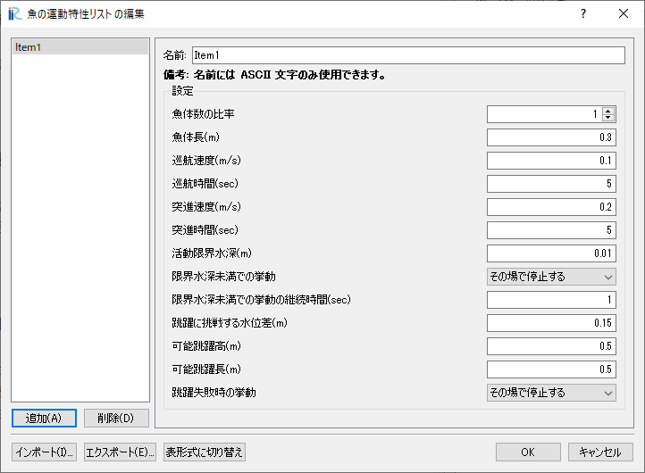

   : Fish Swimming Information List (list format)

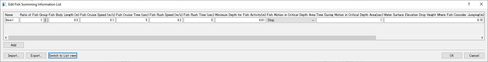

   : Fish Swimming Information List (table format)

The setting items are as follows:

Ratio of Fish Group
    | Specify the number of fish in each group as a ratio of the total number of fish.
    | If the total number of fish is not divisible, they will be allocated to the groups in descending order of ratio.
Fish Body Length (m)
    | Specify the body length of the fish.
Fish Cruise Speed (m/s)
    | Specify the cruising speed of the fish.
Fish Cruise Time (sec)
    | Specify the time the fish will continue swimming at cruising speed.
Fish Rush Speed (m/s)
    | Specify the speed at which the fish will swim in a rush state.
Fish Rush Time (sec)
    | Specify the time the fish will swim at rush speed.
Minimum Depth for Fish Activity(m)
    | Specify the water depth at which the fish can swim without any problems.
    | The behavior of the fish in water depths below this depth is specified in :guilabel:`Fish Motion in Critical Depth Area`.
Fish Motion in Critical Depth Area
    | Specify the behavior of the fish in areas with water depths below the activity limit from the following options.
    | If the fish moves to an area with water depths below the activity limit after moving in a normal state, it will return to the previous location and then take the action specified in the options.
    | If the water level changes to below the activity limit before moving, the fish will take the action specified in the options from that location.
    | While continuing the behavior in areas with water depths below the limit, the fish will not move again even if the water depth is below the limit after moving.

    Stop
        The fish will stop at that location.
    Reverse
        The fish will swim in the opposite direction to its original swimming direction.
    Noswimming
        The fish will abandon its swimming ability and drift with the flow.
    Random
        The fish will swim in a direction randomly tilted according to a normal distribution with a standard deviation of :math:`\pi /2` from its original direction.
    Remove
        The fish will be removed if it enters an area with water depths below the limit.
Time During Motion in Critical Depth Area(sec)
    | Specify the time to continue the behavior in areas with water depths below the limit.
    | During this time, the fish will continue the behavior even if it moves to a location with water depths above the limit, and will return to normal behavior after this time.
Water Surface Elevation Drop Height Where Fish Consider Jumping(m)
    | This parameter is used when fish jumping is enabled. The fish will jump if the water level difference between its current location and the cell one cell upstream in the i-direction exceeds this value.
Possible Jumping Height(m)
    | Specify the maximum water level difference the fish can jump.
Possible Jumping Distance(m)
    | Specify the maximum jumping distance the fish can achieve.
Fish Handling When Jumping Fails
    | Specify the behavior when the water level difference exceeds the possible jumping height from the following options.

    Stop
        The fish will stop at its previous location.
    Continue Swimming
        The fish will resume swimming.

.. note:: 
    Regarding the cycle of fish cruising and rushing, the fish will repeat cruising and rushing states for their respective times. However, to vary the cycle, the fish will start in a cruising state when added, and the initial cruising time will be a random value within the cruising time.

.. note::
    The conditions for fish jumping are as follows:

    - The water level difference with the cell one cell upstream in the i-direction exceeds the jumping consideration water level difference.
    - The water level difference is within the possible jumping height.
    - The fish is in a rush state and has moved less than twice since entering the rush state.
    - The fish is not exhibiting behavior in areas with water depths below the limit.
    - The fish is not in the most upstream cell.

How to Set Initial Location
------------------------------------------------------------------------------------------------------------------------
| Specify the initial location of the fish from the following options.

Nondimensional Coordinate
    | Place the fish using the same method as normal tracers.
Give Total Numbers and Random Placement
    | Specify the total number of fish and place that number of fish randomly within the grid range.

Handling When Unable to Place
------------------------------------------------------------------------------------------------------------------------
| Specify the behavior when the fish cannot be placed at the initial location from the following options.

0:Remove (Obstacle and Depth)
    | The fish will not be placed if the location is an obstacle cell or has a water depth below the activity limit.
1:Remove (Obstacle)
    | The fish will not be placed if the location is an obstacle cell.
2:Relocation (Obstacle and Depth)
    | The fish will be randomly relocated if the location is an obstacle cell or has a water depth below the activity limit.
3:Relocation (Obstacle)
    | The fish will be randomly relocated if the location is an obstacle cell.

Total Number of Fish
------------------------------------------------------------------------------------------------------------------------
| Specify the total number of fish to be placed randomly.

Initial Fish Location
------------------------------------------------------------------------------------------------------------------------
Same as the :ref:`Tracers Supply Range` for normal tracers, so omitted.

Fish Size Magnification Factor
------------------------------------------------------------------------------------------------------------------------
| Specify the magnification factor for the size of the fish polygons displayed during visualization of the calculation result.

Fish Count
------------------------------------------------------------------------------------------------------------------------
| When enabled, the number of times fish pass through a user-specified cross-section i from downstream to upstream will be counted.
| If the fish pass from upstream to downstream, the count will decrease.

Fish Count Section
------------------------------------------------------------------------------------------------------------------------
| Specify the i-direction index of the cross-section where the fish count will be performed.

Fish Count Start Time(sec), End Time(sec)
------------------------------------------------------------------------------------------------------------------------
| Specify the period during which the fish count will be performed.

Diffusion Condition
========================================================================================================================
| This section describes the settings for the diffusion coefficient of tracer movement by random walk.
| Refer to :ref:`Random walk model considering the effect of turbulence` for the diffusion coefficient.

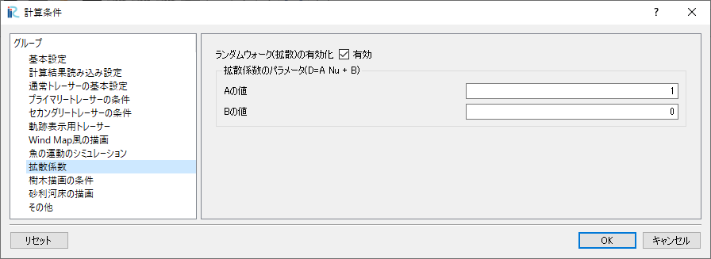

   : Diffusion Condition

Diffusivity Parameters
------------------------------------------------------------------------------------------------------------------------

| Enable this if you want to perform tracer movement by random walk.

Parameters for the diffusion coefficient
------------------------------------------------------------------------------------------------------------------------

Specify the values of a and b in the following equation.

.. math:: 

    K= a \nu_t + b

.. _Tree Drawing Condition:

Tree Drawing Condition
========================================================================================================================
| This section describes the settings for drawing tree polygons in the calculation result.

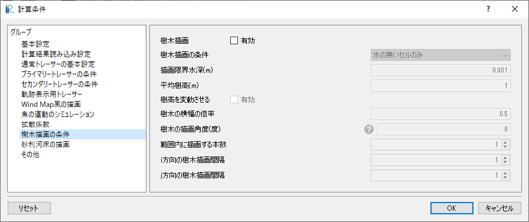

   : Tree Drawing Condition

Tree Drawing
------------------------------------------------------------------------------------------------------------------------
| Enable this if you want to draw tree polygons.

Tree Drawing Condition
------------------------------------------------------------------------------------------------------------------------

| Specify the conditions for drawing tree polygons from the following options.

Dry Cell Only
    | Draw tree polygons in cells with water depths below the :guilabel:`Critical Depth Below Which Tree Draw`.

Read From Cell
    | Draw tree polygons in cells with water depths below the :guilabel:`Critical Depth Below Which Tree Draw` and mapped as :guilabel:`Tree Proliferation Cells` in the calculation grid.

Critical Depth Below Which Tree Draw(m)
------------------------------------------------------------------------------------------------------------------------
| Specify the critical water depth below which tree polygons can be drawn.
| Tree polygons will be drawn in cells with water depths below this value.

Average Tree Height(m)
------------------------------------------------------------------------------------------------------------------------
| Specify the average height of the tree polygons.

Tree Height Variation
------------------------------------------------------------------------------------------------------------------------
| Enable this if you want to randomly vary the height of the tree polygons within a range of 0.5 to 1.5 times the average height.

Aspect Ratio of Tree Image
------------------------------------------------------------------------------------------------------------------------
| Specify the magnification factor for the width of the tree polygons.
| Specify a value greater than 1 to make the trees thicker. The basic shape of the tree is shown in the following image.

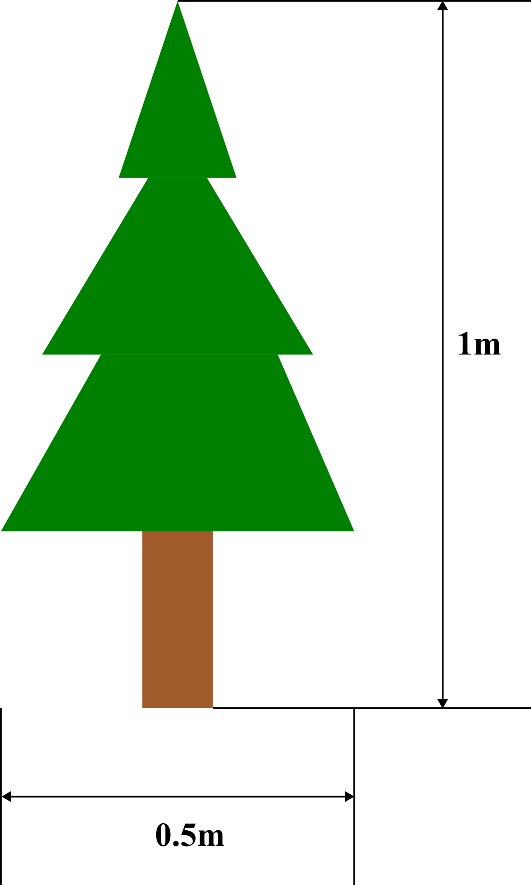

   : Basic shape of the tree polygon

Tree Drawing Angle(Degree)
------------------------------------------------------------------------------------------------------------------------
| Specify the drawing angle of the trees.
| As shown in the following figure, a value of 0 degrees will draw the trees with the Y-axis direction up, and increasing the value will rotate the trees clockwise.

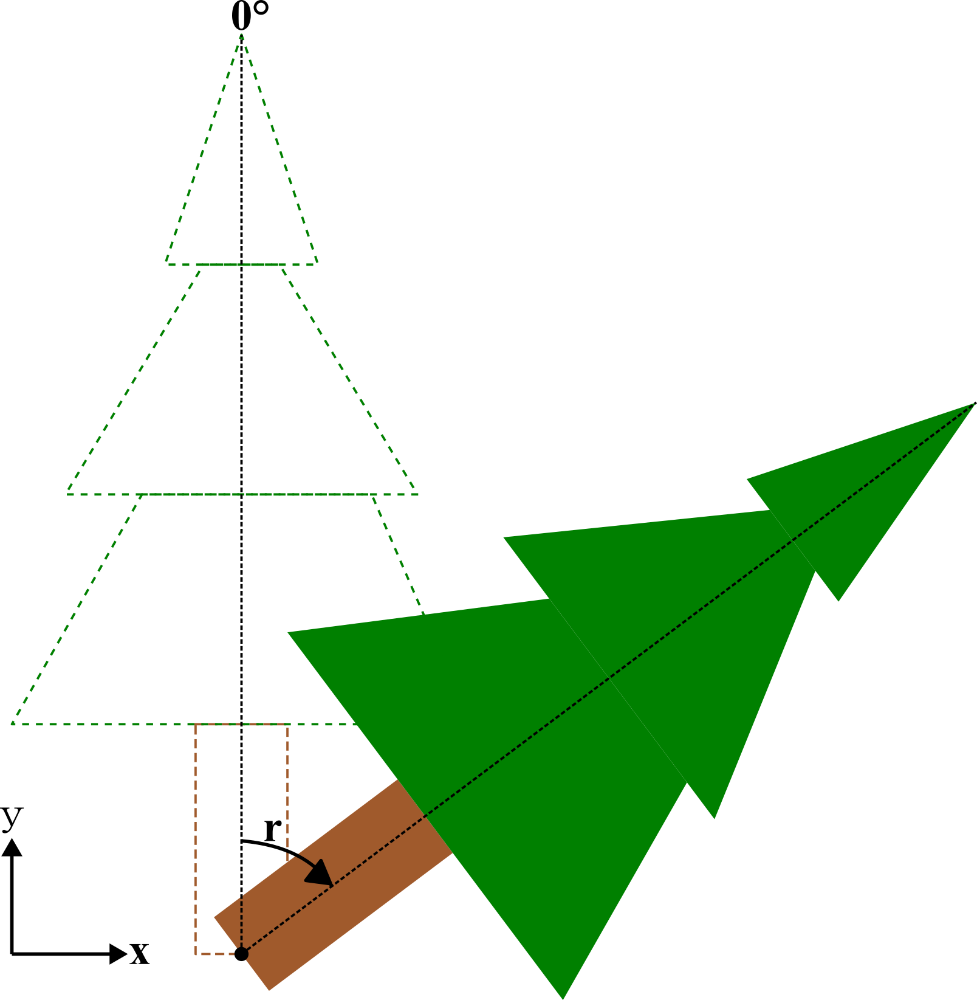

   : Drawing angle of the trees

.. _Number of Tree in The Range:

Number of Tree in The Range
------------------------------------------------------------------------------------------------------------------------
| Specify the number of tree polygons to draw within the range specified in :ref:`Tree Plot Step`.

.. _Tree Plot Step:

Tree Plot Step in i-Direction, Tree Plot Step in j-Direction
------------------------------------------------------------------------------------------------------------------------
| Specify the drawing interval of tree polygons in the i-direction and j-direction.
| For example, if you specify 3 for the i-direction and 2 for the j-direction, tree polygons will be drawn at random locations within the range of :math:`3*2` cells as shown in the following figure, with the number of trees specified in :ref:`Number of Tree in The Range`.

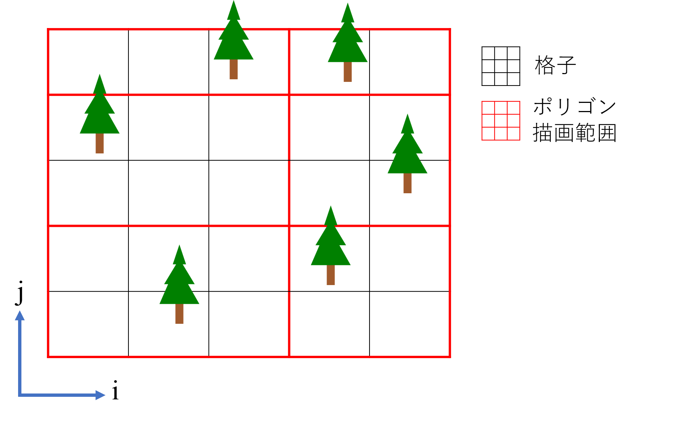

   : Tree Plot Step (i=3, j=2, Tree Number=1)

Gravel Bed Drawing
========================================================================================================================
| This section describes the settings for drawing gravel polygons in the calculation result.

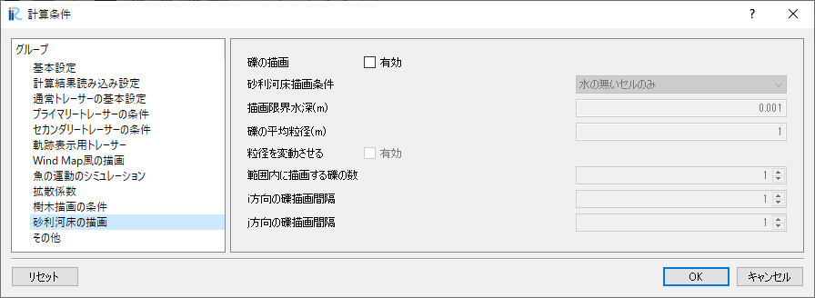

   : Gravel Bed Drawing

The settings for drawing gravel beds are the same as :ref:`Tree Drawing Condition`, so individual explanations are omitted.

Others
========================================================================================================================
| This section describes the settings for other parameters used in the calculation.

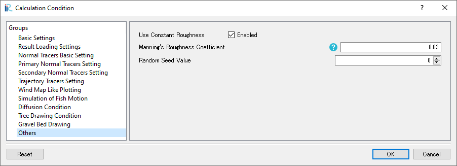

   : Others

.. _Use Constant Roughness:

Use Constant Roughness
------------------------------------------------------------------------------------------------------------------------
| This parameter is enabled by default. It uses the value of :ref:`Manning's Roughness Coefficient` as the Manning roughness coefficient used to calculate the friction velocity and eddy viscosity coefficient in GELATO.
| Disable this if you want to use the roughness coefficient mapped to the grid.

.. _Manning's Roughness Coefficient:

Manning's Roughness Coefficient
------------------------------------------------------------------------------------------------------------------------
| Specify the value of the Manning roughness coefficient to use when :ref:`Use Constant Roughness` is enabled.

.. _Random Seed Value:

Random Seed Value
------------------------------------------------------------------------------------------------------------------------
| This parameter was added in GELATO2.x.
| Previously, the same random numbers were generated when calculations were performed with the same Calculation Condition, resulting in the same behavior for random walk movement regardless of how many times the calculation was performed. By changing this parameter, different random numbers can be generated, changing the behavior.
