====================================================
[Example 1] Tracer transport in a straight channel
====================================================

Flow calculation by Nays2DH
=================================

Select a solver
-------------------

In the [iRIC start page] , select [Create New Project], and when the [Select Solver] screen appears, 
choose [Nays2DH iRIC 4.x 1.0 64bit] and click [OK] button.

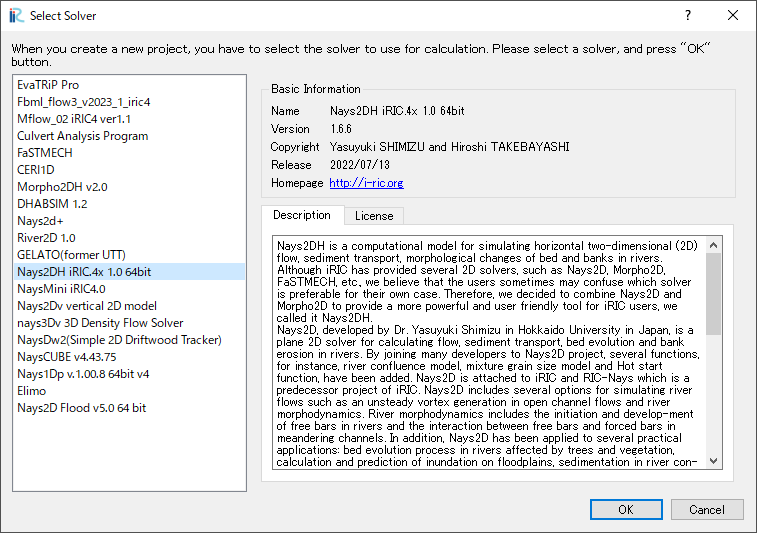

   : Select Solver

A windows with "Untitled - iRIC 4.x.x.xxxx [Nays2DH]" appears as :numref:`01_mudai`.

.. _01_mudai:

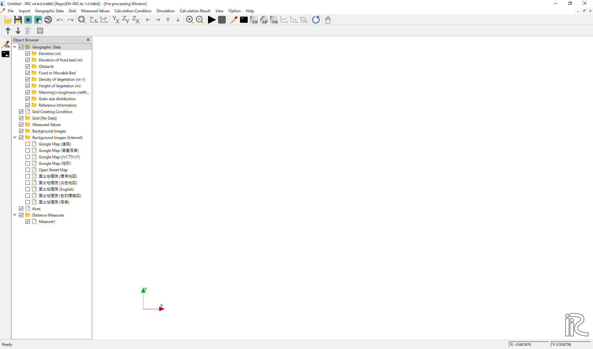

   : Untitled

.. _01_lavel_koshi:

Grid Generation
-------------------

From the main menu of the screen, :numref:`01_mudai`, choose [Grid]->[Select Algorithm to Create Grid] as :numref:`Select_Alg`.

.. _Select_Alg:

.. figure:: images/01/Nays2DH/Select_Alg.png
   :align: center
   :width: 100%

   : Select Algorithm to Create Grid

In the [Select Grid Creating Algorithm] window, select [Simple Straight and Meandering Channel Creator] and click [OK] (:numref:`01_kanni`).

.. _01_kanni:

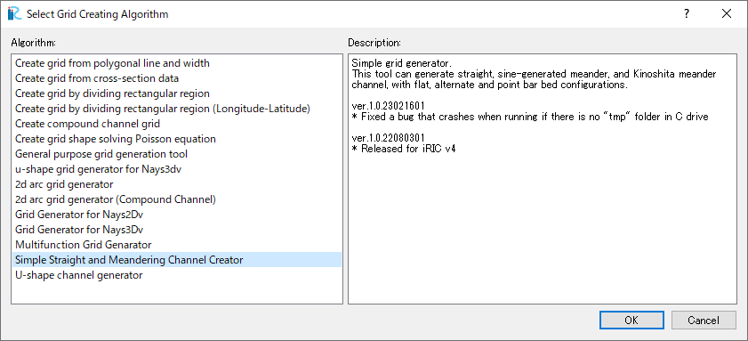

   : Select Grid Creating Algorithm

In the window of :numref:`01_koushi_1` ,
click "Channel Shape" and set [Select Channel Shape of the Main Part] as [straight channel],
and other values as shown in :numref:`01_koushi_1`, then click [Create Grid].

.. _01_koushi_1:

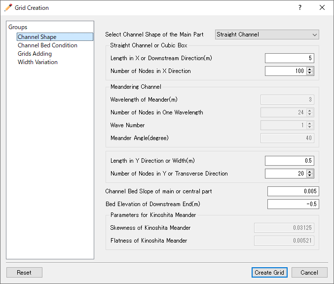

   :Setting Channel Shape

When the confirmation window appears as :numref:`01_koushi_3`, click [Yes] to generate the grid, 
then the computational grid is generated as 
:numref:`01_koushi_4` .

.. _01_koushi_3:

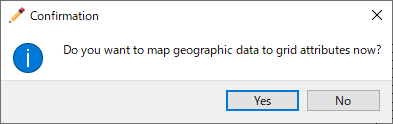

   :Confirmation of mapping

.. _01_koushi_4:

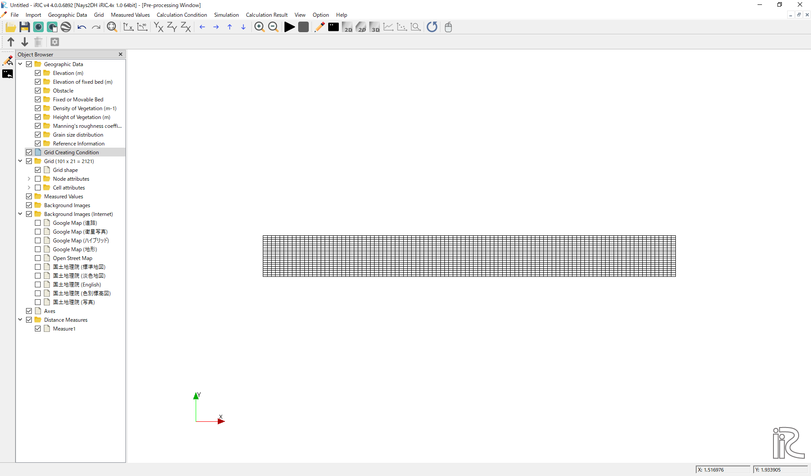

   :Grid Generation Compete

Setting of calculation conditions for flow by Nays2DH
-------------------------------------------------------

The next step is to set the calculation conditions. 
From the menu bar, select [Calculation Conditions]->[Settings], then 
the [Calculation condition setting window] as  :numref:`01_joken_1` appears.

.. _01_joken_1:

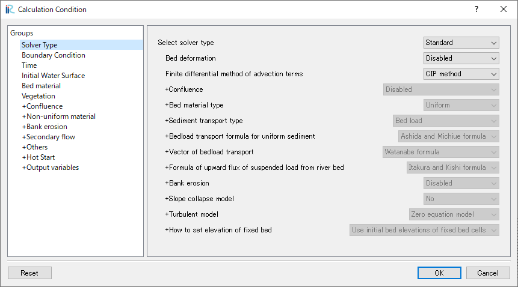

   :Calculation Condition Window

As :numref:`01_joken_2`, in the [Group] of the [Boundary Condition], 
click [Edit] at the [Time series of discharge at upstream and water level at downstream].
Then the [Time series of discharge at upstream and water level at downstream] appears
as :numref:`01_joken_3` . 

.. _01_joken_2:

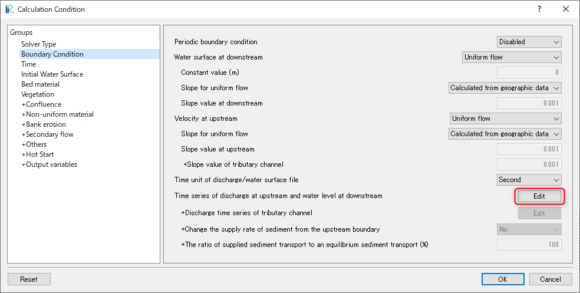

   : Boundary Condition

.. _01_joken_3:

.. figure:: images/01/Nays2DH/joken_3.png
   :align: center
   :width: 600pt

   : Time series of discharge at upstream settings

In :numref:`01_joken_3`, input [Time] and [Discharge] values, and click [OK]
when you finish, and close this window.

.. _01_joken_4:

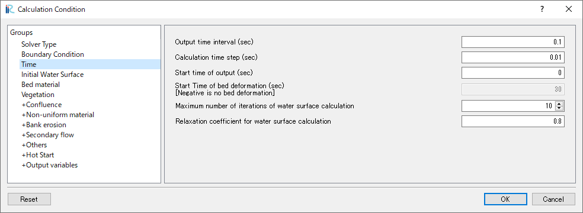

   :Time parameters

Select [Time] and set parameters as :numref:`01_joken_4` and click [OK].

.. _res_Nays2DH:

Flow calculation run by Nays2DH
----------------------------------

From the main menu, when you select [Simulation]->[Run], you will get the message like :numref:`01_warning` .
Then, select [OK] and save the project with an appropriate name. At this time, do not save the project as an ipro file, but save it as a project.  

.. _01_warning:

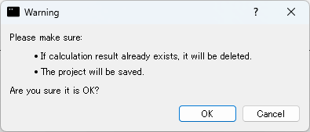

   :warning

| A window as :numref:`01_jikko` is shown during the computation, and :numref:`01_keisan` appears when the computation is finished. 
| Then press [OK], and the computation is completed.

.. _01_jikko:

.. figure:: images/01/Nays2DH/jikko.png
   :align: center
   :width: 100%

   :Window when the solver is running

.. _01_keisan:

.. figure:: images/01/Nays2DH/keisan.png
   :align: center
   :width: 250pt

   :Computation completed

.. note::
   Whenever you finished the computation,  select [File]->[Save] from the menu bar to save the results as  :numref:`01_hozon` . This result is important for later analysis by GELATO.

   .. _01_hozon:

   .. figure:: images/01/Nays2DH/hozon.png
      :align: center
      :width: 100%

      :Saving computational results

Visualization of the calculated results
----------------------------------------------

After the calculation, 
select [Calculation Result] -> [Open New 2D Post-processing Window] to open the visualization window.

.. _01_kekka_0:

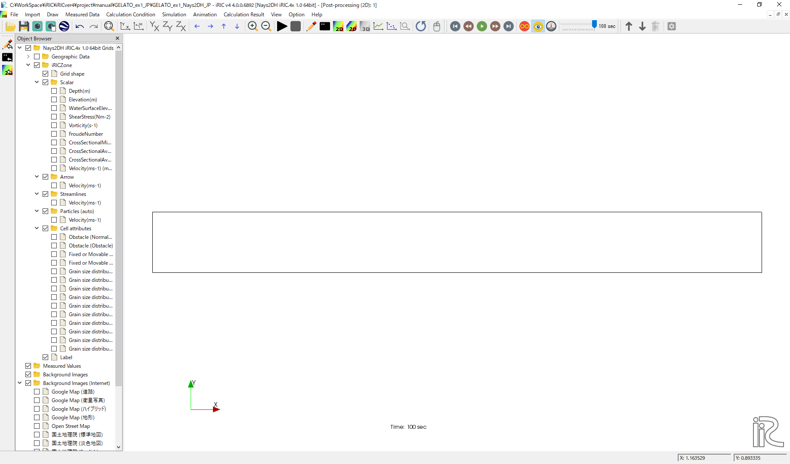

   : 2D Post-processing Window
 

Velocity Vectors
^^^^^^^^^^^^^^^^^^^^

In the [Object Browser], put check marks in the boxes by [Arrow] and [Velocity], click Focus on [Arrow] 
and click the right mouse button [Properties]. Vector setting" window as :numref:`01_kekka_2` appears. 
Set the values in the red line and click [OK].  
:numref:`01_kekka_6` is the depth-averaged velocity vector. Here, the velocity 
distribution is uniform under the constant flow condition.

.. _01_kekka_2:

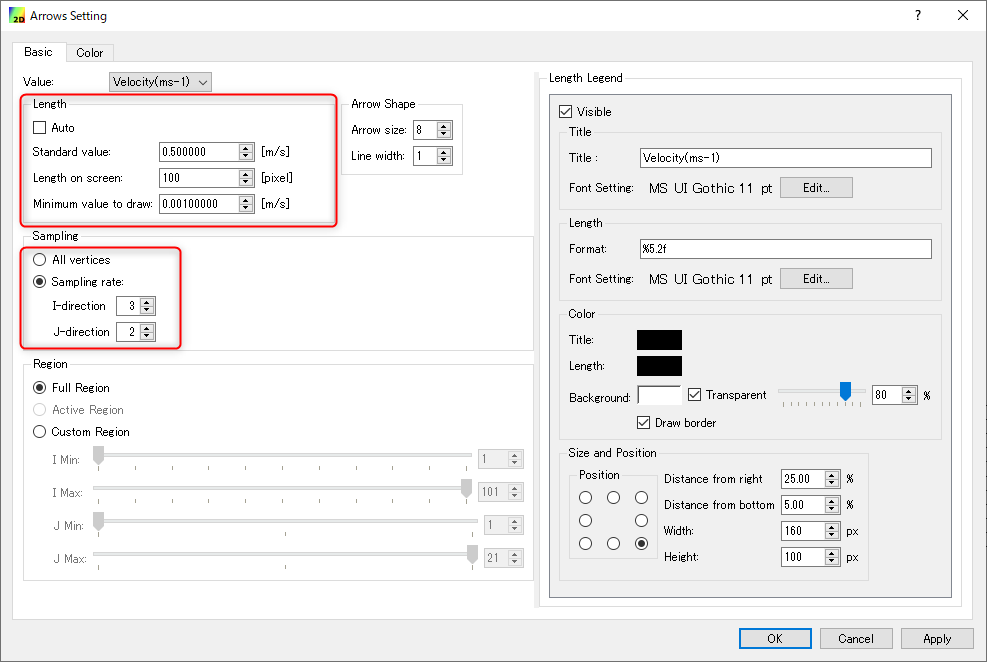

   : Vector Settings
 
.. _01_kekka_6:

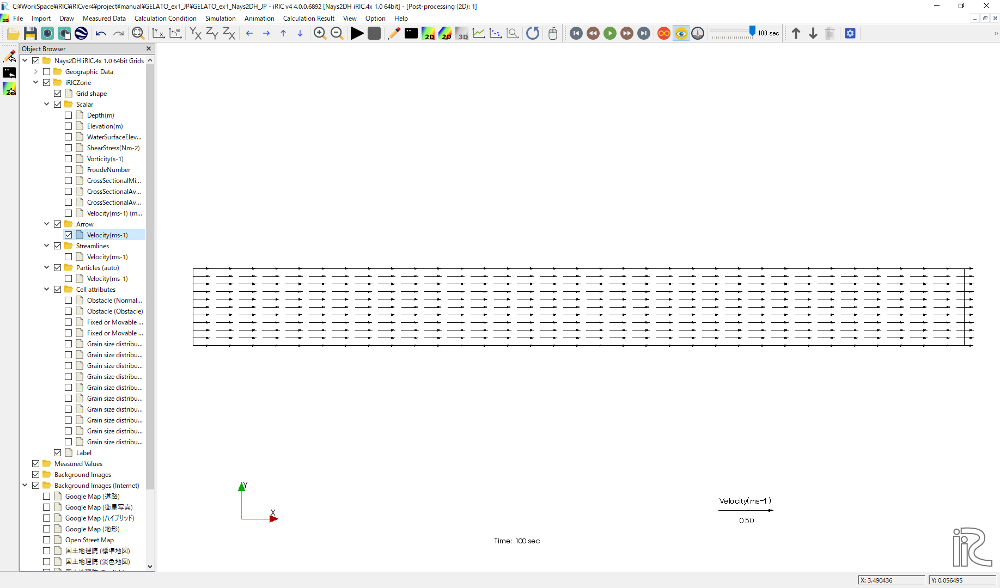

   : Depth averaged velocity vectors
 

Display Particle Movement
^^^^^^^^^^^^^^^^^^^^^^^^^^^^

Uncheck "Vectors" in the Object Browser, and put check marks in "Particles" and "Velocity"
( :numref:`01_kekka_9` )

.. _01_kekka_9:

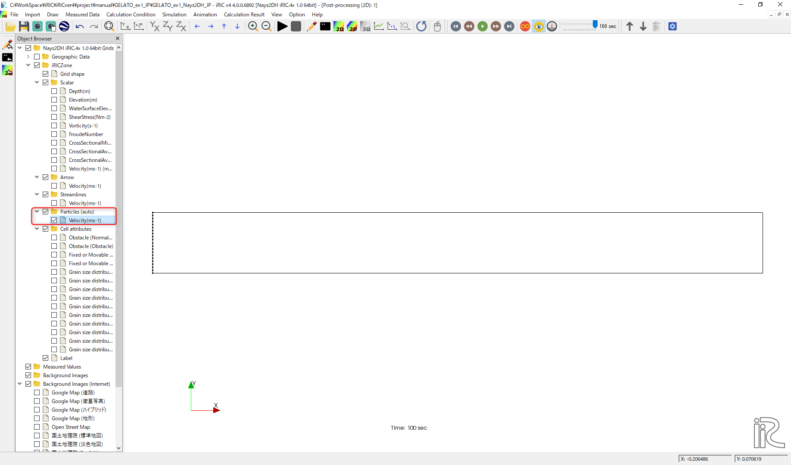

   : Particles(1)
 
Right click [Particle] and select [Properties] as 
:numref:`01_kekka_10` .

.. _01_kekka_10:

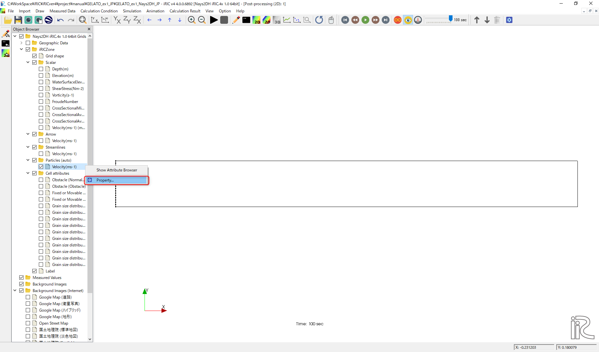

   : Particles(2)
 
Set parameters for particle injection as shown in red box in :numref:`01_kekka_11` .

.. _01_kekka_11:

.. figure:: images/01/Nays2DH/kekka_11.png
   :align: center
   :width: 250pt

   : Set particle parameters
 
As shown in :numref:`01_kekka_12` , set time bar back to zero, and 
select [Animation]->[Start/Stop Animation] rom the main menu bar.
Then the particle animation starts.

.. _01_kekka_12:

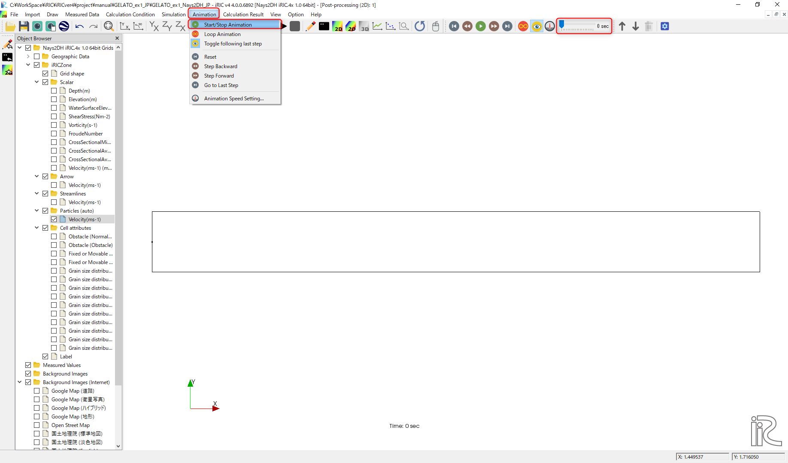

   : Start Particle Animation

.. _01_kekka_13:

.. figure:: images/01/Nays2DH/nays2d_particle.gif
   :align: center
   :width: 100%

   : Particle animation by Nays2DH

As can be seen in :numref:`01_kekka_13`, since the  
sub-grid scale turbulence is not included in the output velocity from the solver.
It only shows very simple steady and uniform movement.

Tracer tracking with GELATO
========================================================================================================================

Starting GELATO and importing the grid
------------------------------------------------------------------------------------------------------------------------

From the iRIC start screen, select [Create New Project], and in the solver selection screen that appears, select "GELATO ver2.x" and click "OK".

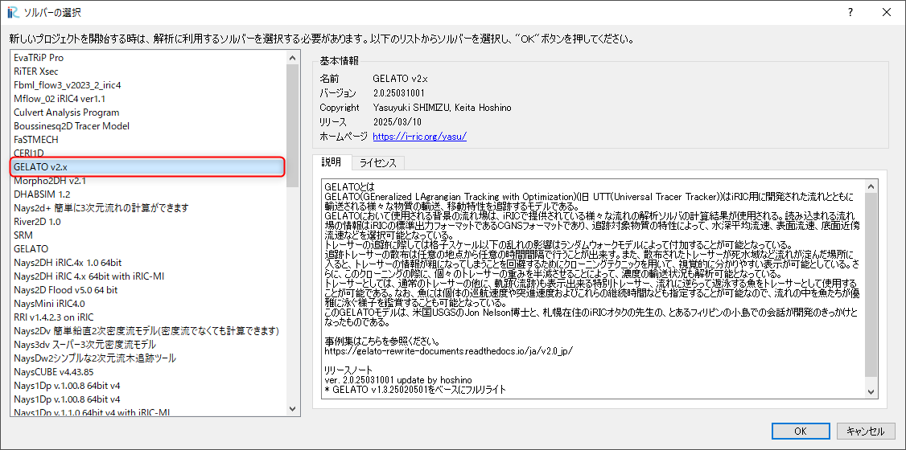

   : Selecting and starting GELATO

The GELATO session starts, and a dialog box titled "Select CGNS file for input" appears.

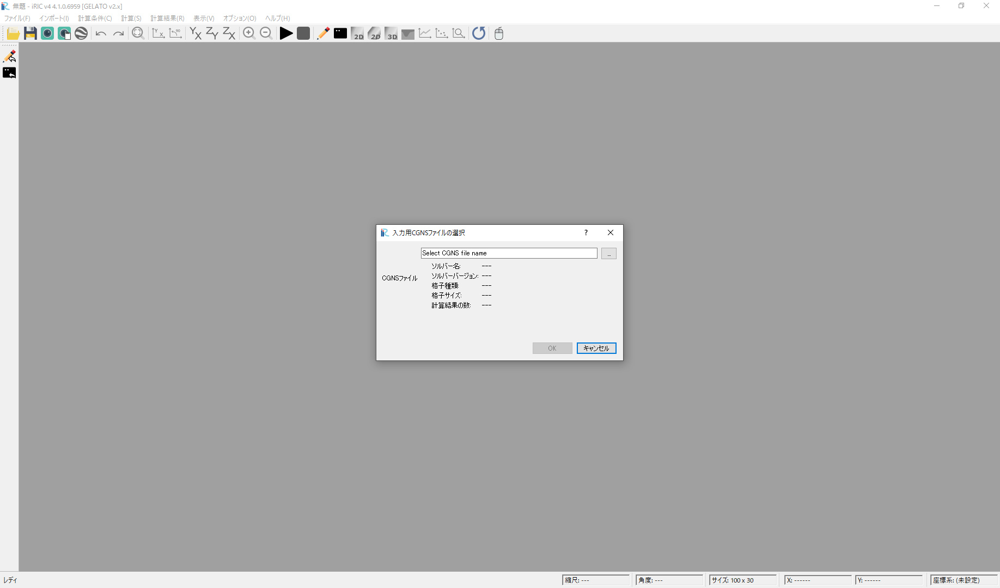

   : Starting GELATO
  
Click the :guilabel:`...` button to display the file selection dialog, and select the CGNS file of the Nays2DH calculation result that was calculated earlier.

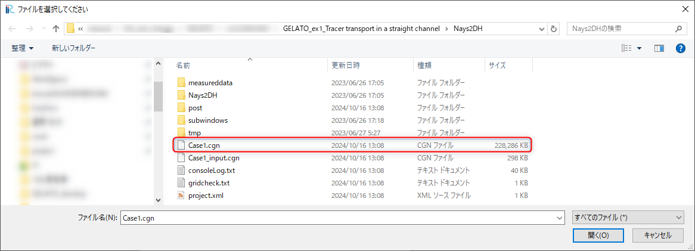

   : Selecting the CGNS file of the calculation result_1

The information of the selected CGNS file is displayed in the dialog, so click :guilabel:`OK`.

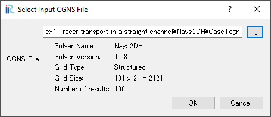

   : Selecting the CGNS file of the calculation result_2

A dialog asking whether to import the grid appears, so click :guilabel:`Yes`.

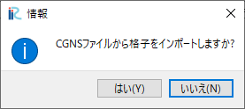

   : Importing the grid_1

The following error is displayed, but this always appears when trying to load the grid of a different solver, so click :guilabel:`Yes` without worrying about it.

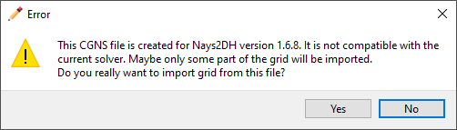

   : Importing the grid_2

When the import is complete, the imported grid is displayed as follows.

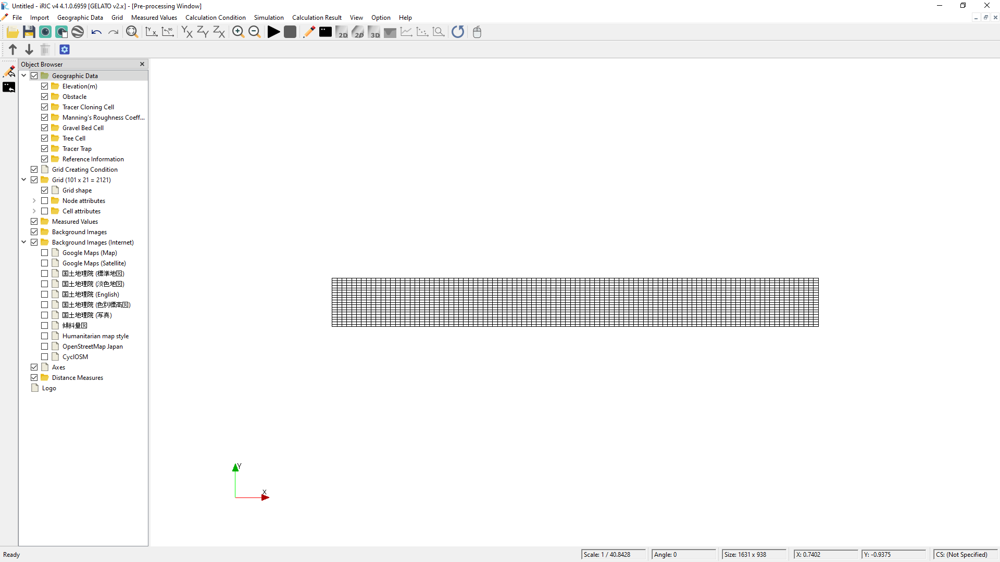

   : Grid import complete

Tracking two types of tracers (without turbulent diffusion)
------------------------------------------------------------------------------------------------------------------------

Setting calculation conditions
^^^^^^^^^^^^^^^^^^^^^^^^^^^^^^^^^^^^^^^^^^^^^^^^^^^^^^^^^^^^^^^^^^^^^^^^^^^^^^^^^^^^^^^^^^^^^^^^^^^^^^^^^^^^^^^^^^^^^^^^

| Open the calculation condition setting window from the menu bar by selecting :menuselection:`Calculation Conditions(C) --> Settings(S)`, and set the parts enclosed in red as follows.
| Other calculation conditions can be left as default.

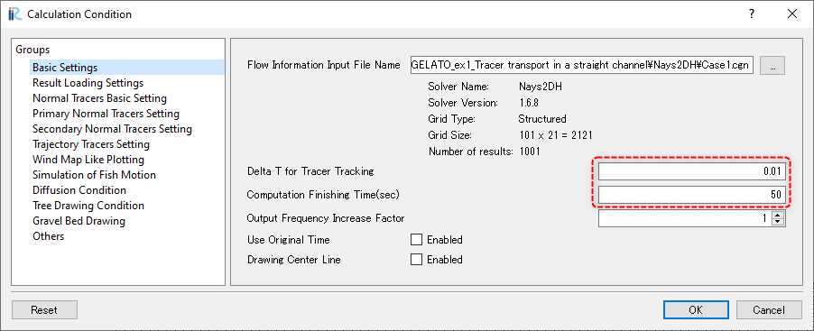

   : Setting calculation conditions_1

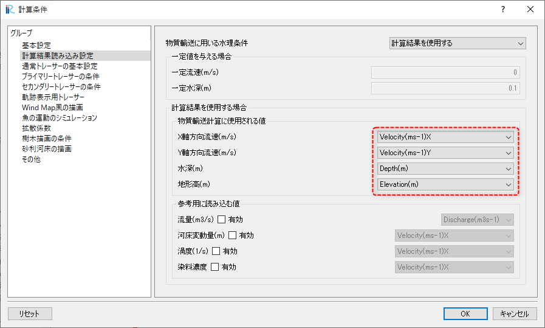

   : Setting calculation conditions_2

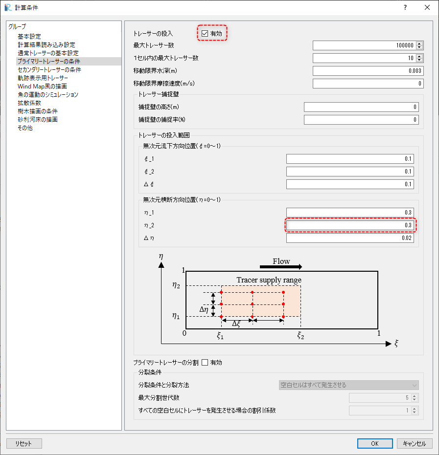

   : Setting calculation conditions_3

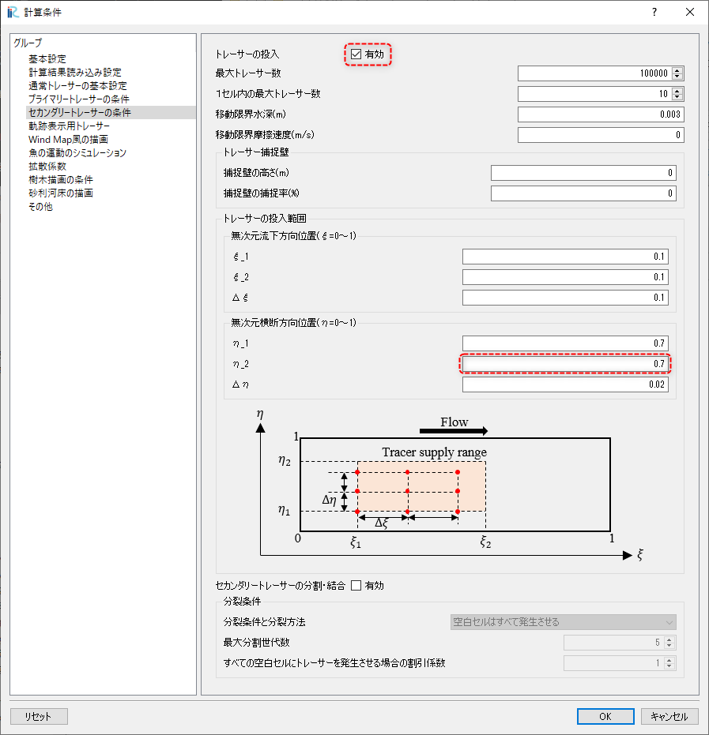

   : Setting calculation conditions_4

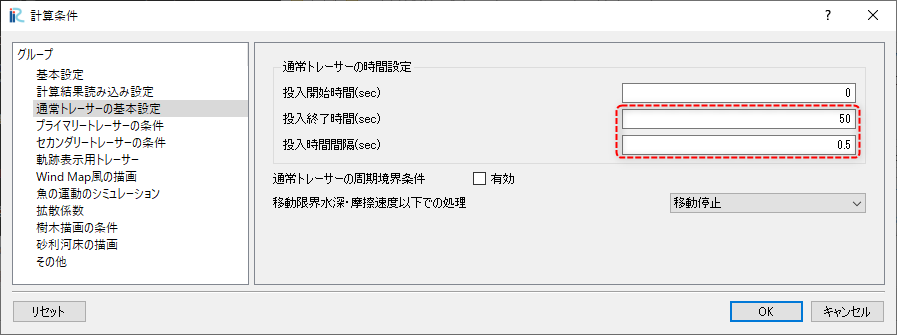

   : Setting calculation conditions_5

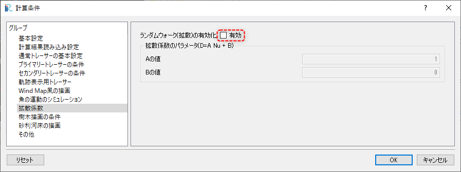

   : Setting calculation conditions_6

Running the calculation
^^^^^^^^^^^^^^^^^^^^^^^^^^^^^^^^^^^^^^^^^^^^^^^^^^^^^^^^^^^^^^^^^^^^^^^^^^^^^^^^^^^^^^^^^^^^^^^^^^^^^^^^^^^^^^^^^^^^^^^^

| Select :menuselection:`Calculation(C) --> Run(R)` from the menu bar, a warning appears, so save it with an appropriate name.
| The save format can be either [Save to file (ipro)] or [Save as project].
| Once the save is complete, the calculation starts, and the following window is displayed.

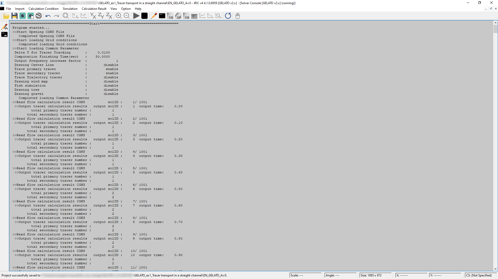

   : Calculation running screen

| When the calculation is finished, a dialog saying "Solver calculation is complete." is displayed, so click :guilabel:`OK`.

Displaying the calculation results
^^^^^^^^^^^^^^^^^^^^^^^^^^^^^^^^^^^^^^^^^^^^^^^^^^^^^^^^^^^^^^^^^^^^^^^^^^^^^^^^^^^^^^^^^^^^^^^^^^^^^^^^^^^^^^^^^^^^^^^^

| Select :menuselection:`Calculation Results(R) --> Open New 2D Visualization Window` from the main menu, and a 2D visualization window is displayed.
| Right-click :guilabel:`primary Nomal Tracers` and :guilabel:`secondary Nomal Tracers` in the Object Browser, and select :guilabel:`Properties`, then the following window is displayed.
| From here, you can change the color of the particles, so change the primary to red and the secondary to blue.

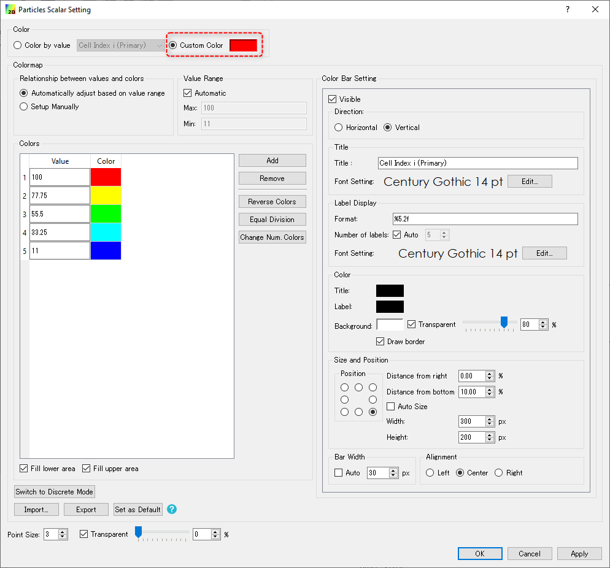

   : Particle properties

| Return the time step to the beginning, and select :menuselection:`Animation(A) --> Start/Stop Animation(S)` from the main menu to play the animation.

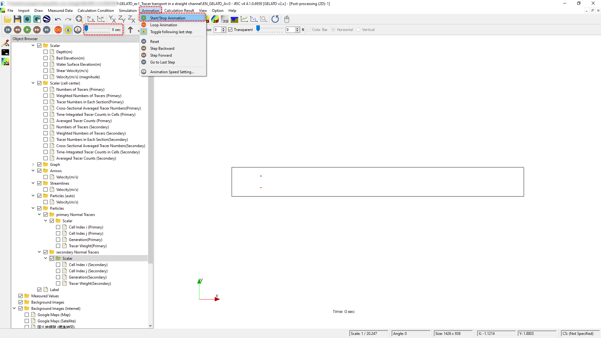

   : Playing the animation

Since this is a calculation without turbulent diffusion, the result is as simple as follows.

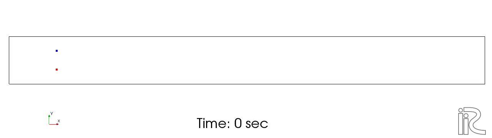

   : Particle animation by GELATO (without diffusion)

Tracking two types of tracers (with turbulent diffusion)
------------------------------------------------------------------------------------------------------------------------

Setting calculation conditions
^^^^^^^^^^^^^^^^^^^^^^^^^^^^^^^^^^^^^^^^^^^^^^^^^^^^^^^^^^^^^^^^^^^^^^^^^^^^^^^^^^^^^^^^^^^^^^^^^^^^^^^^^^^^^^^^^^^^^^^^
| Change the calculation conditions as they are and perform the calculation considering turbulent diffusion.
| First, select :menuselection:`Calculation Conditions(C) --> Settings(S)` from the menu bar, and set as follows.

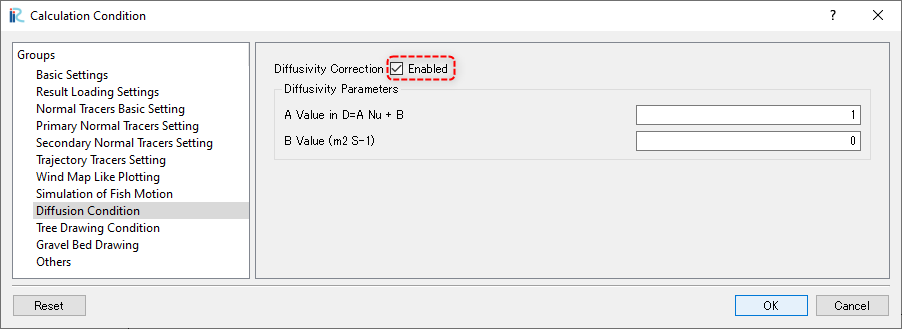

   : Setting conditions for diffusion

Running the calculation and displaying the results
^^^^^^^^^^^^^^^^^^^^^^^^^^^^^^^^^^^^^^^^^^^^^^^^^^^^^^^^^^^^^^^^^^^^^^^^^^^^^^^^^^^^^^^^^^^^^^^^^^^^^^^^^^^^^^^^^^^^^^^^
| Running the calculation with this setting yields the following results.

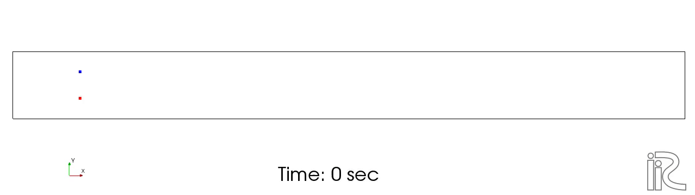

   : Particle animation by GELATO (with diffusion A=1)

| Furthermore, if the value of A is set to 10, it becomes as follows, and the influence of turbulence becomes clearly larger.

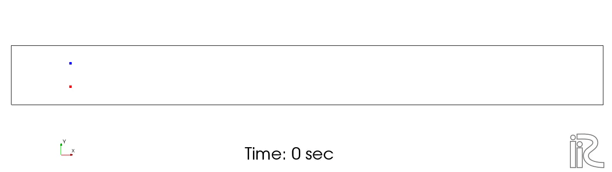

   : Particle animation by GELATO (with diffusion A=10)
