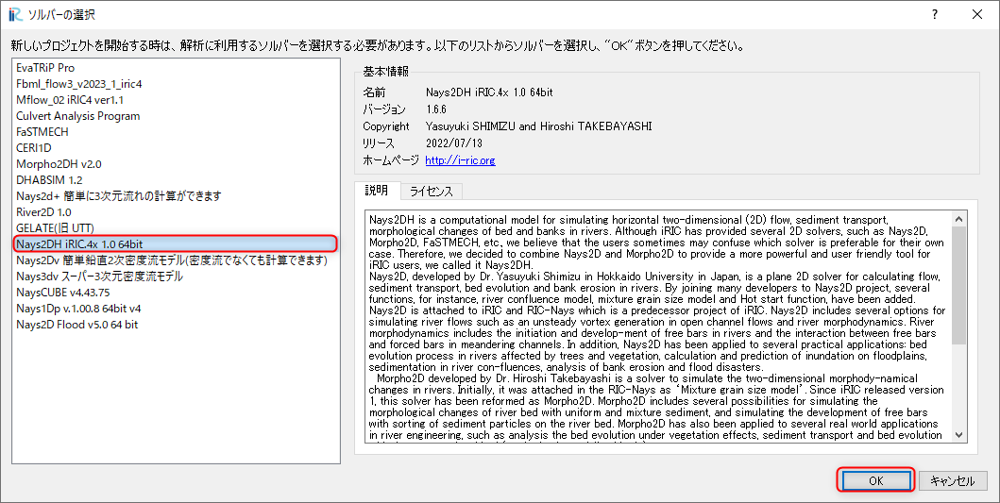
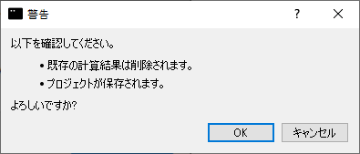

========================================================================================================================
[計算例 1] 直線水路におけるトレーサーの輸送
========================================================================================================================

Nays2DHによる流れの計算
========================================================================================================================

ソルバの選択
------------------------------------------------------------------------------------------------------------------------

iRICの起動画面から、[新しいプロジェクト]を選ぶと表示されるソルバの選択画面で、
[Nays2DH]を選んで[OK]ボタン押すと、

   : ソルバーの選択

「無題- iRIC 4.x.x.xxxx [Nays2DH iRIC4X 1.0 64bit]」と書かれた
Windowが現れる。

.. _01_mudai:

.. figure:: images/01/mudai.png 
   :width: 100%

   : Nays2DH起動画面

計算格子の作成
------------------------------------------------------------------------------------------------------------------------

:numref:`01_mudai` 
のウィンドウで、[格子]→[格子生成アルゴリズムの選択]から現れる、
「格子生成アルゴリズムの選択」ウィンドウ で[簡易直線・蛇行生成ツール]を選んで[OK]を押す。

.. _01_kanni:

.. figure:: images/01/kanni.png
  :width: 600pt

  : 格子生成アルゴリズムの選択

:numref:`01_koushi_1` の画面で、[水路形状]を選択し、下記のようにパラメーターを設定し、他はすべてデフォルトなので、[格子生成]をクリックする。

+----------------------------------+----------+
| 水路主要部の形状                 | 直線水路 |
+----------------------------------+----------+
| X方向長さもしくは流下方向延長(m) | 5        |
+----------------------------------+----------+
| X方向の格子数                    | 100      |
+----------------------------------+----------+
| Y方向長さもしくは水路幅(m)       | 0.5      |
+----------------------------------+----------+
| Y方向または横断方向格子数        | 20       |
+----------------------------------+----------+
| 主要部の河床勾配                 | 0.005    |
+----------------------------------+----------+
| 下流端の河床高(m)                | -0.5     |
+----------------------------------+----------+

.. _01_koushi_1:

.. figure:: images/01/koushi_1.png
   :width: 600pt

   :水路形状

すると、:numref:`01_koushi_3` 確認ウィンドウが現れるので,[はい(Y)]を押すと格子が生成され、
:numref:`01_koushi_4` が表示される。

.. _01_koushi_3:

.. figure:: images/01/koushi_3.png
   :width: 400pt

   :確認(マッピング)

.. _01_koushi_4:

.. figure:: images/01/koushi_4.png
   :width: 100%

   :格子生成完了

Nays2DHによる流れの計算条件の設定
------------------------------------------------------------------------------------------------------------------------

次に計算条件の設定を行う。メニューバーから[計算条件]→[設定]を選ぶと、
計算条件設定ウィンドウ :numref:`01_joken_1` が表示される。

.. _01_joken_1:

.. figure:: images/01/joken_1.png
   :width: 600pt

   :計算条件

:numref:`01_joken_2` の[境界条件]の[上流端流量と下流端水位の時間変化]で[Edit]をクリックして、流量ハイドログラフ入力ウィンドウ :numref:`01_joken_3` に移る。

.. _01_joken_2:

.. figure:: images/01/joken_2.png
   :width: 600pt

   :流量設定

.. _01_joken_3:

.. figure:: images/01/joken_3.png
   :width: 600pt

   :流量下流端水位設定ウィンドウ

:numref:`01_joken_3` において、[時間]、[流量]のハイドログラフを入力する。
ここでは、0～100秒まで、0.001㎥/sの一定流量を与える。設定が終わったら[OK]を押して
ウィンドウを閉じる。

.. _01_joken_4:

.. figure:: images/01/joken_4.png
   :width: 600pt

   :時間に関するパラメータ

[時間]を選択し、パラメーターは :numref:`01_joken_4` のように設定し、
[OK]をクリックする。

Nays2DHによる流れの計算実行
------------------------------------------------------------------------------------------------------------------------

| [計算]→[実行]を指定すると、 :numref:`01_keikoku` のようなダイアログが表示されるので、[OK]を選択しプロジェクトを適当な名前で保存する。
| この時プロジェクトはiproファイルで保存せずに必ずフォルダ(プロジェクトとして保存)で保存すること。

.. _01_keikoku:

   : 警告

計算中は :numref:`01_jikko` のような画面が表示され、計算が終了すると、 :numref:`01_keisan` のような画面が現れるので、[OK]を押して、計算は終了となる。

.. _01_jikko:

.. figure:: images/01/jikko.png
   :width: 100%

   :計算実行中の画面

.. _01_keisan:

.. figure:: images/01/keisan.png
   :width: 250pt

   :計算の終了

.. warning::
   計算が終わったら必ず :numref:`01_hozon` のメニューバーの「ファイル」→「保存」を選んで計算結果を保存すること。この結果は後に行うGELATOによる解析で重要となる。
   
   .. _01_hozon:

   .. figure:: images/01/hozon.png
      :width: 100%

      :計算結果の保存

計算結果の表示
------------------------------------------------------------------------------------------------------------------------

計算の終了後、[計算結果]→[新しい可視化ウィンドウ(2D)を開く]を選ぶことによって、可視化ウィンドウが現れる。

.. _01_kekka_0:

.. figure:: images/01/kekka_0.png
   :width: 100%

   : 計算結果の表示
 

流速ベクトルの表示
^^^^^^^^^^^^^^^^^^^^^^^^^^^^^^^^^^^^^^^^^^^^^^^^^^^^^^^^^^^^^^^^^^^^^^^^^^^^^^^^^^^^^^^^^^^^^^^^^^^^^^^^^^^^^^^^^^^^^^^^

オブジェクトブラウザーで、[ベクトル][Velocity]にチェックマーク入れて、
[ベクトル]をフォーカスさせてマウス右ボタン[プロパティ]をクリックすると、
「ベクトル設定」ウィンドウ :numref:`01_kekka_2` が現れる。ここで、赤線で
囲った部分の設定をして[OK]を
押すと :numref:`01_kekka_6` が表示される。:numref:`01_kekka_6` は水深平均流速ベクトル
である。等流状態で一様の流速分布となっている。 

.. _01_kekka_2:

.. figure:: images/01/kekka_2.png
   :width: 600pt

   : ベクトル設定
 
.. _01_kekka_6:

.. figure:: images/01/kekka_6.png
   :width: 100%

   : 水深平均流速ベクトル表示
 

パーティクルの表示
^^^^^^^^^^^^^^^^^^^^^^^^^^^^^^^^^^^^^^^^^^^^^^^^^^^^^^^^^^^^^^^^^^^^^^^^^^^^^^^^^^^^^^^^^^^^^^^^^^^^^^^^^^^^^^^^^^^^^^^^

オブジェクトブラウザーの「ベクトル」を一旦アンチェックし、「パーティクル」と「Velocity」
にチェックマークを入れる。( :numref:`01_kekka_9` )

.. _01_kekka_9:

.. figure:: images/01/kekka_9.png
   :width: 100%

   : パーティクル(1)
 
:numref:`01_kekka_10` のように「パーティクル」右クリックして「プロパティ」を選ぶと、

.. _01_kekka_10:

.. figure:: images/01/kekka_10.png
   :width: 100%

   : パーティクル(2)
 
:numref:`01_kekka_11` のような「パーティクルの設定」画面が現れるので、図の赤囲いのように
パーティクスの発生位置を指定する。

.. _01_kekka_11:

.. figure:: images/01/kekka_11.png
   :width: 600pt

   : パーティクルの設定
 
.. _01_kekka_12:

:numref:`01_kekka_11` に示すように、タームバーをゼロに戻し、メインメニューから、
「アニメーション」「開始/停止」を選ぶことにより、 :numref:`01_kekka_13` 
のようなパーティクルの動きが表示される。 

.. figure:: images/01/kekka_12.png
   :width: 100%

   : アニメーションの再生

.. _01_kekka_13:

.. figure:: images/01/nays2d_particle.gif
   :width: 70%

   : Nays2DHによるパーティクルアニメーション

:numref:`01_kekka_13` からわかるように、流れの計算結果をそのままパーティクル表示すると、乱流による乱れ成分が含まれていないので、**何の変哲も無い** 単純で退屈な
表示しかされない( ^^) _U~~

GELATOよるトレーサーの追跡
========================================================================================================================

GELATOの起動、格子のインポート
------------------------------------------------------------------------------------------------------------------------

iRICの起動画面から、[新しいプロジェクト]を選ぶと表示されるソルバの選択画面で、「GELATO ver2.x」を選んで、「OK」をクリックする。

.. figure:: images/01/GELATO/kido.png
   :width: 800pt

   : GELATOの選択と起動

GELATOセッションが開始され、「入力用CGNSファイルの選択」というダイアログが現れる。

.. figure:: images/01/GELATO/openning.png
   :width: 100%

   : GELATOの起動
  
:guilabel:`...` ボタンをクリックするとファイル選択ダイアログが表示されるので、先ほど計算したNays2DHの計算結果のCGNSファイルをボタンを押して選択する。

.. figure:: images/01/GELATO/import_grid.png
   :width: 100%

   : 計算結果CGNSの選択_1

するとダイアログに選択したCGNSファイルの情報が表示されるので、:guilabel:`OK` をクリックする。

.. figure:: images/01/GELATO/import_grid_2.png
   :width: 40%

   : 計算結果CGNSの選択_2

格子をインポートするかどうかを尋ねるダイアログが表示されるので、:guilabel:`はい` をクリックする。

.. figure:: images/01/GELATO/import_grid_3.png
   :width: 30%

   : 格子のインポート_1

以下のようなエラーが表示されるが、これは異なるソルバーの格子を読み込もうとすると必ず表示されるのものなので、気にせず :guilabel:`はい` をクリックする。

.. figure:: images/01/GELATO/import_grid_4.png
   :width: 40%

   : 格子のインポート_2

インポートが完了すると以下のようにインポートされた格子が表示される。

.. figure:: images/01/GELATO/import_grid_5.png
   :width: 100%

   : 格子インポート完了

2種のトレーサーの追跡(乱流拡散無し)
------------------------------------------------------------------------------------------------------------------------

計算条件の設定
^^^^^^^^^^^^^^^^^^^^^^^^^^^^^^^^^^^^^^^^^^^^^^^^^^^^^^^^^^^^^^^^^^^^^^^^^^^^^^^^^^^^^^^^^^^^^^^^^^^^^^^^^^^^^^^^^^^^^^^^

| メニューバーの :menuselection:`計算条件(C) --> 設定(S)` から、計算条件設定ウィンドウを開き、赤枠で囲った部分を以下のように設定する。
| その他の計算条件はデフォルトのままでよい。

.. figure:: images/01/GELATO/setting_1_1.png
   :width: 600pt

   : 計算条件設定_1

.. figure:: images/01/GELATO/setting_1_2.png
   :width: 600pt

   : 計算条件設定_2

.. figure:: images/01/GELATO/setting_1_3.png
   :width: 600pt

   : 計算条件設定_3

.. figure:: images/01/GELATO/setting_1_4.png
   :width: 600pt

   : 計算条件設定_4

.. figure:: images/01/GELATO/setting_1_5.png
   :width: 600pt

   : 計算条件設定_5

.. figure:: images/01/GELATO/setting_1_6.png
   :width: 600pt

   : 計算条件設定_6

計算の実行
^^^^^^^^^^^^^^^^^^^^^^^^^^^^^^^^^^^^^^^^^^^^^^^^^^^^^^^^^^^^^^^^^^^^^^^^^^^^^^^^^^^^^^^^^^^^^^^^^^^^^^^^^^^^^^^^^^^^^^^^

| メニューバーの :menuselection:`計算(C) --> 実行(R)` を選択すると、警告が現れるので適当な名前で保存する。
| このときの保存形式は[ファイルに保存(ipro)]か[プロジェクトとして保存]どちらでも良い。
| 保存が完了すると計算が開始され、以下のようなウィンドウが表示される。

.. figure:: images/01/GELATO/console.png
   :width: 100%

   : 計算実行中画面

| 計算が終了すると「ソルバーの計算が終了しました.」とダイアログが表示されるので、:guilabel:`OK` をクリックする。

計算結果の表示
^^^^^^^^^^^^^^^^^^^^^^^^^^^^^^^^^^^^^^^^^^^^^^^^^^^^^^^^^^^^^^^^^^^^^^^^^^^^^^^^^^^^^^^^^^^^^^^^^^^^^^^^^^^^^^^^^^^^^^^^

| メインメニューの :menuselection:`計算結果(R) --> 新しい可視化ウィンドウ(2D)を開く` を選択すると、二次元可視化ウィンドウがが表示される。
| オブジェクトブラウザーで :guilabel:`primary Nomal Tracers` と :guilabel:`secondary Nomal Tracers` の :guilabel:`スカラー` を右クリックし、 :guilabel:`プロパティ` を選択すると、以下のようなウィンドウが表示される。
| ここからパーティクルの色を変更できるので、プライマリーを赤、セカンダリーを青に変更する。

.. figure:: images/01/GELATO/particle_property.png
   :width: 600pt

   : パーティクルのプロパティ

| タイムステップを最初に戻し、メインメニューの :menuselection:`アニメーション(A) --> 開始/停止(S)` を選択すると、アニメーションが再生される。

.. figure:: images/01/GELATO/animation_start.png
   :width: 100%

   : アニメーションの再生

当然乱流拡散なしの計算なので、結果は以下のような単純なものとなる。

.. figure:: images/01/GELATO/A_0_animation.gif
   :width: 70%

   : GELATOによるパーティクルアニメーション(拡散なし)

2種のトレーサーの追跡(乱流拡散あり)
------------------------------------------------------------------------------------------------------------------------

計算条件の設定
^^^^^^^^^^^^^^^^^^^^^^^^^^^^^^^^^^^^^^^^^^^^^^^^^^^^^^^^^^^^^^^^^^^^^^^^^^^^^^^^^^^^^^^^^^^^^^^^^^^^^^^^^^^^^^^^^^^^^^^^
| このまま計算条件を変更し、乱流拡散を考慮した計算を行う。
| まず、メニューバーの :menuselection:`計算条件(C) --> 設定(S)` を選択し、以下のように設定する。

.. figure:: images/01/GELATO/setting_2_1.png
   :width: 600pt

   : 拡散に関する条件設定

計算の実行と結果の表示
^^^^^^^^^^^^^^^^^^^^^^^^^^^^^^^^^^^^^^^^^^^^^^^^^^^^^^^^^^^^^^^^^^^^^^^^^^^^^^^^^^^^^^^^^^^^^^^^^^^^^^^^^^^^^^^^^^^^^^^^
| この設定で計算を実行すると、以下のような結果が得られる。

.. figure:: images/01/GELATO/A_1_animation.gif
   :width: 70%

   : GELATOによるパーティクルアニメーション(拡散あり A=1)

| さらに、Aの値を10にすると以下のようになり、明らかに乱れの影響が大きくなる。

.. figure:: images/01/GELATO/A_10_animation.gif
   :width: 70%

   : GELATOによるパーティクルアニメーション(拡散あり A=10)

