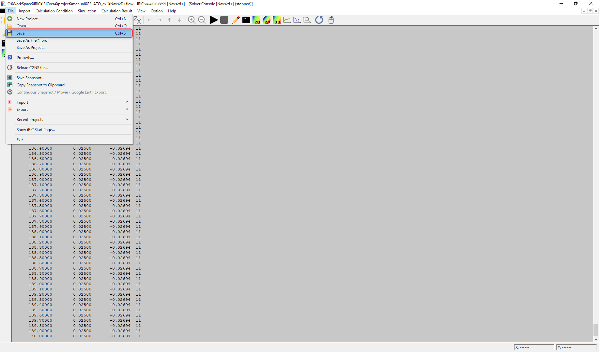
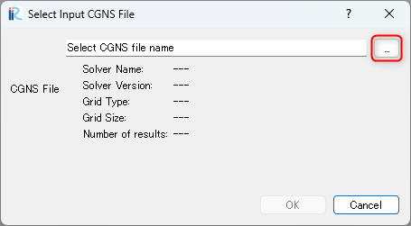
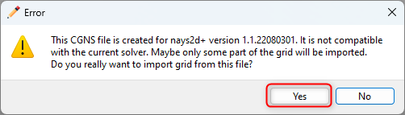
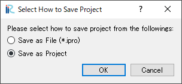
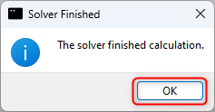

========================================================================================================================
[Example 2] Suspended Material Transport in a Simple Bed Flume
========================================================================================================================

In this section, we perform the following computations using a simple curved flume with straight inlet
out let parts.  The Cross section of the flume is composed with a compound channel in which both the low water 
channel and the flood plane with moveable bed.  Then flood plane is located only left side of the low water channel.
The experiment was carried out by `CTI Engineering Co. Ltd. <http://www.ctie.co.jp/english/>`_ on behalf of 
`Civil Engineering Research Institute of Cold Region <https://www.ceri.go.jp/english/index.html>`_ . 
A movie taken from a drone during the experiment is shown in :numref:`02_jikken`, and the
experimental condition and plane and cross sectional view pictures are shown in :numref:`02_heimen`. 

.. _02_jikken:

.. figure:: images/02/jikken.gif
   :align: center
   :width: 400pt

   : Experimental Video

.. _02_heimen:

.. figure:: images/02/heimen.png
   :align: center
   :width: 450pt

   : Flume Shape

The computational exercises in this section is conducted as the following procedure.

- Flow and bed deformation by Nays2DH until the bed reaches an equilibrium state
- Quasi 3-dimensional flow field by Nays2d+
- Tracer tracking by GELATO. Check the effect of turbulent diffusivity by changing parameter

Calculation of Flow and bed deformation by Nasy2DH
========================================================================================================================

Select a Solver
------------------------------------------------------------------------------------------------------------------------

From the iRIC startup screen, click [Create New Project], and select 
[Nays2DH iRIC4x 1.0 64bit] in the :numref:`02_Select_Nays2dh`.

.. _02_Select_Nays2dh:

.. figure:: images/01/Nays2DH/Select_Nays2dh.png
   :align: center
   :width: 600pt

   : Solver Selection

A window titled as"Untitled- iRIC 4.x.xxxx [Nays2DH iRIC4X 1.0 64bit]"appears.

.. _02_mudai:

.. figure:: images/01/Nays2DH/mudai.png 
   :align: center
   :width: 100%

   : Launch Nays2DH

Grid Creation 
------------------------------------------------------------------------------------------------------------------------

Select from the main menu [Grid]->[Select Algorithm]. Then a window appears as
:numref:`02_koshi1`, select [2d arc grid generator (Compound Channel)] and click
[OK].

.. _02_koshi1:

.. figure:: images/02/Nays2DH/koshi1.png 
   :align: center
   :width: 600pt

   : Select Algorithm to Create Computational Grid

In the [Groups] of the [Grid Creation] window, set parameters of,
[Channel shape], [Cross section], [Additional Channel] and [Roughness and 
fixed/moveable bed] as,
:numref:`02_koshi2` , 
:numref:`02_koshi3` ,
:numref:`02_koshi4` , and 
:numref:`02_koshi5` , respectively.

.. _02_koshi2:

.. figure:: images/02/Nays2DH/koshi2.png
   :align: center
   :width: 600pt

   : Grid Creating Condition(1)

.. _02_koshi3:

.. figure:: images/02/Nays2DH/koshi3.png
   :align: center
   :width: 600pt

   : Grid Creating Condition(2)  

.. _02_koshi4:

.. figure:: images/02/Nays2DH/koshi4.png 
   :align: center
   :width: 600pt

   : Grid Creating Condition(3)

.. _02_koshi5:

.. figure:: images/02/Nays2DH/koshi5.png
   :align: center
   :width: 600pt

   : Grid creating Condition(4)

When you finished all the settings of the grid creating condition, click [Create Grid] in the above 
grid creating condition windows, e.g. :numref:`02_koshi5`.
After clicking [Create Grid] button, you will be asked [Do you want to map?], then answer [Yes], and 
the computational grid is created.
( :numref:`02_mapping` )

.. _02_mapping:

.. figure:: images/02/Nays2DH/mapping.png
   :align: center
   :width: 400pt

   : Confirmation of mapping.

Put check marks in [Grid], [Cell Attributes] and [Fixed or Moveable bed] in the object browser, 
:numref:`02_koshi6` appears with the fixed bed part in red and the moveable bed part shown in blue. 

.. _02_koshi6:

.. figure:: images/02/Nays2DH/koshi6.png
   :align: center
   :width: 100%

   : Grid Shape with Fixed and Moveable bed Colored 

The red part of the fixed bed along the boundary between the low water channel and the flood plane is assumed 
to be a revetment, in this grid creating tool, however, since the revetment in the actual experiment is only 
the bend part plus short length of upstream and downstream. 
So, as shown in :numref:`02_koshi7`, focus [Fixed or Moveable bed], and right-click on a straight section of 
the revetment part (in this case, the red section upstream of grid number 101) and change the attribute to 
[Moveable bed], and press [OK].

.. _02_koshi7:

.. figure:: images/02/Nays2DH/koshi7.png
   :align: center
   :width: 100%

   : Change attribute from fixed bed to moveable bed

Since the downstream end is the fixed bed, set the attribute of the downstream end cells into [Fixed Bed],
by expanding and rotating, as demonstrated in :numref:`02_koshi8`.

.. _02_koshi8:

.. figure:: images/02/Nays2DH/koshi8.png
   :align: center
   :width: 100%

   : Change downstream end cell attribute to fixed bed

Setting Computational Condition
------------------------------------------------------------------------------------------------------------------------

Show the [Calculation Condition] window by selecting [Calculation Condition]->[Setting],
and in the [Group] of [Solver Type], [Boundary Condition], [Time] and [Bed Material]
, set the parameters, as
:numref:`02_joken1` , 
:numref:`02_joken2` ,
:numref:`02_joken3` , and 
:numref:`02_joken4`, respectively.

.. _02_joken1:

.. figure:: images/02/Nays2DH/joken1.png
   :align: center
   :width: 600pt

   : Calculation Condition(Solver TYpe)

.. _02_joken2:

.. figure:: images/02/Nays2DH/joken2.png
   :align: center
   :width: 600pt

   : Calculation Condition(Boundary Condition)

.. _02_joken3:

.. figure:: images/02/Nays2DH/joken3.png
   :align: center
   :width: 600pt

   : Calculation Condition(Tme)

.. _02_joken4:

.. figure:: images/02/Nays2DH/joken4.png
   :align: center
   :width: 600pt

   : Calculation Condition(Bed Material)

In addition, in the [Boundary Condition] setting of :numref:`02_joken2`, 
press [Edit] of [Time series of discharge at upstream end ......],
and set [Time] and [Discharge] hydrograph data in the [Time series of discharge at upstream end ......]
window as :numref:`02_joken5`, and press [OK].

.. _02_joken5:

.. figure:: images/02/Nays2DH/joken5.png
   :align: center
   :width: 600pt

   : Setting Discharge Hydrograph

When you finished the settings of all the computational condition parameters,
press [OK] in the [Calculation Condition] window.

Run Nays2DH
------------------------------------------------------------------------------------------------------------------------

Before executing the Nays2DH, select [File]->[Save as Project] and save the project. 
Here we save the project as a name of [Nays2DH_flow_bed] (:numref:`02_save_project`)

.. _02_save_project:

.. figure:: images/02/Nays2DH/save_project.png
   :align: center
   :width: 600pt

   : Save Project

From the main menu, when you select [Simulation]->[Run], you will get the message like :numref:`02_jikko1` . Then press [OK], save as a project, and the computation starts running as :numref:`02_jikko2`.

.. _02_jikko1:

.. figure:: images/01/warning.png
   :align: center
   :width: 400pt

   : "warning"

.. _02_jikko2:

.. figure:: images/02/Nays2DH/jikko2.png
   :align: center
   :width: 100%

   : "Nays2DH is running"
 
When the computation finished, save the results by selecting [Calculation Result]->[Save], from the main menu.

Display the Calculation Results
------------------------------------------------------------------------------------------------------------------------

Open a [Post Processing Window] by selecting [Calculation Result]->[Open new 2D Post-Processing Window] as
:numref:`02_hyoji1-0`.   

.. _02_hyoji1-0:

.. figure:: images/02/Nays2DH/hyoji1-0.png
   :align: center
   :width: 100%

   : Open Post Processing Window

In the object browser of the [Post Processing Window], put check marks in 
[iRICZone], [Scalar(node)] and [ElevationChange(m)], 
right click [ElevationChange(m)] to show [Property] and press it, 
open [Scalar Settings], and set parameters as :numref:`02_hyoji1`.

.. _02_hyoji1:

.. figure:: images/02/Nays2DH/hyoji1.png
   :align: center
   :width: 70%

   : "Scalar Setting"

In the object browser, put check marks in [Arrow] and [Velocity(m)], 
right click [Arrow], show [Property] and press it, open [Arrow Setting Window]
as :numref:`02_hyoji2`, and set parameters as marked with red squares in the 
:numref:`02_hyoji2`.

.. _02_hyoji2:

.. figure:: images/02/Nays2DH/hyoji2.png
   :align: center
   :width: 70%

   : [Arrow Settings]

Put the [Time Scale Bar] back to zero, select [Animation]->[Start/Stop] to
start animation as :numref:`02_hyoji3`.

.. _02_hyoji3:

.. figure:: images/02/Nays2DH/hyoji3.png
   :align: center
   :width: 100%

   : [Launch Animation]

As shown in :numref:`02_hyoji4`, it is shown that the bed elevation change reached an equilibrium.

.. _02_hyoji4:

.. figure:: images/02/Nays2DH/hyoji4.gif
   :align: center
   :width: 100%

   : Animation of velocity vectors and bed elevation changes

Export the Computational Results
------------------------------------------------------------------------------------------------------------------------

In order to use the calculated bed elevation as an boundary conditions for the quasi-3D flow calculation 
by Nays2d+ in the next section, we export the calculated results to a text file.
As shown in :numref:`02_export`, select [File]->[Export]->[Calculation Result].

.. _02_export:

.. figure:: images/02/Nays2DH/export.png
   :align: center
   :width: 100%

   : Exporting Computational Results(1)

When the [Export Calculation Result] setting window (:numref:`02_export2`) is appeared, 
choose [Format] as [Topography Files(\*.tpo)].

.. _02_export2:

.. figure:: images/02/Nays2DH/export2.png
   :align: center
   :width: 300pt

   : Exporting Computational Results(2)

The output folder can be any name, and uncheck the checkbox at [All time steps],
and set [Start] and [End] as 10,800.
Then click [OK] to complete the export of the calculation Results
:numref:`02_export3`. 

.. _02_export3:

.. figure:: images/02/Nays2DH/export3.png
   :align: center
   :width: 300pt

   : Exporting Computational Results(3)

The exported calculation results are stored in the specified folder.
As shown in :numref:`02_export4`, many files contain different values as water depth, 
velocity, sediment transport rate, riverbed elevations, and so on, however, since only 
the riverbed elevation is used for the flow calculations in the next section, 
all files except [Result_1_Elevation(m).tpo] can be deleted.

.. _02_export4:

.. figure:: images/02/Nays2DH/export4.png
   :align: center
   :width: 600pt

   : Exporting Computational Results(4)

.. _02_Flow_Calculation_by_Nays2d+:

Quasi-3D Flow Calculation by Nays2d+
========================================================================================================================

Selecting a Solver
------------------------------------------------------------------------------------------------------------------------

From the iRIC startup screen, click [Create New Project], and select 
[Nays2d+] in the :numref:`02_select2`, and press [OK].

.. _02_select2:

.. figure:: images/02/Nays2D+/select2.png
   :align: center
   :width: 450pt

   : Solver selection of Nays2d+

Importing Computational Grid, Channel Bed Elevation and Mapping
------------------------------------------------------------------------------------------------------------------------

Importing Grid
^^^^^^^^^^^^^^^^^^^^^^^^^^^^^^^^^^^^^^^^^^^^^^^^^^^^^^^^^^^^^^^^^^^^^^^^^^^^^^^^^^^^^^^^^^^^^^^^^^^^^^^^^^^^^^^^^^^^^^^^

From the main menu, select [Import]->[Grid], and choose [Case1.cgn] in the folder of [Nays2DH_floe_bed] which 
was created in the previous section.  While importing, a warning as 
:numref:`02_koshi10` is coming out, press [Yes], and complete importing grid (:numref:`02_koshi11`).

.. _02_koshi10:

.. figure:: images/02/Nays2D+/koshi10.png
   :align: center
   :width: 400pt

   : [Warning]

.. _02_koshi11:

.. figure:: images/02/Nays2D+/koshi11.png
   :align: center
   :width: 100%

   : [Grid import complete]

Import Bed Elevation
^^^^^^^^^^^^^^^^^^^^^^^^^^^^^^^^^^^^^^^^^^^^^^^^^^^^^^^^^^^^^^^^^^^^^^^^^^^^^^^^^^^^^^^^^^^^^^^^^^^^^^^^^^^^^^^^^^^^^^^^

From the main menu, select [Import]->[Geographic Data]->[Elevation](:numref:`02_import2`).

.. _02_import2:

.. figure:: images/02/Nays2D+/import2.png
   :align: center
   :width: 100%

   : Import Elevation

In the import file selection window, :numref:`02_import3`, assign the file [Results_1_Elevation(m).tpo], 
which was exported from Nays2DH calculated results in the previous section.

.. _02_import3:

.. figure:: images/02/Nays2D+/import3.png
   :align: center
   :width: 600pt

   : Select bed elevation file to import

:numref:`02_import4` appears, but if there is no particular need to thin out the data, 
you can leave it as it is, and press [OK] to complete the import the [Bed Elevation]
(:numref:`02_import5`).

.. _02_import4:

.. figure:: images/02/Nays2D+/import4.png
   :align: center
   :width: 50%

   : Import Bed Elevation (Setting Thinning)

.. _02_import5:

.. figure:: images/02/Nays2D+/import5.png
   :align: center
   :width: 100%

   : Bed Elevation Data Import Completed

Execute Mapping
^^^^^^^^^^^^^^^^^^^^^^^^^^^^^^^^^^^^^^^^^^^^^^^^^^^^^^^^^^^^^^^^^^^^^^^^^^^^^^^^^^^^^^^^^^^^^^^^^^^^^^^^^^^^^^^^^^^^^^^^

The imported bed elevation data is mapped onto the imported computational grid.
Select [Grid]->[Attribute Mapping]->[Execute] as :numref:`02_mapping2`.

.. _02_mapping2:

.. figure:: images/02/Nays2D+/mapping2.png
   :align: center
   :width: 100%

   : "Execute Mapping"

As :numref:`02_mapping3`, you will be asked which [Geographic Data] to be mapped.
Put check mark in the box of [Elevation(m)], and press [OK].

.. _02_mapping3:

.. figure:: images/02/Nays2D+/mapping3.png
   :align: center
   :width: 200pt

   : Selection of the Mapping Item

When the mapping is completed, press [OK] as :numref:`02_mapping4`.

.. _02_mapping4:

.. figure:: images/02/Nays2D+/mapping4.png
   :align: center
   :width: 250pt

   : Mapping Completed

Setting Calculation Condition for Nays2d+
------------------------------------------------------------------------------------------------------------------------

In the window of [Calculation Condition] which appears when you select [Calculation Condition]->[Setting],
set parameters in the [Groups] of [Discharge and downstream water surface elevation], 
[Time and bed erosion parameters], [Boundary Condition], [Other computational parameters] and
[3D Velocity Profile] as,  
:numref:`02_joken6`, 
:numref:`02_joken7`,
:numref:`02_joken8`,
:numref:`02_joken9`, and
:numref:`02_joken10`, respectively.

.. _02_joken6:

.. figure:: images/02/Nays2D+/joken6.png
   :align: center
   :width: 100%

   : Discharge and downstream water surface elevation

.. _02_joken7:

.. figure:: images/02/Nays2D+/joken7.png
   :align: center
   :width: 100%

   : Time and bed erosion parameters

.. _02_joken8:

.. figure:: images/02/Nays2D+/joken8.png
   :align: center
   :width: 100%

   : Boundary Condition

.. _02_joken9:

.. figure:: images/02/Nays2D+/joken9.png
   :align: center
   :width: 100%

   : Other computational parameters

.. _02_joken10:

.. figure:: images/02/Nays2D+/joken10.png
   :align: center
   :width: 100%

   : 3D Velocity Profile

In addition, while in the settings of the [Discharge and downstream water surface elevation], 
:numref:`02_joken6`,  press [Edit] and set discharge data in in the 
[Time series of discharge and downstream stare] setting window as 
:numref:`02_joken11`.

.. _02_joken11:

.. figure:: images/02/Nays2D+/joken11.png
   :align: center
   :width: 100%

   : Setting the time series of discharge Data

When you finish setting all the calculation condition, press [OK] in the
[Calculation Condition] window. 

Execute Nays2d+
------------------------------------------------------------------------------------------------------------------------

We will skip the explanation of how to executing Nays2d+ because it is exactly same as other
solvers.  However, it is recommended that you save the project before running the calculation. 
In this case, we save the file to a project named [Nays2d+Flow].

.. _02_save_project2:

.. figure:: images/02/Nays2D+/save_project2.png
   :align: center
   :width: 100%

   : Save project(Nays2d+Flow)

The results are saved in a CGNS file named [Case1.cgn], which will be used for the tracer tracking 
computation of GELATO as input data.  Be sure to save the result using 
[Calculation Result]->[Save] even when the calculation is finished.
(:numref:`02_jikko4`).

.. _02_jikko4:

   : Save the Results of the Computation (Don't Forget!)

Tracer Tracking Calculation by GELATO
========================================================================================================================

Launching GELATO and Importing Grid
------------------------------------------------------------------------------------------------------------------------

From the iRIC startup screen, select [Create New Project], and in the solver selection screen that appears, select "GELATO ver2.x" and click "OK".

.. figure:: images/01/GELATO/kido.png
   :width: 800pt

   : Selecting and Launching GELATO

A GELATO session starts, and a dialog titled "Select CGNS file for input" appears.

.. figure:: images/01/GELATO/openning.png
   :width: 100%

   : Launching GELATO
  
Click the :guilabel:`...` button to display the file selection dialog, and select the CGNS file of the calculation result of [Nays2d+Flow] calculated earlier.

.. figure:: images/02/GELATO/import_grid_1.png
   :width: 80%

   : Selecting Calculation Result CGNS_1

The information of the selected CGNS file is displayed in the dialog, so click :guilabel:`OK`.

.. figure:: images/02/GELATO/import_grid_2.png   
   :width: 30%

   : Selecting Calculation Result CGNS_2

A dialog asking whether to import the grid appears, so click :guilabel:`Yes`.

.. figure:: images/01/GELATO/import_grid_3.png
   :width: 30%

   : Importing Grid_1

An error like the one below will be displayed, but this always appears when trying to load the grid of a different solver, so click :guilabel:`Yes` without worrying about it.

.. figure:: images/02/GELATO/import_grid_3.png
   :width: 40%

   : Importing Grid_2

When the import is complete, the imported grid is displayed as shown below.

.. figure:: images/02/GELATO/import_grid_4.png
   :width: 100%

   : Grid Import Complete

Tracer Tracking Calculation by GELATO
------------------------------------------------------------------------------------------------------------------------

Setting Calculation Conditions
^^^^^^^^^^^^^^^^^^^^^^^^^^^^^^^^^^^^^^^^^^^^^^^^^^^^^^^^^^^^^^^^^^^^^^^^^^^^^^^^^^^^^^^^^^^^^^^^^^^^^^^^^^^^^^^^^^^^^^^^
| Open the calculation condition setting window from the menu bar :menuselection:`Calculation Condition(C) --> Setting(S)` and set the parts enclosed in red as follows.
| Other calculation conditions can be left as default.

.. figure:: images/02/GELATO/setting_1_1.png
   :width: 60%

   : Setting Calculation Conditions_1

.. figure:: images/02/GELATO/setting_1_2.png
   :width: 60%

   : Setting Calculation Conditions_2

.. figure:: images/02/GELATO/setting_1_3.png
   :width: 60%

   : Setting Calculation Conditions_3

.. figure:: images/02/GELATO/setting_1_4.png
   :width: 60%

   : Setting Calculation Conditions_4

.. figure:: images/02/GELATO/setting_1_5.png
   :width: 60%

   : Setting Calculation Conditions_5

.. note::
   In Setting Calculation Conditions_2, if you change :guilabel:`X-axis velocity (m/s)` and :guilabel:`Y-axis velocity (m/s)` to :guilabel:`SurfaceVelocityX` and :guilabel:`SurfaceVelocityY`, it is possible to track tracers using surface velocity or bottom velocity.

Executing Calculation
^^^^^^^^^^^^^^^^^^^^^^^^^^^^^^^^^^^^^^^^^^^^^^^^^^^^^^^^^^^^^^^^^^^^^^^^^^^^^^^^^^^^^^^^^^^^^^^^^^^^^^^^^^^^^^^^^^^^^^^^

| Select :menuselection:`Calculation(C) --> Execute(R)` from the menu bar, a warning will appear, so save it with an appropriate name.
| The save format at this time can be either [Save to file (ipro)] or [Save as project].
| When the save is complete, the calculation starts, and a window like the one below is displayed.

.. figure:: images/02/GELATO/console.png
   :width: 100%

   : Calculation Execution Screen

| When the calculation is finished, a dialog saying "Solver calculation is finished." will be displayed, so click :guilabel:`OK`.

Displaying Calculation Results
^^^^^^^^^^^^^^^^^^^^^^^^^^^^^^^^^^^^^^^^^^^^^^^^^^^^^^^^^^^^^^^^^^^^^^^^^^^^^^^^^^^^^^^^^^^^^^^^^^^^^^^^^^^^^^^^^^^^^^^^

| Select :menuselection:`Calculation Result(R) --> Open new visualization window (2D)` from the main menu, and a two-dimensional visualization window will be displayed.

.. figure:: images/02/GELATO/visualization.png
   :width: 100%

   : Visualization Window

| Since the orientation is opposite to the experimental image shown at the beginning of this chapter :numref:`02_jikken`, click the 90° rotation mark indicated by the arrow in the image below twice to rotate it 180°.

.. figure:: images/02/GELATO/rotate.png
   :width: 100%

   : Image Rotation

| The time display is very small and hard to see, so right-click [Time] in the object browser, display [Time Settings] from [Properties], and appropriately increase the font size.

.. figure:: images/02/GELATO/time_size_setting.png
   :width: 100%

   : Time Display Settings

| Return the time step to the beginning, and select :menuselection:`Animation(A) --> Start/Stop(S)` from the main menu to play the animation.

.. figure:: images/02/GELATO/animation_start.png
   :width: 100%

   : Playing Animation

| It can be seen that the tracer flows in a linear fashion without much diffusion.

.. figure:: images/02/GELATO/A_0_animation.gif
   :width: 70%

   : Tracer Animation (Turbulent Diffusion Intensity A=0)

Comparison of Different Turbulent Diffusion Intensities
^^^^^^^^^^^^^^^^^^^^^^^^^^^^^^^^^^^^^^^^^^^^^^^^^^^^^^^^^^^^^^^^^^^^^^^^^^^^^^^^^^^^^^^^^^^^^^^^^^^^^^^^^^^^^^^^^^^^^^^^
| Change the calculation conditions as they are and perform calculations considering turbulent diffusion.
| It is convenient to save each calculation project with a different name.
| First, select :menuselection:`Calculation Condition(C) --> Setting(S)` from the menu bar and set it as follows.

.. figure:: images/02/GELATO/setting_2_1.png
   :width: 60%

   : Setting Calculation Conditions_1

| When you execute the calculation with this setting, the following result is obtained.

.. figure:: images/02/GELATO/A_1_animation.gif
   :width: 70%

   : Tracer Animation (Turbulent Diffusion Intensity A=1)

| Similarly, try random walks with [A=5], [A=10], and [A=50]...

.. figure:: images/02/GELATO/A_5_animation.gif
   :width: 70%

   : Tracer Animation (Turbulent Diffusion Intensity A=5)

.. figure:: images/02/GELATO/A_10_animation.gif
   :width: 70%

   : Tracer Animation (Turbulent Diffusion Intensity A=10)

.. figure:: images/02/GELATO/A_50_animation.gif
   :width: 70%

   : Tracer Animation (Turbulent Diffusion Intensity A=50)

Comparing with :numref:`02_jikken`, it can be seen that the feeling is around [A=10].

Tracer Cloning
^^^^^^^^^^^^^^^^^^^^^^^^^^^^^^^^^^^^^^^^^^^^^^^^^^^^^^^^^^^^^^^^^^^^^^^^^^^^^^^^^^^^^^^^^^^^^^^^^^^^^^^^^^^^^^^^^^^^^^^^
| Select :menuselection:`Calculation Condition(C) --> Setting(S)` from the menu bar and set it as follows.
| Since other calculation conditions are the same as when calculating [A=10], it is good to copy the project and change only the following parts.

.. figure:: images/02/GELATO/setting_3_1.png
   :width: 60%

   : Setting Calculation Conditions_1

| When you execute the calculation again, the following result is obtained.

.. figure:: images/02/GELATO/A_10_clone_animation.gif
   :width: 70%

   : Tracer Clone Display (Up to 20 Generations, A=10)

| The diffusion range of the tracer is close to the diffusion range of the green dye in the experimental video of :numref:`02_jikken`.
| Here, if you check :guilabel:`Primary Normal Tracers` -> :guilabel:`Scalar` -> :guilabel:`Generation(Primary)` in the object browser, the generation will be displayed.
| When you display this as an animation, it looks like the following.

.. figure:: images/02/GELATO/A_10_clone_generation_animation.gif
   :width: 70%

   : Tracer Clone Display (Up to 20 Generations, A=10, Generation Display)

| As mentioned in " :ref:`cloning00` ", the actual weight is :math:`W=0.00195` for the 10th generation and :math:`W=0.00000195` for the 20th generation, so the concentration of tracers such as green, yellow, and red is logarithmically lower than the blue-based tracers in the center.
| Next, visualize the actual concentration by multiplying the number of tracers in the grid by the weight.

1. In the object browser, uncheck :guilabel:`Primary Normal Tracers` -> :guilabel:`Scalar`, and check :guilabel:`Scalar (Cell Center)` -> :guilabel:`Weighted Particle Number (Primary)`.

   .. figure:: images/02/GELATO/scalar_setting_3_1.png
      :width: 100%

      : Scalar Setting_1

2. Right-click :guilabel:`Weighted Particle Number (Primary)` and select :guilabel:`Properties`.

   .. figure:: images/02/GELATO/scalar_setting_3_2.png
      :width: 40%

      : Scalar Setting_2

1. In the [Scalar Settings] window, set it as follows and click :guilabel:`OK`.

   .. figure:: images/02/GELATO/scalar_setting_3_3.png
      :width: 60%

      : Scalar Setting_3

When you play the animation, it looks like the following.

.. figure:: images/02/GELATO/A_10_clone_weighted_animation.gif
   :width: 70%

   : Tracer Clone Display (Up to 20 Generations, A=10, Weighted Display)

Visualization of Flow Using Tracer Clones
------------------------------------------------------------------------------------------------------------------------
| An example of flow visualization using the tracer clone tool is shown.
| Select :menuselection:`Calculation Condition(C) --> Setting(S)` from the menu bar and set it as follows.
| Since other calculation conditions are the same as when calculating [A=10], it is good to copy the project and change only the following parts.

.. figure:: images/02/GELATO/setting_4_1.png
   :width: 60%

   : Setting Calculation Conditions_1

.. figure:: images/02/GELATO/setting_4_2.png
   :width: 60%

   : Setting Calculation Conditions_2

| After setting, check :guilabel:`Primary Normal Tracers` -> :guilabel:`Scalar`, uncheck :guilabel:`Scalar (Cell Center)` -> :guilabel:`Weighted Particle Number (Primary)`, and play the animation, it looks like the following.

.. figure:: images/02/GELATO/A_10_clone_visualization_animation.gif
   :width: 60%

   : Flow Visualization Using Tracers

Fish Swimming Simulation
------------------------------------------------------------------------------------------------------------------------
| Select :menuselection:`Calculation Condition(C) --> Setting(S)` from the menu bar and set it as follows.

.. figure:: images/02/GELATO/setting_5_1.png
   :width: 60%

   : Setting Calculation Conditions_1

.. figure:: images/02/GELATO/setting_5_2.png
   :width: 60%

   : Setting Calculation Conditions_2

.. figure:: images/02/GELATO/setting_5_3.png
   :width: 60%

   : Setting Calculation Conditions_3

| When you click :guilabel:`Edit` in the fish movement characteristics list, an edit dialog is displayed.
| You can add groups by clicking :guilabel:`Add` and enter parameters for each, but it is cumbersome, so this time we will read and input the parameters from a csv file where the parameters are saved. The csv data ( :file:`fish_data.csv` ) can be downloaded from here : `fish_data.csv <https://i-ric.org/download/gelato-v2-0-fish_data/>`_.
|
| When you click :guilabel:`Import`, a file selection dialog is displayed, so select :file:`fish_data.csv`.

.. figure:: images/02/GELATO/setting_5_4.png
   :width: 60%

   : Setting Calculation Conditions_4

.. note::
   This csv file can be created by exporting what was entered on iRIC, or it can be created using a macro for Microsoft Excel that can easily create fish setting files (\*.csv).
   This macro can be downloaded `here <https://i-ric.org/download/gelato_fishfilemaker/>`_.

| When the reading is complete, the fish movement characteristics are displayed as follows.

.. figure:: images/02/GELATO/setting_5_5.png
   :width: 60%

   : Setting Calculation Conditions_5 (List Display)

.. figure:: images/02/GELATO/setting_5_6.png
   :width: 100%

   : Setting Calculation Conditions_5 (Table Format)

When you save the calculation conditions and execute the calculation, the following result is obtained.

.. figure:: images/02/GELATO/fish_animation.gif
   :width: 60%

   : Fish Swimming Simulation
  
Driftwood Tracking by NaysDW2 and Visualization
========================================================================================================================

In this section, driftwood tracking simulation by NaysDW2 (Nays Driftwood 2D) is shown.

Select a Solver
------------------------------------------------------------------------------------------------------------------------

From the iRIC startup screen, click [Create New Project], and select [NaysDw2(Simple 2D Driftwood Tracker)] as shown in :numref:`02_select_Dw2`, and press [OK].

.. _02_select_Dw2:

.. figure:: images/02/NaysDw2/select_Dw2.png
   :align: center
   :width: 600pt

   : Selecting [NaysDw2] (Simple 2D Driftwood Tracker)

Select the flow calculation project
------------------------------------------------------------------------------------------------------------------------

As shown in :numref:`02_select_project1`, click [...] and select CGNS files that calculated Nays2D+ project in " :ref:`02_Flow_Calculation_by_Nays2d+` "

.. _02_select_project1:

   : [Select CGNS(1)]

.. _02_select_project2:

.. figure:: images/02/NaysDw2/select_project_02.png
   :align: center
   :width: 600pt

   : [Select CGNS(2)]

When you select a CGNS file, the specifications of the selected project will be displayed, such as :numref:`02_select_project3` . Then, go ahead and click [OK].

.. _02_select_project3:

.. figure:: images/02/NaysDw2/select_project_03.png
   :align: center
   :width: 400pt

   : [Select CGNS(3)]

So, you will be asked whether to import the grid, so click [Yes] ( :numref:`02_select_project4` ). 

.. _02_select_project4:

.. figure:: images/02/NaysDw2/select_project_04.png
   :align: center
   :width: 300pt

   : [Select CGNS(4)]

| Then A warning, as shown in :numref:`02_import8` , will then appear, but simply ignore it and click [Yes] again. 
| This will complete the grid import process, as shown in :numref:`02_import9` .

.. _02_import8:

   : [Warning Message]

.. _02_import9:

.. figure:: images/02/NaysDw2/import9.png
   :align: center
   :width: 100%

   : [Grid Import complete]

Setting Condition
------------------------------------------------------------------------------------------------------------------------

From the main menu, select [Calculation Condition]->[Setting],and set the calculation condition 
as follows.

Set other parameters as :numref:`02_dw1` ~ :numref:`02_dw4`

.. _02_dw1:

.. figure:: images/02/NaysDw2/dw1.png
   :align: center
   :width: 600pt

   : Other settings in [Basic Setting]

.. _02_dw2:

.. figure:: images/02/NaysDw2/dw2.png
   :align: center
   :width: 600pt

   : Other settings in [Driftwood feeding condition]

.. _02_dw3:

.. figure:: images/02/NaysDw2/dw3.png
   :align: center
   :width: 600pt

   : [Driftwood Feeding Condition]

.. _02_dw4:

.. figure:: images/02/NaysDw2/dw4.png
   :align: center
   :width: 600pt

   : [DEM Coefficients]

Run Driftwood Simulation
------------------------------------------------------------------------------------------------------------------------

From the main menu, select [Simulation]->[Run] as :numref:`02_dw6`. 

.. _02_dw6:

.. figure:: images/02/NaysDw2/dw6.png
   :align: center
   :width: 100%

   : [Simulation]->[Run]

When you are asked as :numref:`02_dw7`, press [Yes] and save the project.

.. _02_dw7:

.. figure:: images/01/warning.png
   :align: center
   :width: 400pt

   : warning

As :numref:`02_dw8`, when you are asked [How to save the project], in this example,
select [Save as project], and press [OK]. Choose an empty folder to save project, and
press [Select Folder].

.. _02_dw8:

   : [How to save project]

.. _02_dw9:

When the calculation starts, :numref:`02_dw10` is displayed, and
:numref:`02_dw11` is appear when the calculation ends. 
Then click [OK] to finish calculation. 

.. _02_dw10:

.. figure:: images/02/NaysDw2/dw10.png
   :align: center
   :width: 100%

   : Solver Running 

.. _02_dw11:

   : Calculation finished

Visualization of driftwood motion
------------------------------------------------------------------------------------------------------------------------

From the main menu, select [Calculation Result]->[Open New 2D Post-processing Window] as :numref:`02_dw12`.

.. _02_dw12:

.. figure:: images/02/NaysDw2/dw12.png
   :align: center
   :width: 100%

   : Open New 2D Post-processing Window

In the [Object Browser] of :numref:`02_dw13`, put check marks in the boxes at [iRICZone], [Scalar] and [Velocity(magnitude)], right click [Velocity(magnitude)] and choose [Property]. 

.. _02_dw13:

.. figure:: images/02/NaysDw2/dw13.png
   :align: center
   :width: 100%

   : Scalar Setting(1)

Set the parameters for [Scalar Settings] as :numref:`02_dw14`, and press [OK]. 

.. _02_dw14:

.. figure:: images/02/NaysDw2/dw14.png
   :align: center
   :width: 600pt

   : Scalar Setting(2)

Set the time bar back to zero, and select [Animation]->[Start/Stop] from the main menu bar
as :numref:`02_dw15`, and start animation as :numref:`02_dw16`

.. _02_dw15:

.. figure:: images/02/NaysDw2/dw15.png
   :align: center
   :width: 100%

   : Start Animation

.. _02_dw16:

.. figure:: images/02/NaysDw2/dw.gif
   :align: center
   :width: 80%

   : Driftwood Tracking Animation

