========================================================================================================================
[計算例 2] 単純な湾曲水路の浮遊物追跡
========================================================================================================================

:numref:`02_jikken` に示すような直線+湾曲+直線水路実験の流量解析およびトレーサーの追跡計算を行う。
この実験は水路全幅約1.8mで、左岸側半分が高水敷、右岸側半分が低水路の複断面水路で、右岸側のみが
移動床となっている。平面形状および断面形状の概略を :numref:`02_heimen` に示す。
この実験は `寒地土木研究所 <https://www.ceri.go.jp/>`_ の委託により。
`(株)建設技術研究所 <http://www.ctie.co.jp/>`_ によって行われたものである。

.. _02_jikken:

.. figure:: images/02/jikken.gif
   :width: 400pt

   : 実験状況の動画

.. _02_heimen:

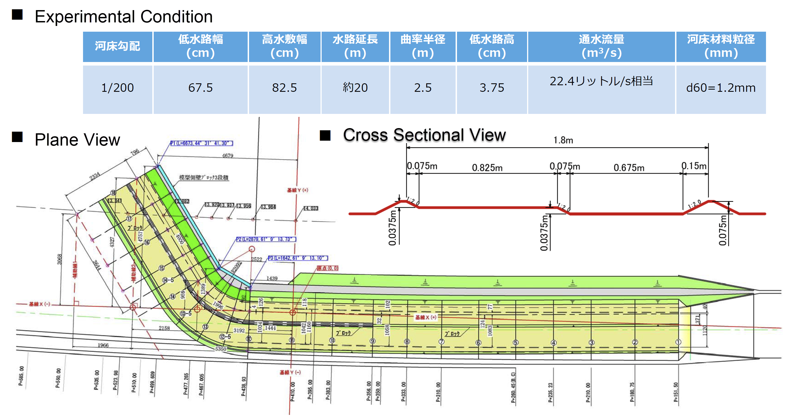

   : 実験水路の形状

以下の計算事例では以下の手順で計算を実施する。

(1) Nays2DHにより河床変動計算を実施し、河床変動がほぼ定常に達すた状態の河床形状を得る。
(2) Nays2d+により準3次元流れ場の計算をする。
(3) GELATOによりトレーサーの追跡を行う。乱流拡散強度パラーメーターを変更してその影響を比較する。

Nays2DHによる流れと河床変動の計算
========================================================================================================================

ソルバの選択
------------------------------------------------------------------------------------------------------------------------

iRICの起動画面から、[新しいプロジェクト]を選ぶと表示されるソルバの選択画面で、
[Nays2DH]を選んで[OK]ボタン押すと、

.. figure:: images/01/Select_Nays2DH.png
   :width: 600pt

   : ソルバーの選択

「無題- iRIC 4.x.x.xxxx [Nays2DH iRIC3X 1.0 64bit]」と書かれた
Windowが現れる。

.. _02_mudai:

.. figure:: images/01/mudai.png 
   :width: 100%

   : 無題

計算格子の作成
------------------------------------------------------------------------------------------------------------------------

[格子]->[格子生成アルゴリズムの選択]で現れるウィンドウで、
[2次元単純円弧格子作成ツール(複断面対応版)]を選んで[OK]を押す。
(:numref:`02_koshi1` )

.. _02_koshi1:

.. figure:: images/02/Nays2DH/koshi1.png 
   :width: 600pt

   : 格子生成アルゴリズムの選択

[格子生成]のグループ[水路形状]、[断面形状]、[追加水路]、[粗度と河床状態]を
それぞれ、
:numref:`02_koshi2` 、
:numref:`02_koshi3` ,
:numref:`02_koshi4` ,
:numref:`02_koshi5` 
のようにパラメータを設定して、最後に[格子生成]を押す。

.. _02_koshi2:

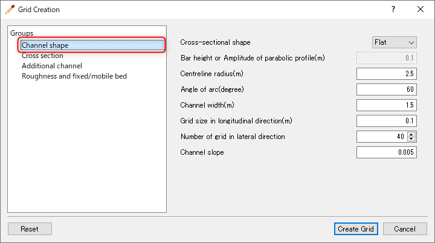

   : 格子生成(1)

.. _02_koshi3:

.. figure:: images/02/Nays2DH/koshi3.png
   :width: 400pt

   : 格子生成(2)  

.. _02_koshi4:

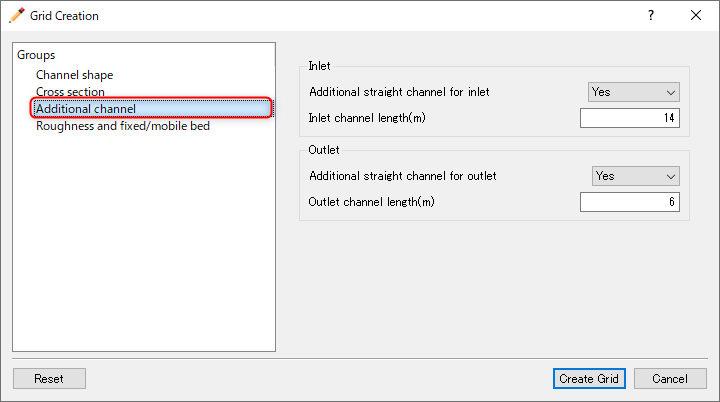

   : 格子生成(3)

.. _02_koshi5:

.. figure:: images/02/Nays2DH/koshi5.png
   :width: 400pt

   : 格子生成(4)

「マッピングを実行しますか？」と聞かれるので[はい(Y)]を押す。
( :numref:`02_mapping` )

.. _02_mapping:

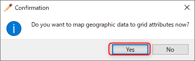

   : 確認

オブジェクトブラウザーの[格子][セルの属性][固定床と移動床]にチェックマークを入れると、
:numref:`02_koshi6` のように固定床部分が赤、移動床部分が青で示された
格子の図が示される。

.. _02_koshi6:

.. figure:: images/02/Nays2DH/koshi6.png
   :width: 100%

   : 固定床と移動床

低水路と高水敷の境界の固定床は護岸を想定しているが、本実験での護岸は湾曲部を含むその上下流のみ
なので、:numref:`02_koshi7` に示すように[固定床と移動床]をフォーカスして、
直線部の護岸部分(この例では格子番号101より上流の赤色の格子部分)を選んで右クリックして、
属性を[移動床]に変更すし、[OK]を押す。

.. _02_koshi7:

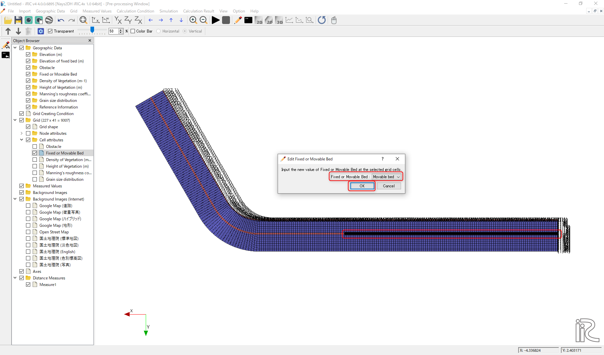

   : 固定床と移動床の属性変更

また下流端は固定床なので、:numref:`02_koshi8` に示すように拡大、回転して
最下流の格子属性を[固定床]に変更する。

.. _02_koshi8:

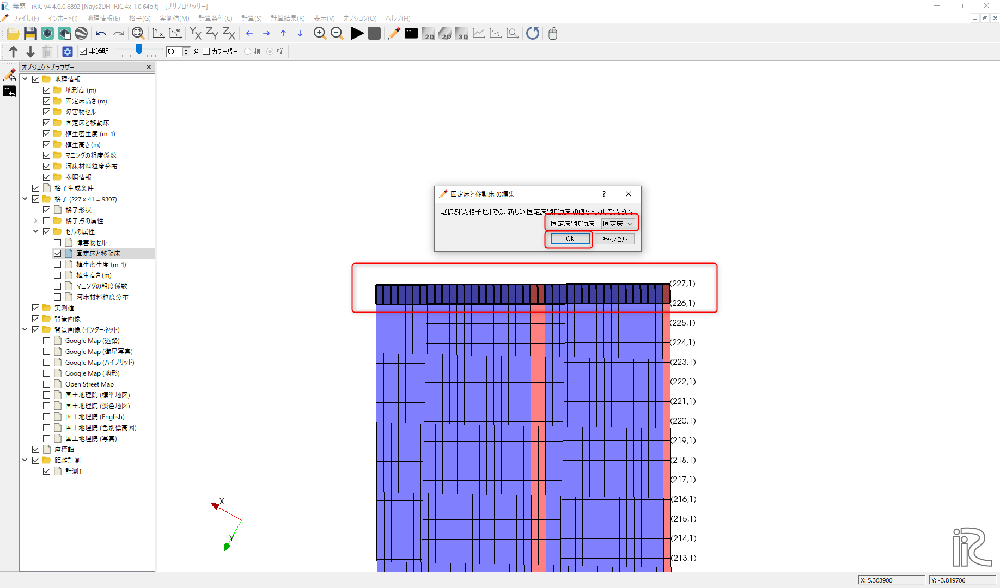

   : 最下流端の格子を固定床に変更

計算条件の設定
------------------------------------------------------------------------------------------------------------------------

メインメニューから[計算条件]->[設定]で現れる[計算条件]ウィンドウの、
[グループ]において、
[ソルバー・タイプ]、[境界条件]、[時間]、[河床材料]を
それぞれ、
:numref:`02_joken1` 、
:numref:`02_joken2` ,
:numref:`02_joken3` ,
:numref:`02_joken4` 
のようにパラメータを設定する。

.. _02_joken1:

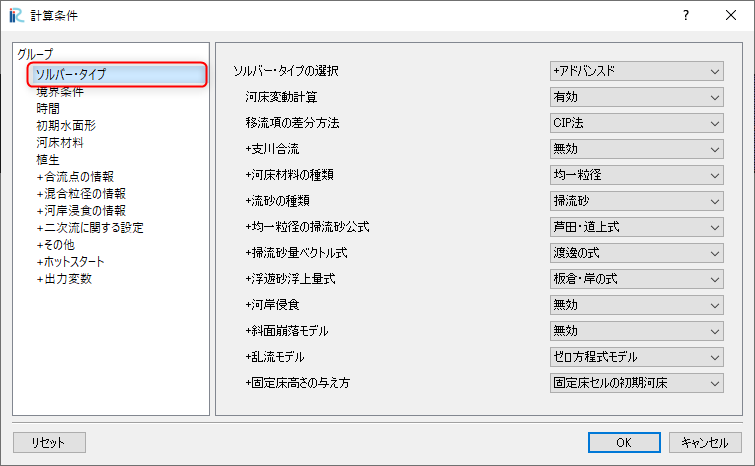

   : 計算条件(ソルバー・タイプ)

.. _02_joken2:

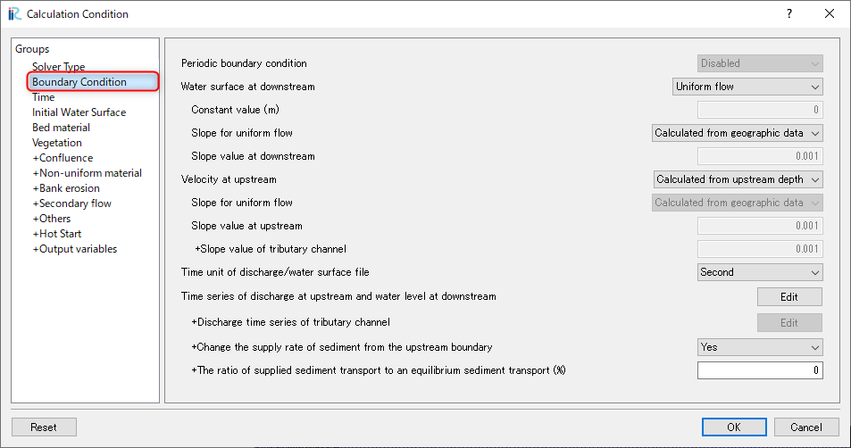

   : 計算条件(境界条件)

.. _02_joken3:

.. figure:: images/02/Nays2DH/joken3.png
   :width: 600pt

   : 計算条件(時間)

.. _02_joken4:

.. figure:: images/02/Nays2DH/joken4.png
   :width: 600pt

   : 計算条件(河床材料)

なお。:numref:`02_joken2` の[境界条件]においては、
[上流端流量と下流端水位の時間変化]で[Edit]を押して現れる、
:numref:`02_joken5` の[流量時間変化設定ウィンドウ]で時間と流量の関係を与える。

.. _02_joken5:

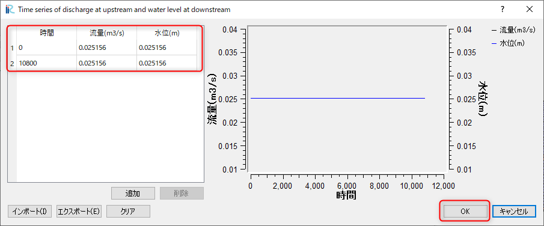

   : 計算条件(流量の時間配分の設定)

計算条件の設定が終了したら、[計算条件]ウィンドウで[OK]を押す。

計算の実行
------------------------------------------------------------------------------------------------------------------------

計算を実行する前に、メインメニューから[ファイル]->[名前を付けてポロジェクトに保存]を選択して、
新しいフォルダを作成し、そのフォルダを選択することによりプロジェクトを保存しておく。
ここでは、[Nays2DH_flow_bed]という名前で保存する。( :numref:`02_save_project` )

.. _02_save_project:

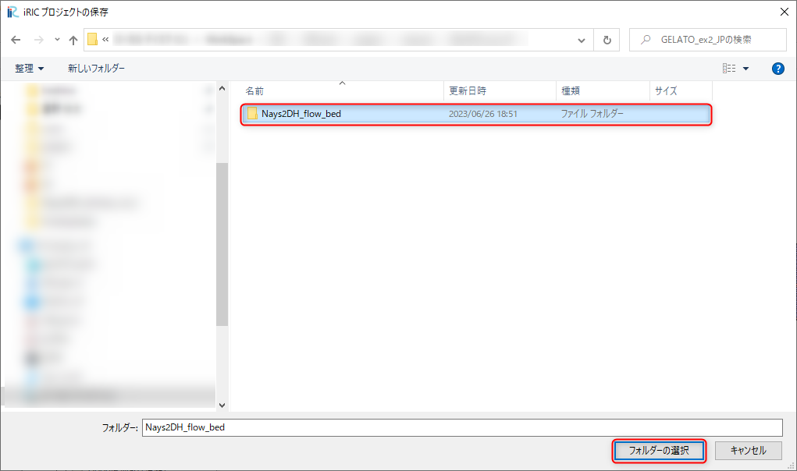

   : 計算プロジェクトの保存

メインメニューから[計算]->[実行]を選択すると、 :numref:`02_jikko1`  のようなダイアログが表示されるので、[OK]を選択すると計算が開始される。(:numref:`02_jikko2` ) 

.. _02_jikko1:

.. figure:: images/01/keikoku.png
   :width: 400pt

   : 警告

.. _02_jikko2:

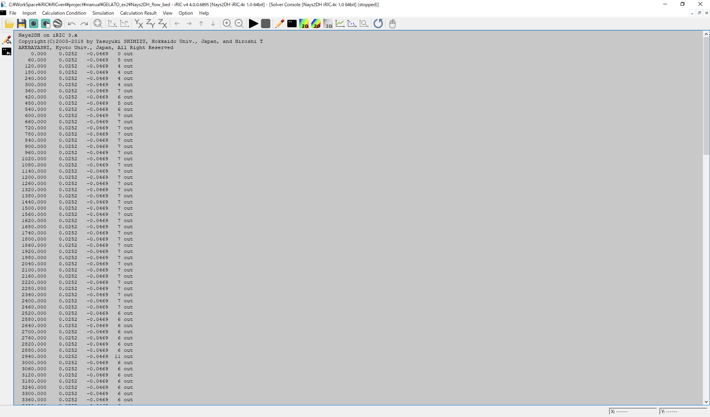

   : 「計算実行中」
 
計算が終了したら、メインメニューから[計算結果]->[保存]を選択して計算結果を保存しておく。

計算結果の表示
------------------------------------------------------------------------------------------------------------------------

オブジェクトブラウザーから[iRICZone]->[スカラー]->[ElevationChange(m)]にチェックマークを付け、
[ElevationChange(m)]を右クリックして[プロパティ]を選択して、[スカラー設定]を
:numref:`02_hyoji1` のように設定する。

.. _02_hyoji1:

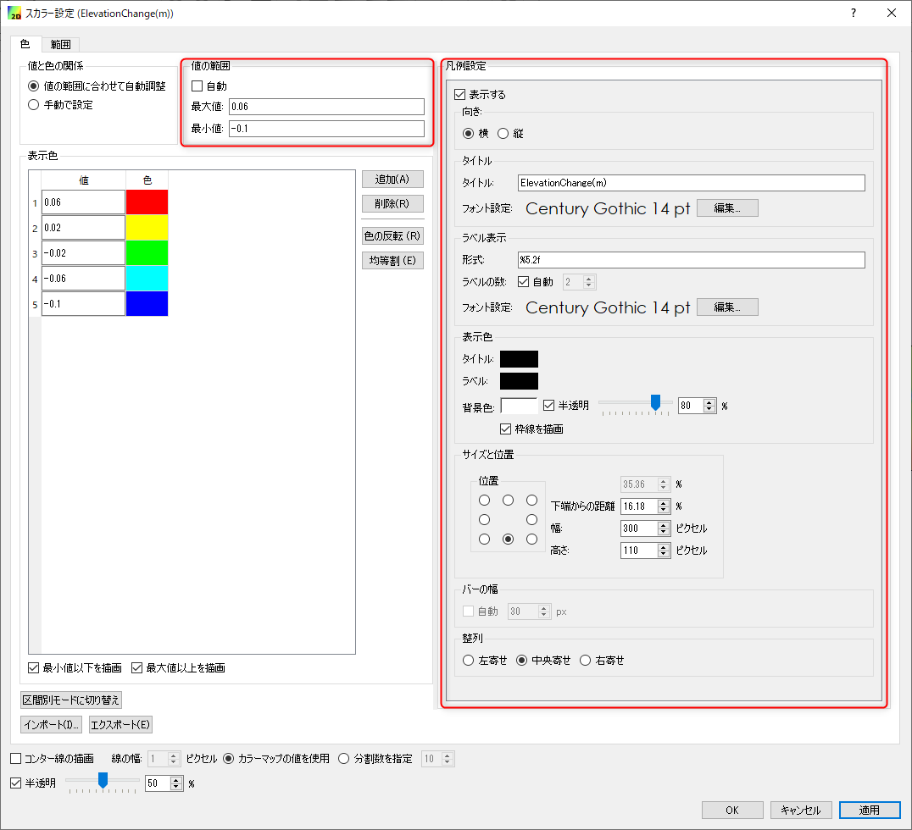

   : 「スカラー設定」

オブジェクトブラウザーから[ベクトル]->[Velocity(ms-1)]にチェックマークを付け、
[ベクトル]を右クリックして[プロパティ]を選択して、[ベクトル設定]を
:numref:`02_hyoji2` のように設定する。

.. _02_hyoji2:

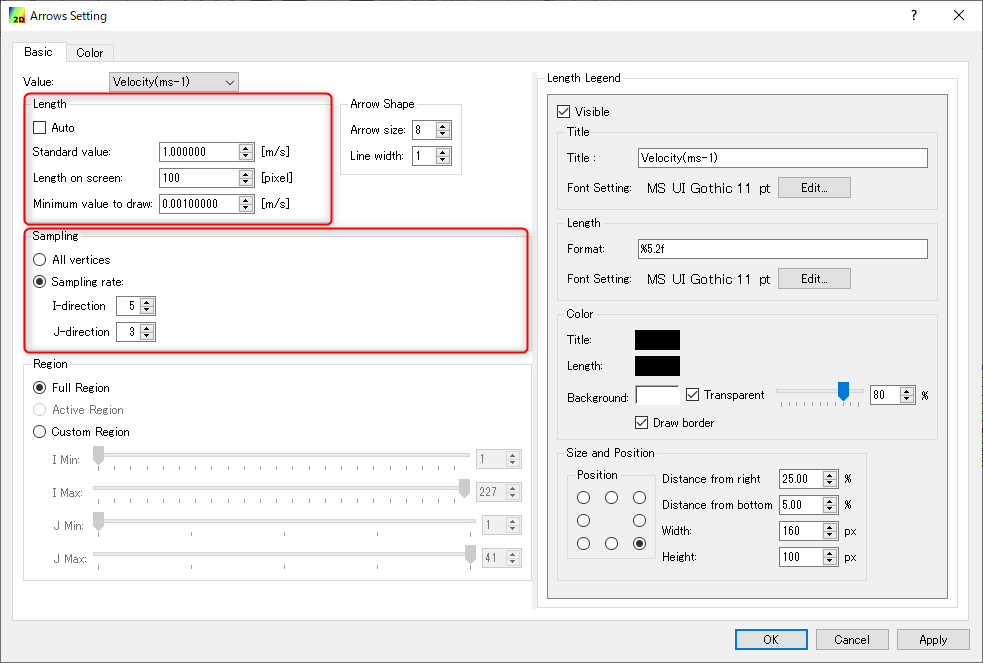

   : 「ベクトル設定」

メインメニューに[タイムスケールバー]をゼロに戻し、[アニメーション]->[開始/停止]を選択する
( :numref:`02_hyoji3` )

.. _02_hyoji3:

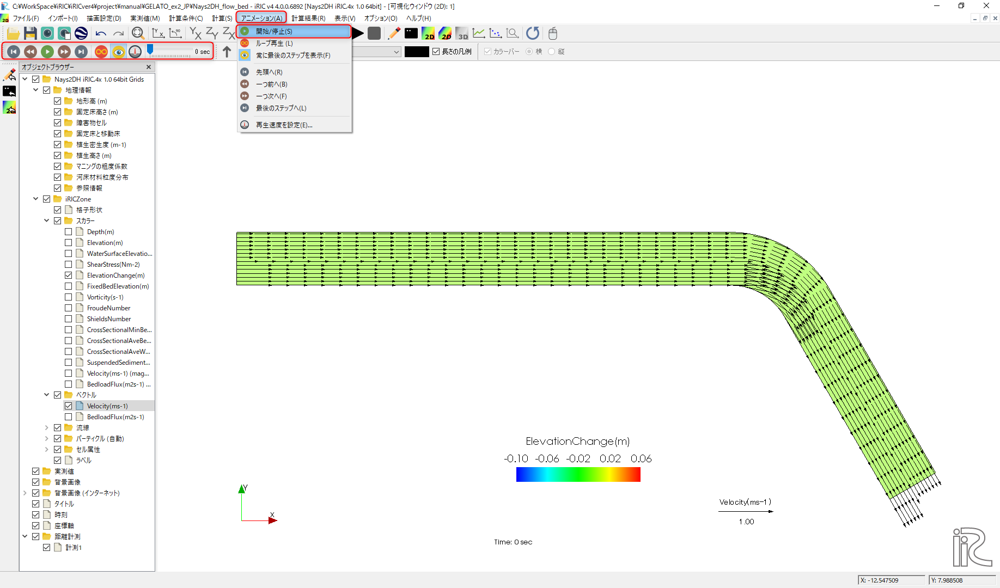

   : 「アニメーションの実行」

:numref:`02_hyoji4` のようにアニメーションが表示され、河床変動がほぼ定常に達していることが分かる。

.. _02_hyoji4:

.. figure:: images/02/Nays2DH/hyoji4.gif
   :width: 70%

   : 「河床変動と流速ベクトルのアニメーション」

計算結果のエクスポート
------------------------------------------------------------------------------------------------------------------------

計算で得られた河床形状を次節で行うNays2d+による準3次元流れの計算の境界条件に使用するために
計算結果をテキストファイルにエクスポートする。:numref:`02_export` に示すように、メインメニューから、
[ファイル]->[エクスポート]->[計算結果]を選ぶ.

.. _02_export:

.. figure:: images/02/Nays2DH/export.png
   :width: 100%

   : 「計算結果のエクスポート(1)」

[計算結果のエクスポート]ウィンドウ( :numref:`02_export` )が表示されるので、
[形式]を[地勢データファイル形式(tpo)]に設定する( :numref:`02_export2` )。

.. _02_export2:

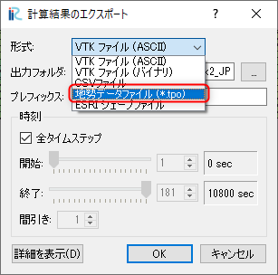

   : 「計算結果のエクスポート(2)」

出力フォルダは任意の名前で、
[全タイムステップ]の前にあるチェックボックスのチェックを外し、[開始][終了]を10,800に設定して、[OK]をクリックすると、計算結果のエクスポートが完了する( :numref:`02_export3` )。

.. _02_export3:

.. figure:: images/02/Nays2DH/export3.png
   :width: 250pt

   : 「計算結果のエクスポート(3)」

エクスポートされた計算結果は、( :numref:`02_export4` )に示すように、水深、流速、流砂量、河床高。。。。
など種類別に様々なファイルに保存されているが、このうち次節の計算に使用するのは河床高のみであるので、
[Results_1_Elevation(m).tpo]という名前のファイル以外は不要なので消しても構わない。

.. _02_export4:

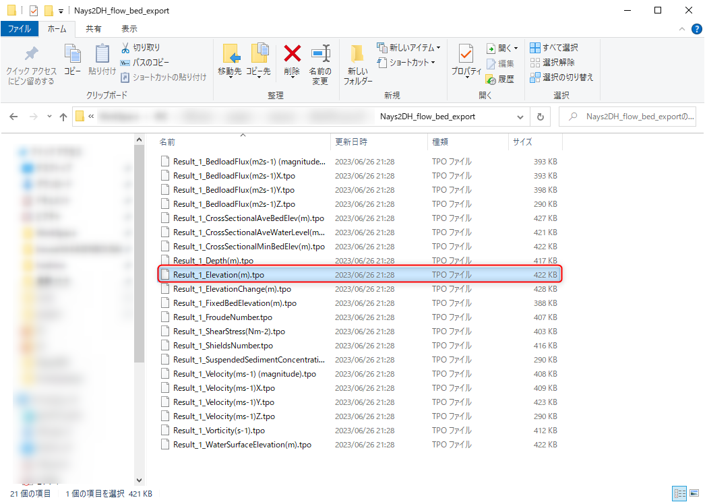

   : 「計算結果のエクスポート(3)」

Nays2d+による準3次元流れの計算
========================================================================================================================

ソルバの選択
------------------------------------------------------------------------------------------------------------------------

iRICの起動画面から、[新しいプロジェクト]を選ぶと表示されるソルバの選択画面
( :numref:`02_select2` )で[Nays2d+簡単に3次元の流れの計算が出来ます]
を選択して[OK]を押す。

.. _02_select2:

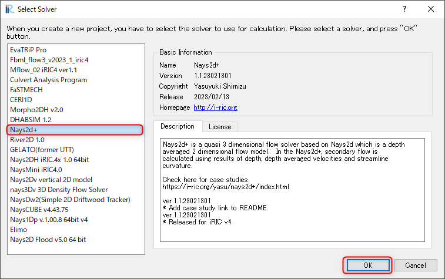

   : 「ソルバーNays2d+の選択」

計算格子と河床形状のインポートとマッピング
------------------------------------------------------------------------------------------------------------------------

格子のインポート
^^^^^^^^^^^^^^^^^^^^^^^^^^^^^^^^^^^^^^^^^^^^^^^^^^^^^^^^^^^^^^^^^^^^^^^^^^^^^^^^^^^^^^^^^^^^^^^^^^^^^^^^^^^^^^^^^^^^^^^^

メインメニューから[インポート]->[格子]を選択し、前記のNays2DHのプロジェクトフォルダー
[Nays2DH_flow_bed]の中の[Case1.cgn]を選ぶ。
:numref:`02_koshi10` のような警告が出るが、「余計なお世話です」と心の中で思いながら、
構わず[はい]をクリックすると、格子のインポートが完了する。
( :numref:`02_koshi11` )

.. _02_koshi10:

.. figure:: images/02/Nays2D+/koshi10.png
   :width: 400pt

   : 「警告」

.. _02_koshi11:

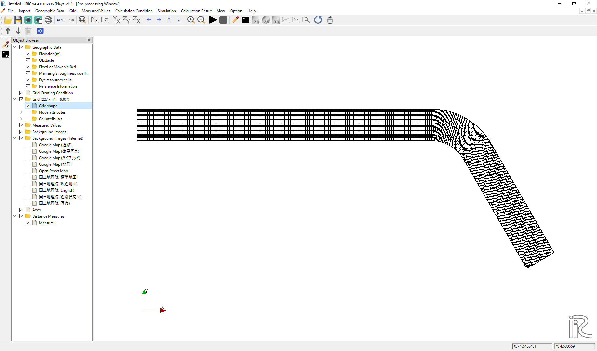

   : 「格子のインポート完了」

河床高のインポート
^^^^^^^^^^^^^^^^^^^^^^^^^^^^^^^^^^^^^^^^^^^^^^^^^^^^^^^^^^^^^^^^^^^^^^^^^^^^^^^^^^^^^^^^^^^^^^^^^^^^^^^^^^^^^^^^^^^^^^^^

メインメニューから[インポート]->[地理情報]->[河床高]を選択する( :numref:`02_import2` ).

.. _02_import2:

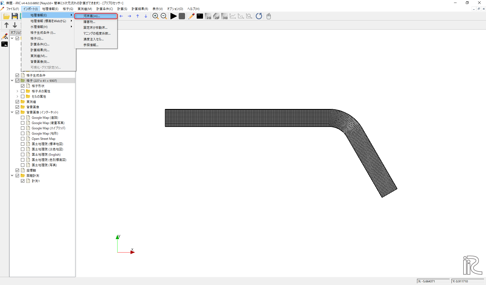

   : 「河床高のインポート」

インポートファイルの選択画面が現れる(:numref:`02_import3` )ので、前節のNays2DHの計算結果として
エクスポートした [Results_1_Elevation(m).tpo]を選択して[開く]。

.. _02_import3:

.. figure:: images/02/Nays2D+/import3.png
   :width: 600pt

   : 「河床高のインポート(ファイルの選択)」

:numref:`02_import4` のようにデータを間引くかどうか来かれるが、特に間引く必要がなければ、そのまま
[OK]を押すと[河床高]のインポートが完了する( :numref:`02_import5` )

.. _02_import4:

.. figure:: images/02/Nays2D+/import4.png
   :width: 400pt

   : 「河床高のインポート(間引き設定)」

.. _02_import5:

.. figure:: images/02/Nays2D+/import5.png
   :width: 100%

   : 「河床高のインポート完了」

マッピング
^^^^^^^^^^^^^^^^^^^^^^^^^^^^^^^^^^^^^^^^^^^^^^^^^^^^^^^^^^^^^^^^^^^^^^^^^^^^^^^^^^^^^^^^^^^^^^^^^^^^^^^^^^^^^^^^^^^^^^^^

インポートした河床高データをインポートした格子上にマッピングを行う。

:numref:`02_mapping2` のように[格子]->[属性のマッピング]->[実行]を選ぶ。 

.. _02_mapping2:

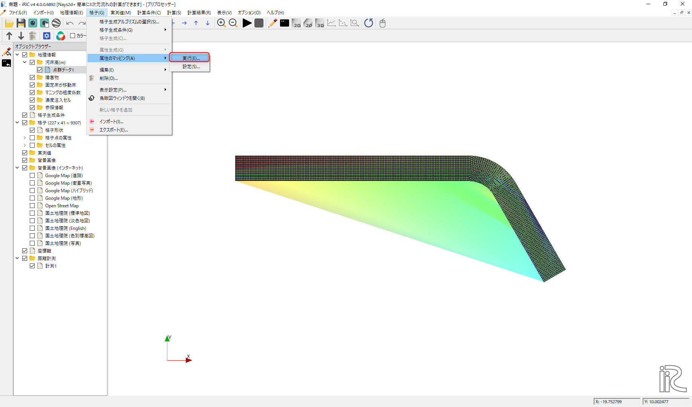

   : 「マッピング」

:numref:`02_mapping3` マッピングする[地理情報]を聞かれるので、
[河床高(m)]にチェックを入れて[OK]をクリックすると 

.. _02_mapping3:

.. figure:: images/02/Nays2D+/mapping3.png
   :width: 200pt

   : 「マッピングする情報の選択」

マッピングが完了する( :numref:`02_mapping4` )ので、[OK]をクリックして
完了。

.. _02_mapping4:

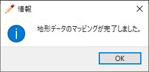

   : 「マッピングの完了」

Nays2d＋の計算条件の設定
------------------------------------------------------------------------------------------------------------------------

メインメニューから[計算条件]->[設定]で現れる[計算条件]ウィンドウの、
[グループ]において、
[流量および下流端水位の設定]、[時間および浸食に関するパラメータパラメータ]、
[境界条件]、[他の計算条件]、[３次元流速分布]を
それぞれ、
:numref:`02_joken6` 、
:numref:`02_joken7` ,
:numref:`02_joken8` ,
:numref:`02_joken9` ,
:numref:`02_joken10` 
のようにパラメータを設定する。

.. _02_joken6:

.. figure:: images/02/Nays2D+/joken6.png
   :width: 600pt

   : 計算条件(流量および下流端水位の設定)

.. _02_joken7:

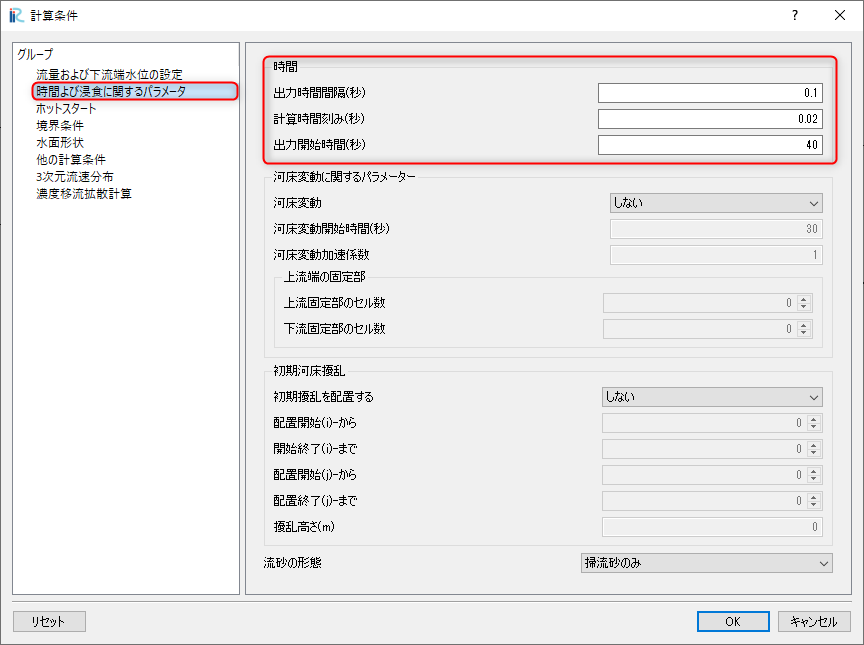

   : 計算条件(時間および浸食に関するパラメーター)

.. _02_joken8:

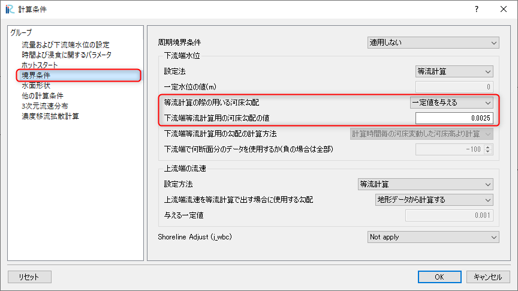

   : 計算条件(境界条件)

.. _02_joken9:

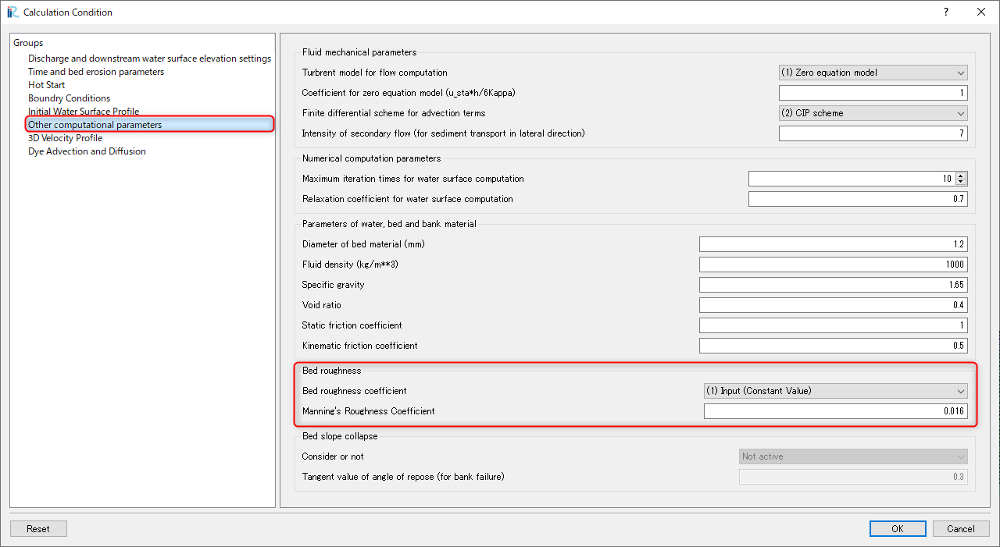

   : 計算条件(他の計算条件)

.. _02_joken10:

.. figure:: images/02/Nays2D+/joken10.png
   :width: 600pt

   : 計算条件(3次元流速分布)

なお。:numref:`02_joken6` の[流量および下流端水位の設定]においては、
[流量と下流端水位の時系列]の隣の[Edit]を押して現れる、
:numref:`02_joken11` の[流量時間変化設定ウィンドウ]で時間と流量の関係を与える。

.. _02_joken11:

.. figure:: images/02/Nays2D+/joken11.png
   :width: 600pt

   : 計算条件(流量の時間配分の設定)

計算条件の設定が終了したら、[計算条件]ウィンドウで[OK]を押す。

Nays2d+の計算の実行
------------------------------------------------------------------------------------------------------------------------

計算の実行方法は前節[Nays2DHによる計算の実行]と全く同じで、タダでさえ長いのに
これ以上同じことをクドクド書くと嫌われそうなので省略する。
ただ、計算の実行の前に、必ず、プロジェクトを保存しておくことを推奨する。
ここでは、[Nays2d+Flow]とう名前のプロジェクトに保存する。

.. _02_save_project2:

.. figure:: images/02/Nays2D+/save_project2.png
   :width: 600pt

   : プロジェクトの保存(Nays2d+Flow)

計算結果は[Case1.cgn]というCGNSファイルに保存されるが、次のGELATOで使用するのはこの
フォルダに保存される[Case1.cgn]を使用する。
計算の実行が終わった時も必ず[計算結果]->[保存]で結果を保存すること。

GELATOによる仮想トレーサーの追跡計算
========================================================================================================================

GELATOの起動、格子のインポート
------------------------------------------------------------------------------------------------------------------------

iRICの起動画面から、[新しいプロジェクト]を選ぶと表示されるソルバの選択画面で、「GELATO ver2.x」を選んで、「OK」をクリックする。

.. figure:: images/01/GELATO/kido.png
   :width: 800pt

   : GELATOの選択と起動

GELATOセッションが開始され、「入力用CGNSファイルの選択」というダイアログが現れる。

.. figure:: images/01/GELATO/openning.png
   :width: 100%

   : GELATOの起動
  
:guilabel:`...` ボタンをクリックするとファイル選択ダイアログが表示されるので、先ほど計算した[Nays2d+Flow]の計算結果のCGNSファイルをボタンを押して選択する。

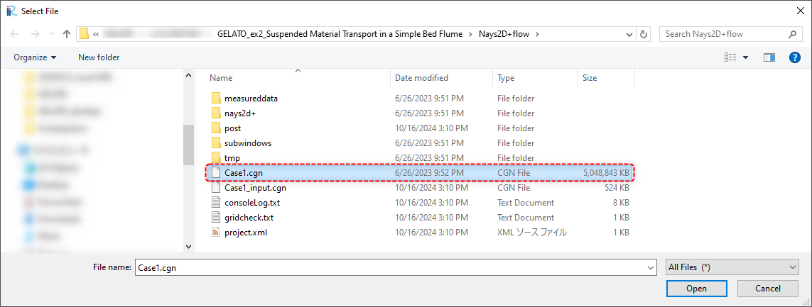

   : 計算結果CGNSの選択_1

するとダイアログに選択したCGNSファイルの情報が表示されるので、:guilabel:`OK` をクリックする。

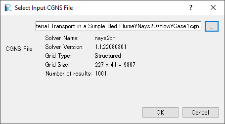

   : 計算結果CGNSの選択_2

格子をインポートするかどうかを尋ねるダイアログが表示されるので、:guilabel:`はい` をクリックする。

.. figure:: images/01/GELATO/import_grid_3.png
   :width: 30%

   : 格子のインポート_1

以下のようなエラーが表示されるが、これは異なるソルバーの格子を読み込もうとすると必ず表示されるのものなので、気にせず :guilabel:`はい` をクリックする。

.. figure:: images/02/GELATO/import_grid_3.png
   :width: 40%

   : 格子のインポート_2

インポートが完了すると以下のようにインポートされた格子が表示される。

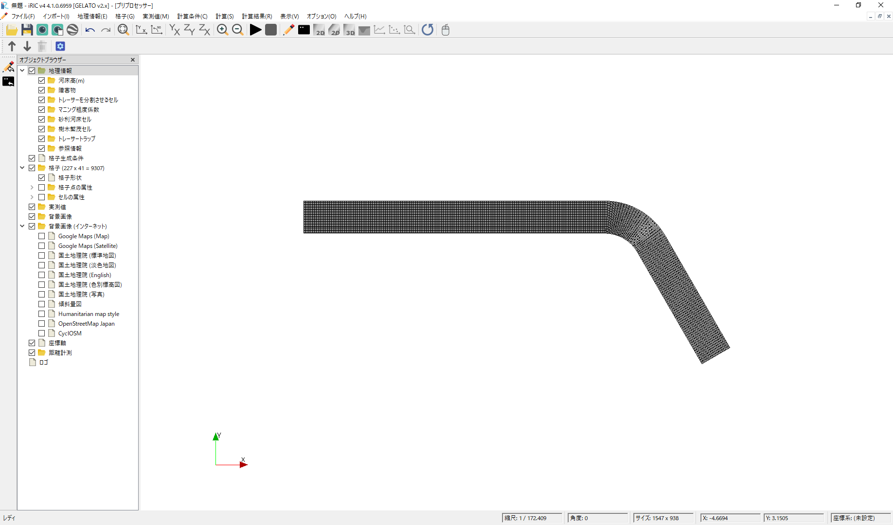

   : 格子インポート完了

GELATOによるトレーサー追跡計算
------------------------------------------------------------------------------------------------------------------------

計算条件の設定
^^^^^^^^^^^^^^^^^^^^^^^^^^^^^^^^^^^^^^^^^^^^^^^^^^^^^^^^^^^^^^^^^^^^^^^^^^^^^^^^^^^^^^^^^^^^^^^^^^^^^^^^^^^^^^^^^^^^^^^^
| メニューバーの :menuselection:`計算条件(C) --> 設定(S)` から、計算条件設定ウィンドウを開き、赤枠で囲った部分を以下のように設定する。
| その他の計算条件はデフォルトのままでよい。

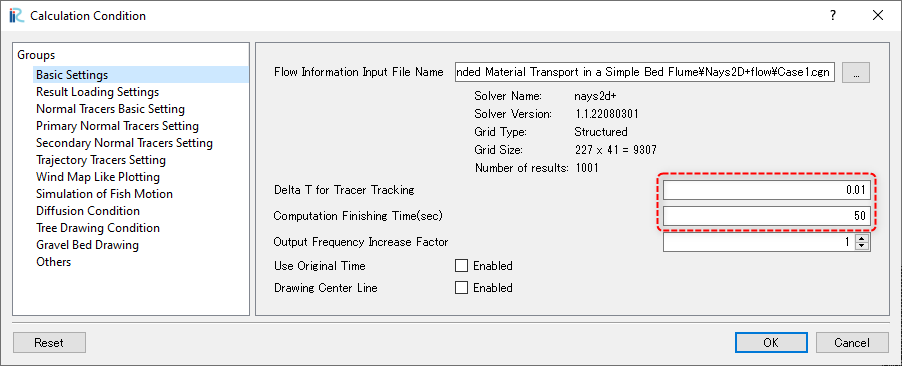

   : 計算条件の設定_1

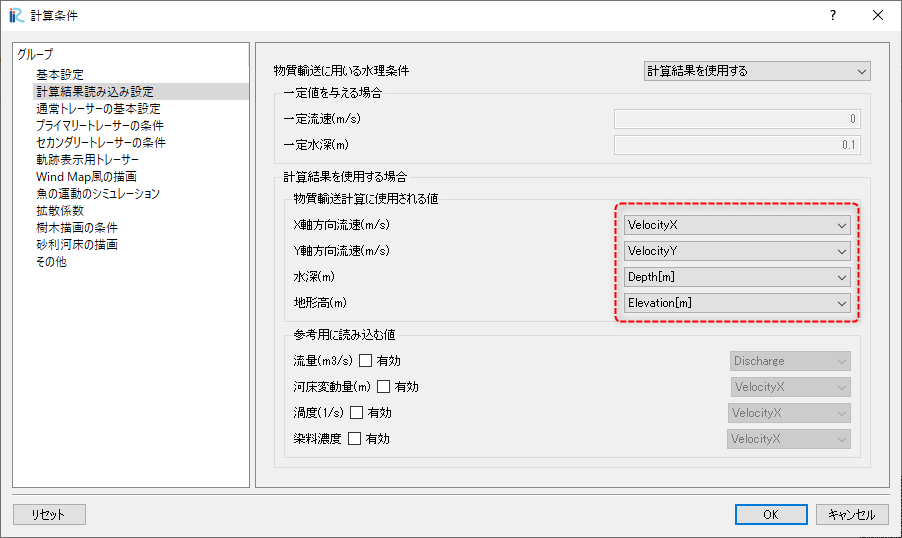

   : 計算条件の設定_2

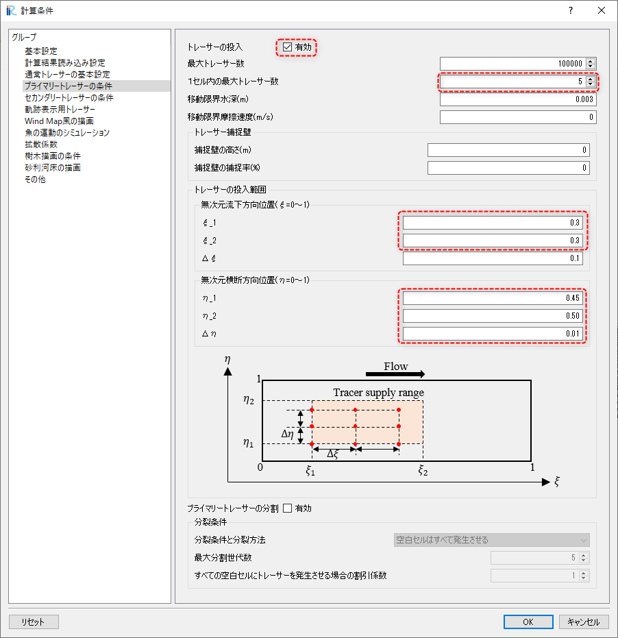

   : 計算条件の設定_3

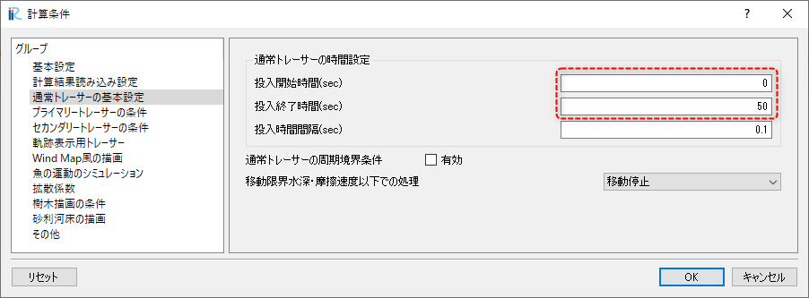

   : 計算条件の設定_4

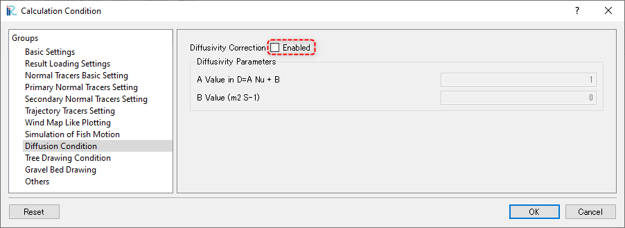

   : 計算条件の設定_5

.. note::
   計算条件の設定2において、:guilabel:`X軸方向流速(m/s)` と :guilabel:`Y軸方向流速(m/s)` を :guilabel:`SurfaceVelocityX` , :guilabel:`SurfaceVelocityY` のように変更すると、表面流速や底面流速を用いたトレーサーの追跡が可能となる。

計算の実行
^^^^^^^^^^^^^^^^^^^^^^^^^^^^^^^^^^^^^^^^^^^^^^^^^^^^^^^^^^^^^^^^^^^^^^^^^^^^^^^^^^^^^^^^^^^^^^^^^^^^^^^^^^^^^^^^^^^^^^^^

| メニューバーの :menuselection:`計算(C) --> 実行(R)` を選択すると、警告が現れるので適当な名前で保存する。
| このときの保存形式は[ファイルに保存(ipro)]か[プロジェクトとして保存]どちらでも良い。
| 保存が完了すると計算が開始され、以下のようなウィンドウが表示される。

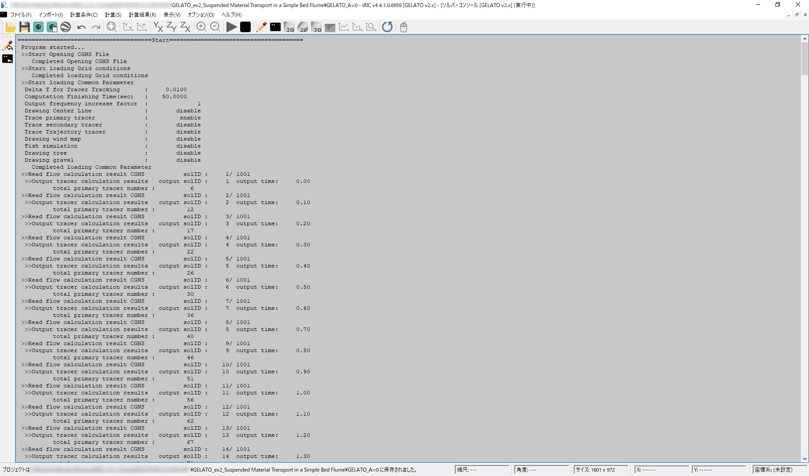

   : 計算実行中画面

| 計算が終了すると「ソルバーの計算が終了しました.」とダイアログが表示されるので、:guilabel:`OK` をクリックする。

計算結果の表示
^^^^^^^^^^^^^^^^^^^^^^^^^^^^^^^^^^^^^^^^^^^^^^^^^^^^^^^^^^^^^^^^^^^^^^^^^^^^^^^^^^^^^^^^^^^^^^^^^^^^^^^^^^^^^^^^^^^^^^^^

| メインメニューの :menuselection:`計算結果(R) --> 新しい可視化ウィンドウ(2D)を開く` を選択すると、二次元可視化ウィンドウがが表示される。

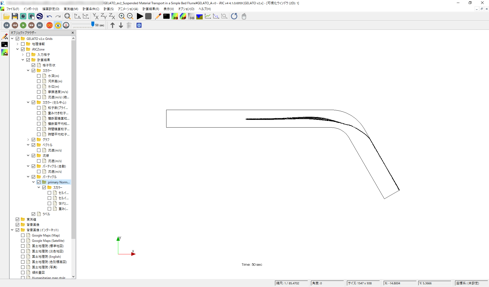

   : 可視化ウィンドウ

| 本章冒頭に示した実験の画像 :numref:`02_jikken` と向きが反対なので、以下の画像に矢印で示す90°回転のマークを2回クリックして180°回転させる。

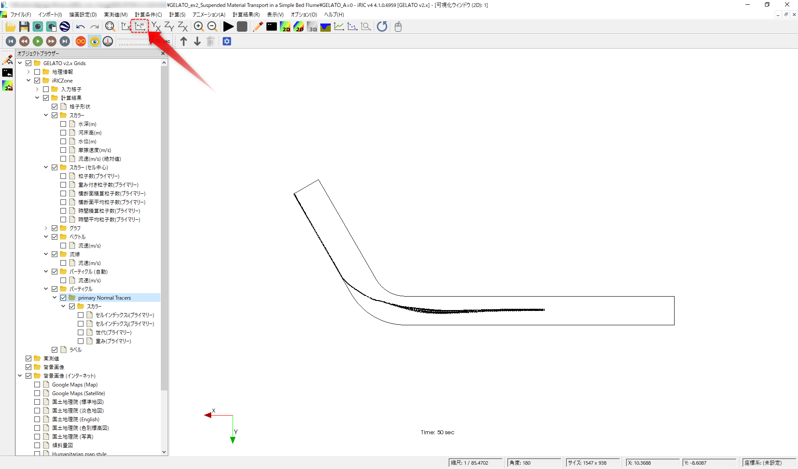

   : 画像の回転

| 時刻表示が小さくてメチャ見にくいので、オブジェクトブラウザーの[時刻]を右クリックし、[プロパティ]から [時刻設定]を表示させて、フォントサイズを適当に大きくする。

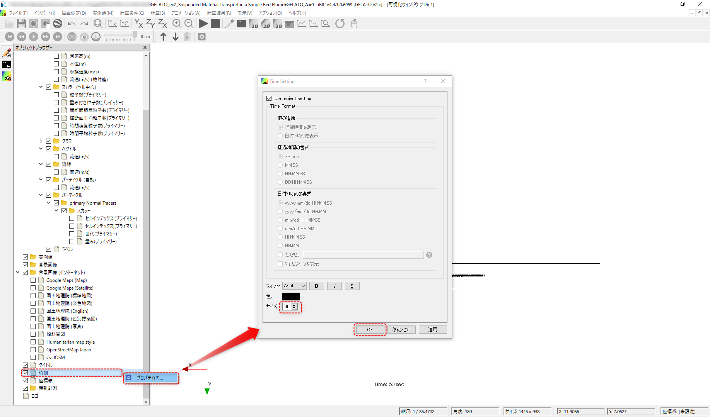

   : 時刻表示の設定

| タイムステップを最初に戻し、メインメニューの :menuselection:`アニメーション(A) --> 開始/停止(S)` を選択すると、アニメーションが再生される。

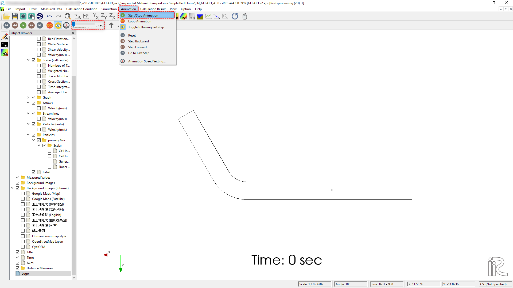

   : アニメーションの再生

| トレーサーは殆ど拡散せずに、線状に流れて行くのが分かる。

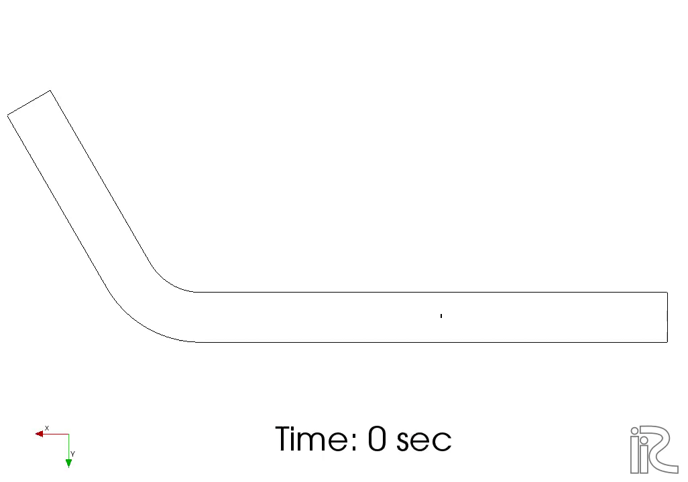

   : トレーサーのアニメーション(乱流拡散強度A=0)

乱流拡散強度の違いの比較
^^^^^^^^^^^^^^^^^^^^^^^^^^^^^^^^^^^^^^^^^^^^^^^^^^^^^^^^^^^^^^^^^^^^^^^^^^^^^^^^^^^^^^^^^^^^^^^^^^^^^^^^^^^^^^^^^^^^^^^^
| このまま計算条件を変更し、乱流拡散を考慮した計算を行う。
| 計算プロジェクトはそれぞれ別名保存をしておくと便利である。
| まず、メニューバーの :menuselection:`計算条件(C) --> 設定(S)` を選択し、以下のように設定する。

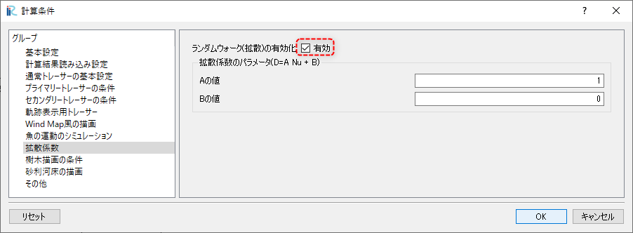

   : 計算条件の設定_1

| この設定で計算を実行すると、以下のような結果が得られる。

   : トレーサーのアニメーション(乱流拡散強度A=1)

| 同様に、[A=5]、[A=10]、[A=50]でランダムウォークをやってみると。。。

   : トレーサーのアニメーション(乱流拡散強度A=5)

   : トレーサーのアニメーション(乱流拡散強度A=10)

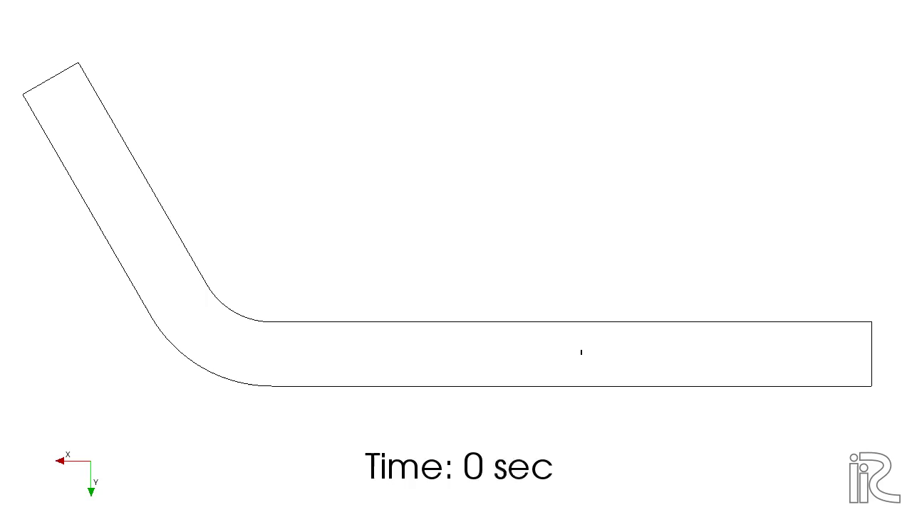

   : トレーサーのアニメーション(乱流拡散強度A=50)

:numref:`02_jikken` と比較すると、[A=10]位の感じであることが分かる。

トレーサーのクローン
^^^^^^^^^^^^^^^^^^^^^^^^^^^^^^^^^^^^^^^^^^^^^^^^^^^^^^^^^^^^^^^^^^^^^^^^^^^^^^^^^^^^^^^^^^^^^^^^^^^^^^^^^^^^^^^^^^^^^^^^
| メニューバーの :menuselection:`計算条件(C) --> 設定(S)` を選択し、以下のように設定する。
| その他の計算条件は[A=10]の計算のときと同じなので、プロジェクトをコピーして、以下の部分だけを変更するとよい。

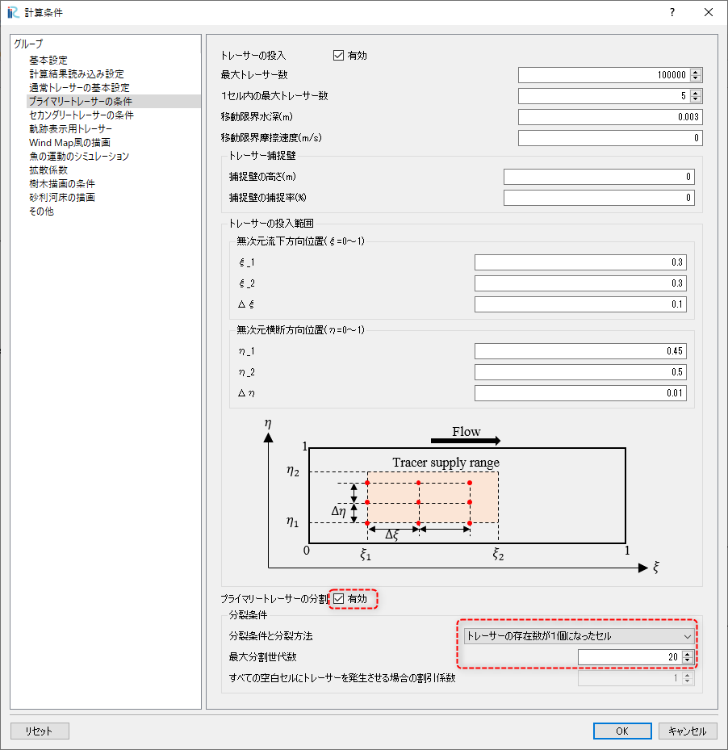

   : 計算条件の設定_1

| 再度計算を実行すると以下のような結果となる。

   : トレーサークローン表示(最大20世代、A=10)

| トレーサーの拡散範囲は :numref:`02_jikken` の実験動画の緑色染料の拡散範囲に近くなっている。
| ここで、オブジェクトブラウザーで、 :guilabel:`Primary Normal Tracers` -> :guilabel:`スカラー` -> :guilabel:`Generation(Primary)` にチェックを入れると、世代が表示される。
| これをアニメーション表示すると、以下のようになる。

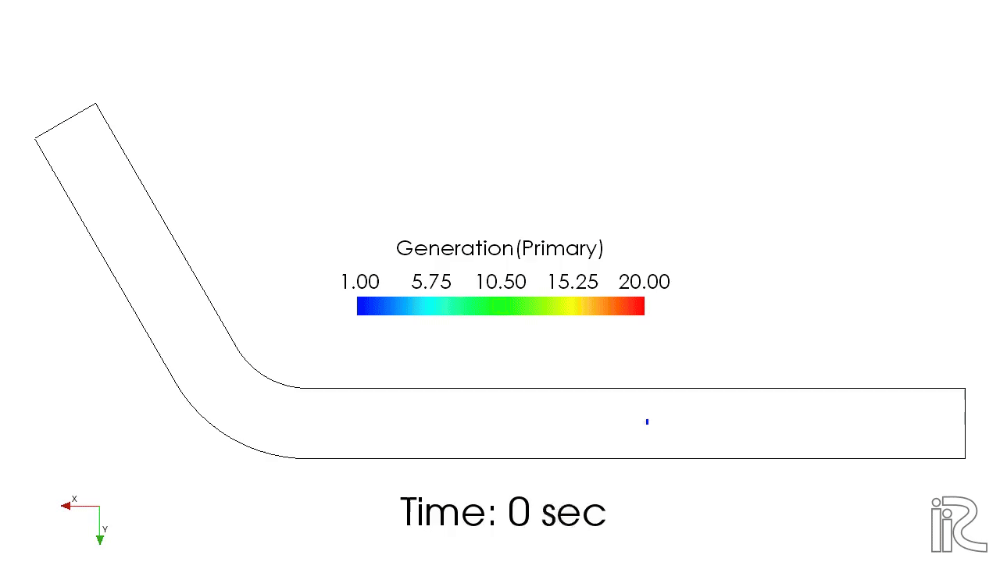

   : トレーサークローン表示(最大20世代、A=10、世代表示)

| 「 :ref:`cloning00` 」で述べたように、実質の重みは10世代目で :math:`W=0.00195`、20世代目だと :math:`W=0.00000195` なので、緑・黄・赤等のトレーサー濃度は中心部の青色系のトレーサーに比べ対数的に低いことになる。
| 次に、格子内のトレーサー数に重みを乗じて、実質の濃度を可視化する。

1. オブジェクトブラウザーで、 :guilabel:`Primary Normal Tracers` -> :guilabel:`スカラー` のチェックを外し、 :guilabel:`スカラー(セル中心)` -> :guilabel:`重み付き粒子数(プライマリー)` にチェックを入れる。

   .. figure:: images/02/GELATO/scalar_setting_3_1.png
      :width: 100%

      : スカラー設定_1

2. :guilabel:`重み付き粒子数(プライマリー)` を右クリックし、 :guilabel:`プロパティ` を選択する。

   .. figure:: images/02/GELATO/scalar_setting_3_2.png
      :width: 40%

      : スカラー設定_2

1. [スカラー設定]ウィンドウで、以下のように設定して :guilabel:`OK` を押す。

   .. figure:: images/02/GELATO/scalar_setting_3_3.png
      :width: 60%

      : スカラー設定_3

アニメーションを再生すると、以下のようになる。

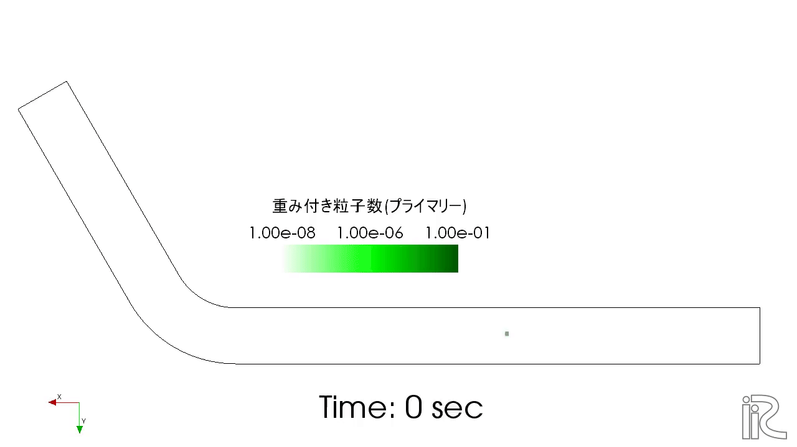

   : トレーサークローン表示(最大20世代、A=10、重み付き表示)

トレーサークローンを利用した流れの可視化
------------------------------------------------------------------------------------------------------------------------
| トレーサーのクローンツールを用いた流れの可視化の例を示す。
| メニューバーの :menuselection:`計算条件(C) --> 設定(S)` を選択し、以下のように設定する。
| その他の計算条件は[A=10]の計算のときと同じなので、プロジェクトをコピーして、以下の部分だけを変更するとよい。

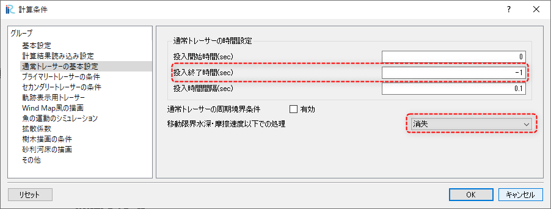

   : 計算条件の設定_1

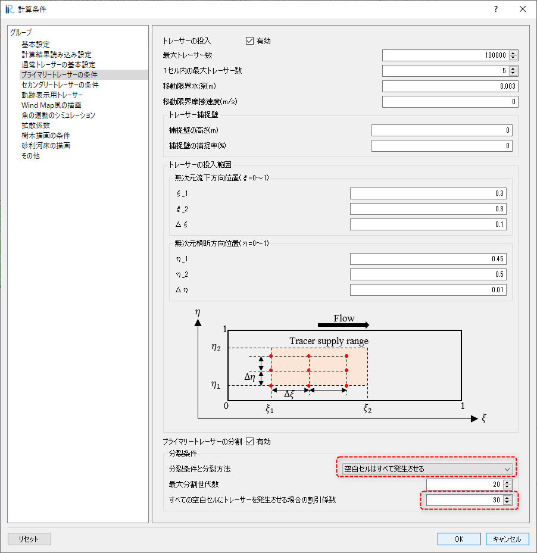

   : 計算条件の設定_2

| 条件を設定して計算を実行後、 :guilabel:`Primary Normal Tracers` -> :guilabel:`スカラー` にチェックを入れ、 :guilabel:`スカラー(セル中心)` -> :guilabel:`重み付き粒子数(プライマリー)` のチェックを外し、アニメーションを再生すると以下のようになる。

.. figure:: images/02/GELATO/A_10_clone_visualization_animation.gif
   :width: 60%

   : トレーサーを用いた流れの可視化

魚の遊泳シミュレーション
------------------------------------------------------------------------------------------------------------------------
| メニューバーの :menuselection:`計算条件(C) --> 設定(S)` を選択し、以下のように設定する。

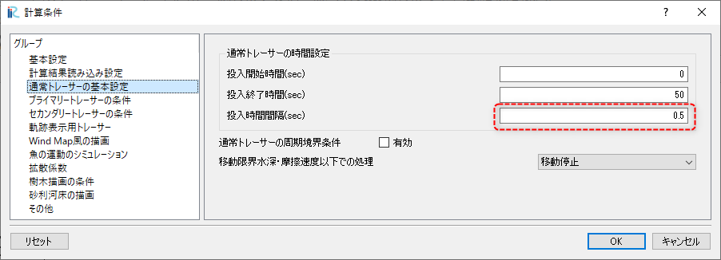

   : 計算条件の設定_1

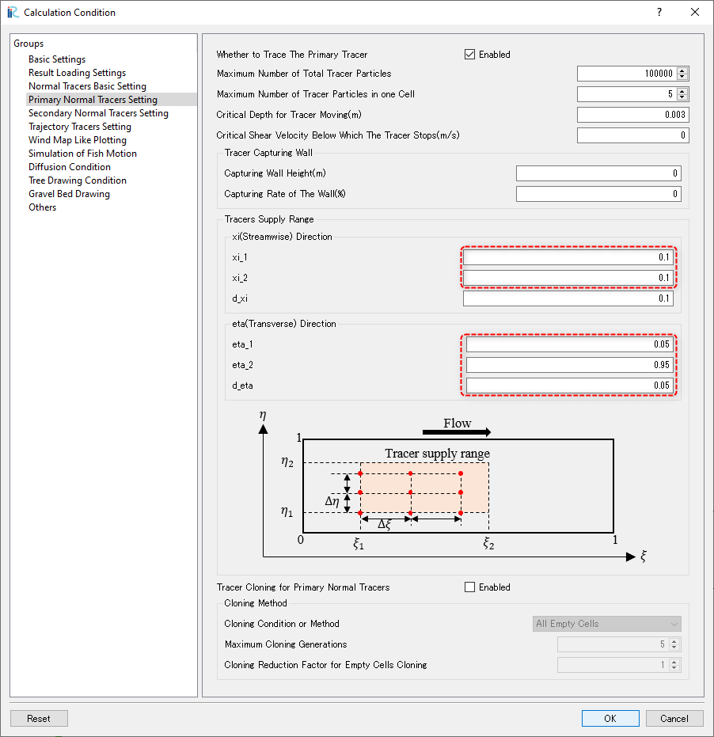

   : 計算条件の設定_2

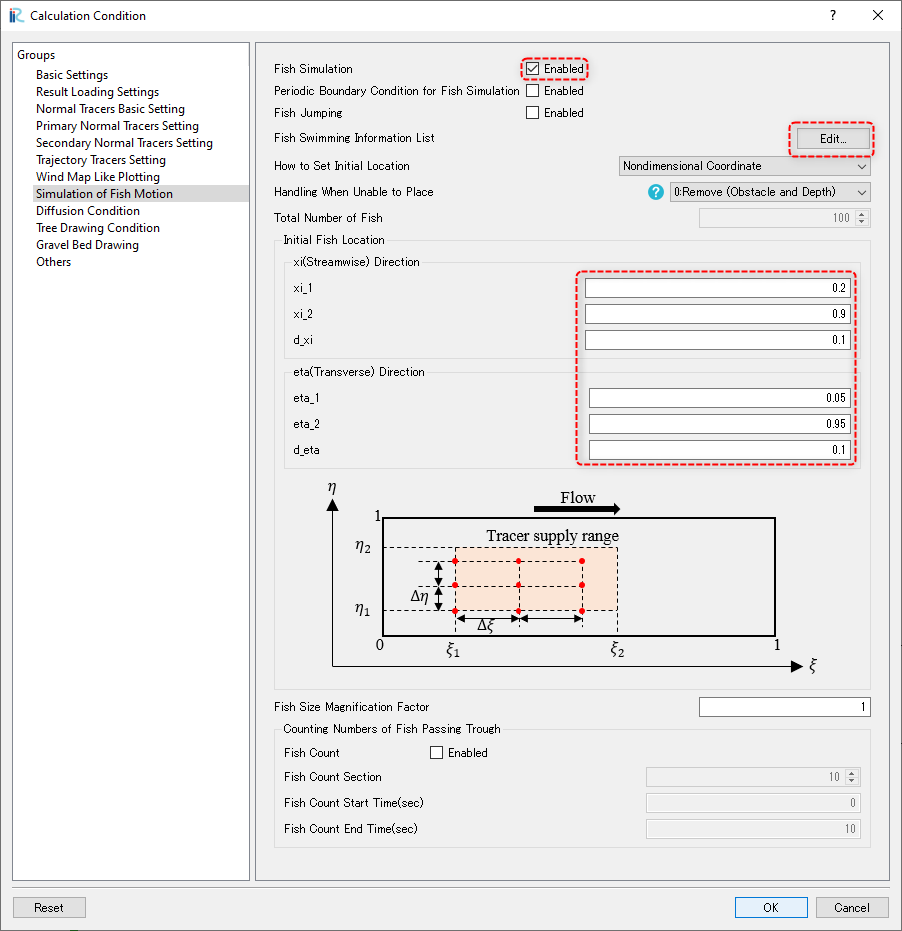

   : 計算条件の設定_3

| 魚の運動特性リストは :guilabel:`編集` をクリックすると編集用ダイアログが表示される。
| :guilabel:`追加` をクリックしてグループを追加してそれぞれにパラメーターを入力してもよいが、手間なので今回はパラメータを保存されているcsvファイルを読み込んで入力を行う。csvデータ( :file:`fish_data.csv` )は `こちら <https://i-ric.org/download/gelato-v2-0-fish_data/>`_ からダウンロードしてください。
|
| :guilabel:`インポート` をクリックするとファイル選択ダイアログが表示されるので、 :file:`fish_data.csv` を選択する。

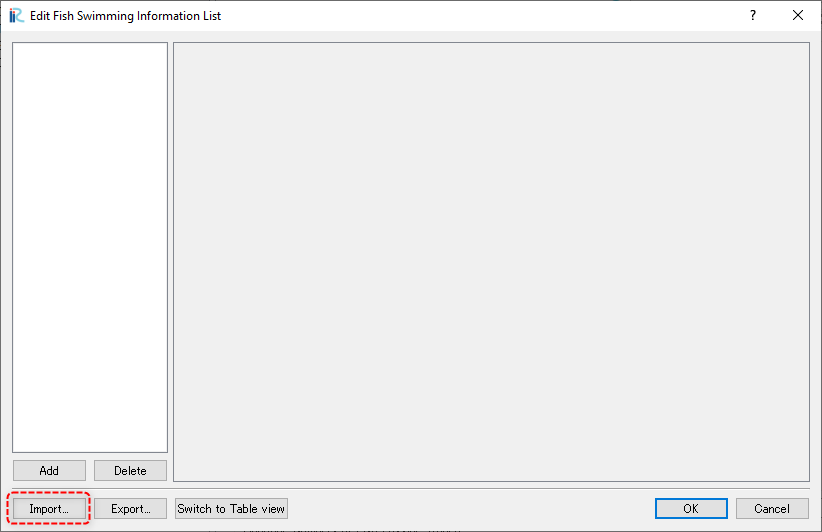

   : 計算条件の設定_4

.. note::
   このcsvファイルは、iRIC上で入力したものをエクスポートして作成するほか、魚の設定ファイル(\*.csv)を簡便に作成できるMicrosoft Excel用のマクロを使用しても作成できる。
   このマクロは `ここ <https://i-ric.org/download/gelato_fishfilemaker/>`_ からダウンロード可能である。

| 読み込みが完了すると以下のように魚の運動特性が表示される。

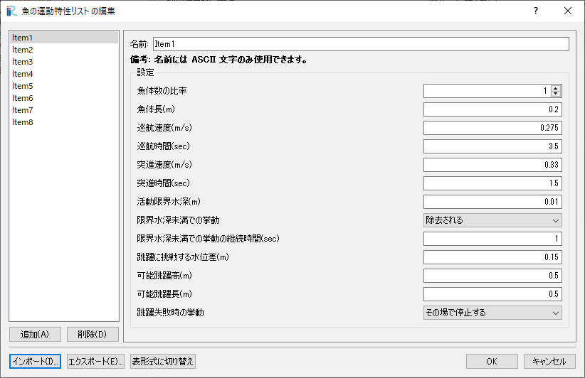

   : 計算条件の設定_5(リスト表示)

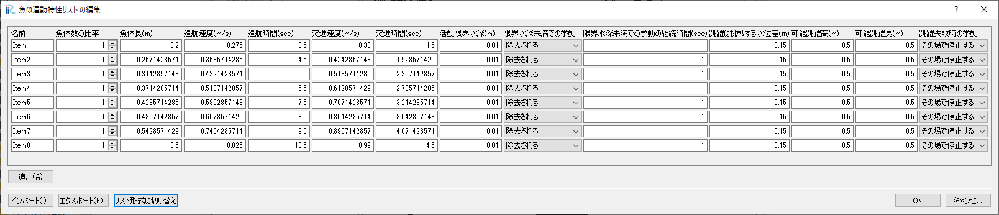

   : 計算条件の設定_5(表形式)

計算条件を保存して、計算を実行すると以下のような結果が得られる。

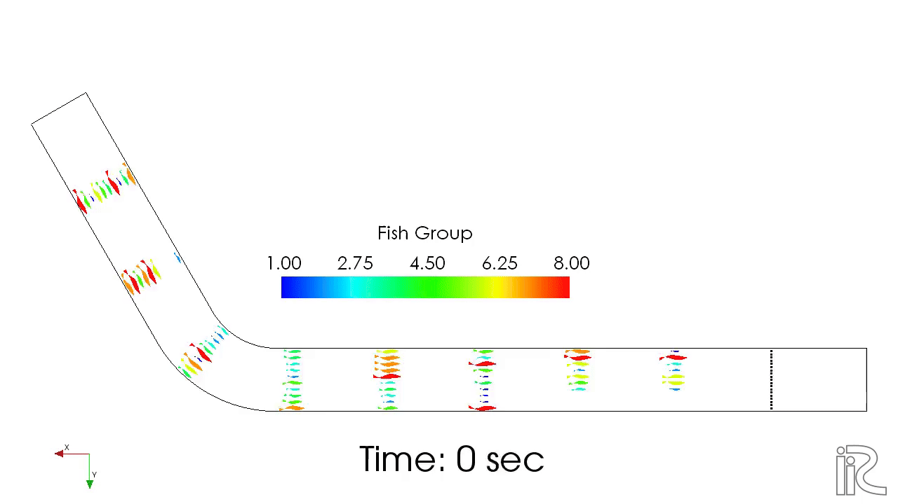

   : 魚の遊泳シミュレーション

NaysDw2による流木の追跡計算
========================================================================================================================

本節では2次元流木追跡ソルバNaysDw2により流木の追跡を行う。

ソルバの選択
------------------------------------------------------------------------------------------------------------------------

iRICの起動画面から、[新しいプロジェクト]を選ぶと表示されるソルバの選択画面( :numref:`02_select_Dw2` )で[NaysDw2シンプルな2次元流木追跡ツール]を選択して[OK]を押す。

.. _02_select_Dw2:

.. figure:: images/02/NaysDw2/select_Dw2.png
   :width: 600pt

   : 「ソルバーNaysDw2の選択」

格子のインポート
------------------------------------------------------------------------------------------------------------------------

:numref:`02_import_grid3` のように入力するCGNSファイルの選択ダイアログが表示されるので、[...]をクリックする。

.. _02_import_grid3:

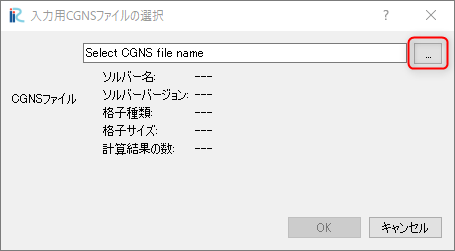

   : 「格子のインポート_1」

ファイル選択ウィンドウが現れるので、先ほど[Nays2d+]の計算結果を保存したフォルダ[Nays2d+Flow]の中の[Case1.cgn]を選ぶ( :numref:`02_import_grid4`)

.. _02_import_grid4:

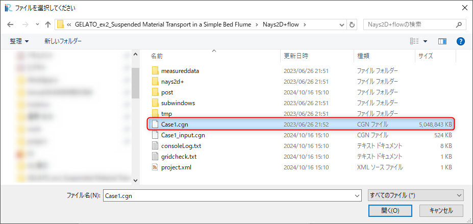

   : 「格子のインポート_2」

[Case1.cgn]を選択すると :numref:`02_import_grid5` のように選択した計算結果の概要が表示されるので[OK]を押す。

.. _02_import_grid5:

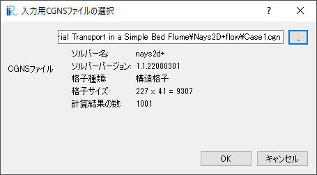

   : 「格子のインポート_3」

「CGNSファイルから格子をインポートしますか？」と効かれるので[はい]を押すと :numref:`02_import8` の警告が表示されるが、構わず[はい]を押して進むと格子のインポートが完了する。( :numref:`02_import9`)

.. _02_import8:

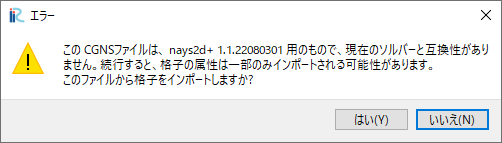

   : 「警告」

.. _02_import9:

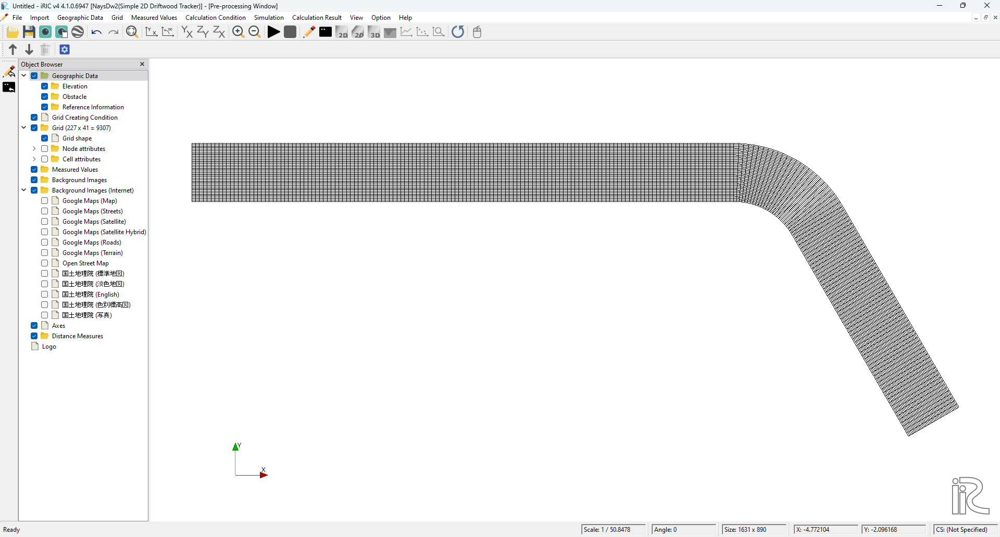

   : 「格子のインポート完了」

計算条件の設定
------------------------------------------------------------------------------------------------------------------------

[計算条件]->[設定]で :numref:`02_dw3` ～ :numref:`02_dw8` のとおりの設定を行う。 

.. _02_dw3:

.. figure:: images/02/NaysDw2/dw3.png
   :width: 600pt

   : [基本設定]

.. _02_dw4:

.. figure:: images/02/NaysDw2/dw4.png
   :width: 600pt

   : [流木の供給条件]

.. _02_dw5:

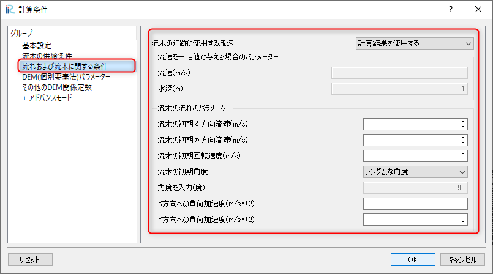

   : [流れおよび流木に関するパラメーター]

.. _02_dw8:

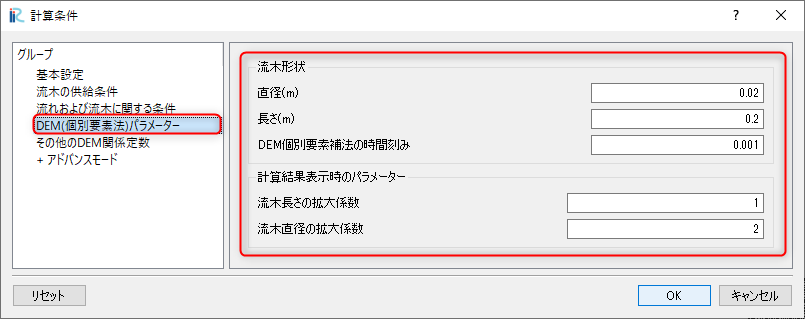

   : [DEM(個別要素法)パラメーター]

流木追跡計算の実行
------------------------------------------------------------------------------------------------------------------------

| 計算を実行する前にプロジェクトを保存しておく。
| プロジェクトを保存したら :numref:`02_dw6` メインメニューから[計算]->[実行]を選択、いつもの警告が出るので[OK]を押す。

.. _02_dw6:

.. figure:: images/02/NaysDw2/dw6.png
   :width: 100%

   : [計算]->[実行]

計算が開始されると、:numref:`02_dw10` の画面が表示され、終了すると :numref:`02_dw11` が表示されるので[OK]をクリックする。 

.. _02_dw10:

.. figure:: images/02/NaysDw2/dw10.png
   :width: 100%

   : [計算の実行]

.. _02_dw11:

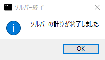

   : [計算の終了]

流木追跡計算結果の表示
------------------------------------------------------------------------------------------------------------------------

:numref:`02_dw12` メインメニューから[計算結果]->[新しい可視化ウィンドウ(2D)を開く]を選択

.. _02_dw12:

.. figure:: images/02/NaysDw2/dw12.png
   :width: 100%

   : [可視化ウィンドウの表示]

:numref:`02_dw13` オブジェクトブラウザーで、[iRICZone][スカラー(格子点)][Velocity(絶対値)]にチェックマーク
を入れて、[右クリック]->[プロパティ]を選択

.. _02_dw13:

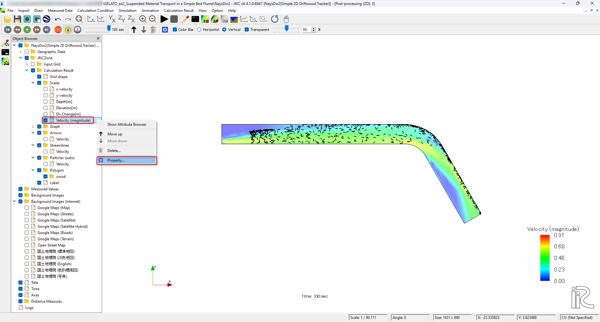

   : [スカラーの表示]

:numref:`02_dw14` [スカラー設定]ウィンドウを図のように設定して[OK]を押す。

.. _02_dw14:

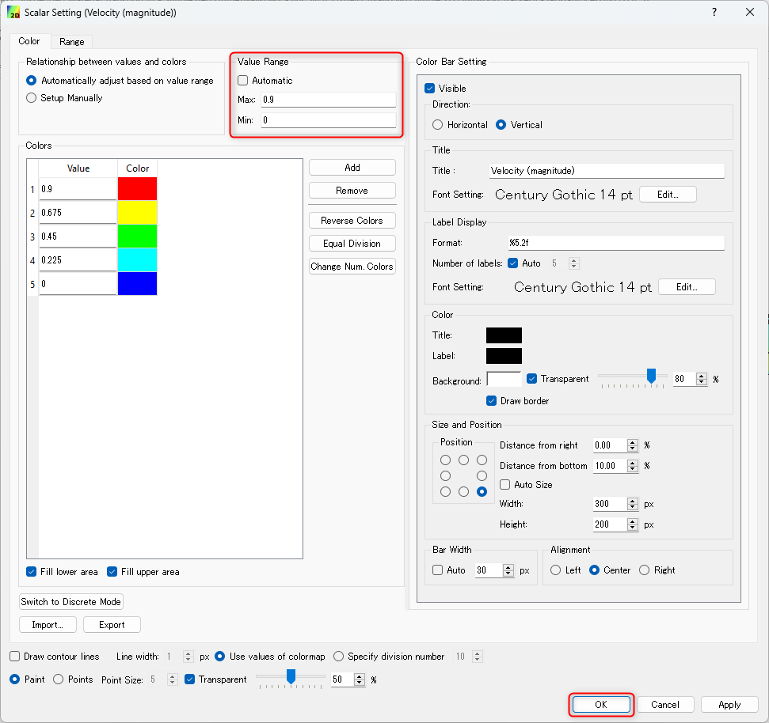

   : [スカラー設定]

:numref:`02_dw15` タイムバーをゼロに戻し、[アニメーション]->[開始/停止]を押す。

.. _02_dw15:

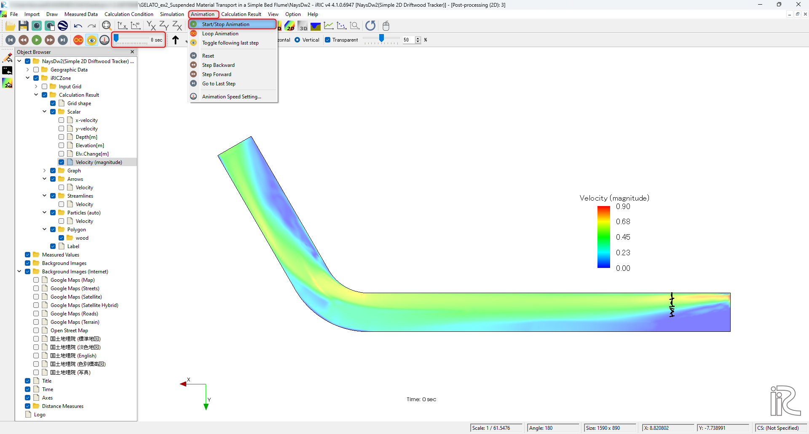

   : [アニメーションの開始]

:numref:`02_dw16` のようなアニメーションが表示される。

.. _02_dw16:

.. figure:: images/02/NaysDw2/dw.gif
   :width: 70%

   : [流木追跡のアニメーション]

