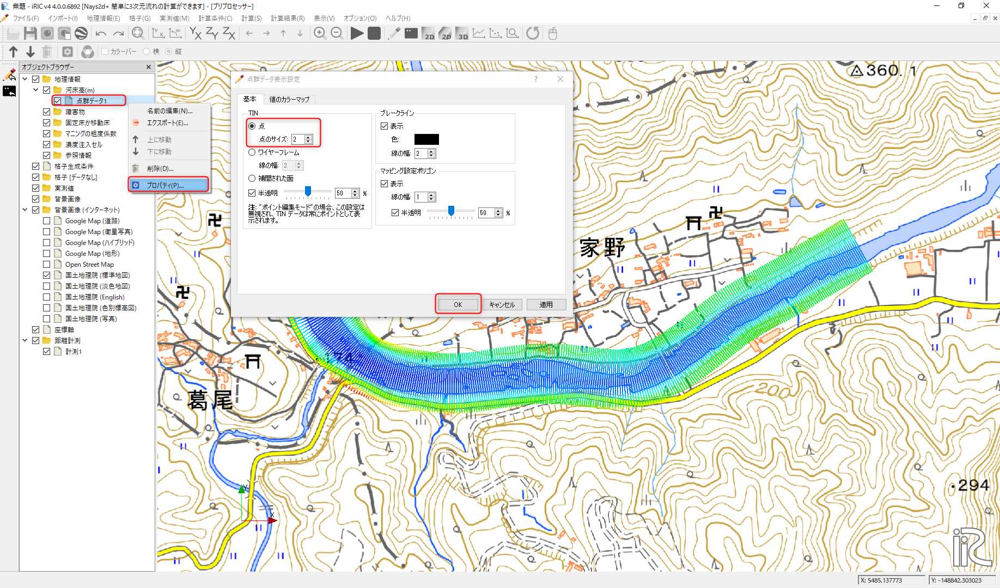
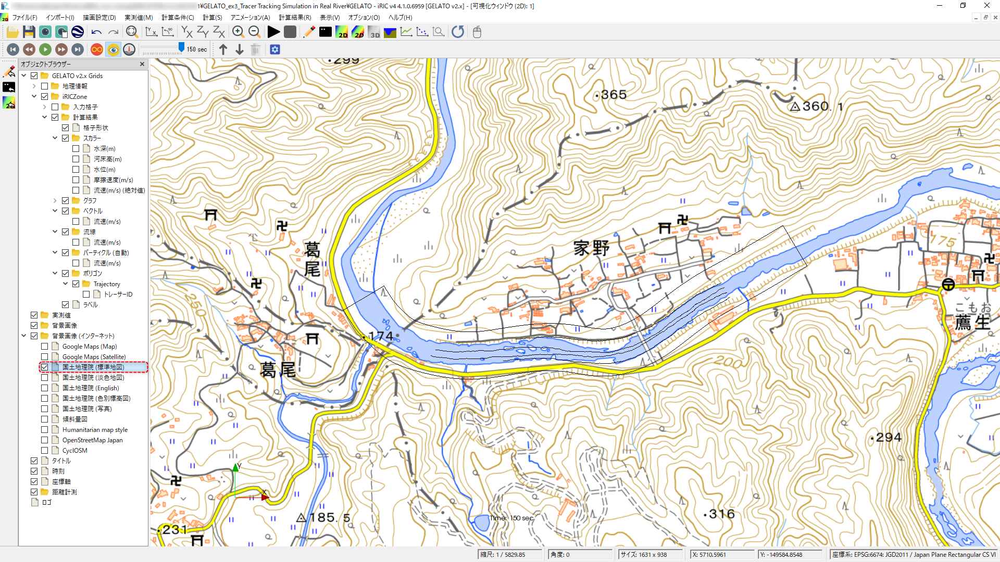

[計算例 3] 実河川の流れとトレーサーの追跡計算
========================================================================================================================

実河川で行われた浮子観測の結果をもとに再現を行う。
洪水時に浮子投下機から浮子を投下し、100m区間の流下時間を測定、流速を算定している。
観測水位・流速から求められた流量 :math:`2640 \, \text{m}^3/\text{s}` を対象に、Nays2d+を用いて表面流を算定後、
GELATOによる浮子の再現を行う。

Nays2d+による流れの計算
------------------------------------------------------------------------------------------------------------------------

ソルバの選択
^^^^^^^^^^^^^^^^^^^^^^^^^^^^^^^^^^^^^^^^^^^^^^^^^^^^^^^^^^^^^^^^^^^^^^^^^^^^^^^^^^^^^^^^^^^^^^^^^^^^^^^^^^^^^^^^^^^^^^^^

iRIC起動画面より、[Nays2d+]を起動する。

.. figure:: images/03/Nays2D+/001.png
   :width: 600pt

   : ソルバーの選択

計算格子と河床形状の作成
^^^^^^^^^^^^^^^^^^^^^^^^^^^^^^^^^^^^^^^^^^^^^^^^^^^^^^^^^^^^^^^^^^^^^^^^^^^^^^^^^^^^^^^^^^^^^^^^^^^^^^^^^^^^^^^^^^^^^^^^

1)  河床高のインポート
++++++++++++++++++++++++++++++++++++++++++++++++++++++++++++++++++++++++++++++++++++++++++++++++++++++++++++++++++++++++
[インポート] → [ 地理情報] → [河床高(m)] より、tikei.tpo（点群データ）を読み込みます。
次に点群データの間引きを選択します。ここでは間引きは行わず、1を選びます。

.. figure:: images/03/Nays2D+/002.png
   :width: 600pt

   : 河床高選択
 
.. figure:: images/03/Nays2D+/003.png
   :width: 600pt

   : 点群データ読み込み

.. figure:: images/03/Nays2D+/004.png
   :width: 400pt

   : 間引き

読み込んだ地形データを示します。

.. figure:: images/03/Nays2D+/005.png
   :width: 100%

   : 地形データ

2) 背景の設定
++++++++++++++++++++++++++++++++++++++++++++++++++++++++++++++++++++++++++++++++++++++++++++++++++++++++++++++++++++++++
[ ファイル ] → [ プロパティ ] を選択し、プロパティ画面より座標系を選択します。

.. figure:: images/03/Nays2D+/006.png
   :width: 300pt

   : プロジェクトプロパティ

   

検索からJapanを打ち込み、EPSGのJapan VIを選択します。

.. figure:: images/03/Nays2D+/007.png
   :width: 300pt

   : 座標系の選択

オブジェクトブラウザより、[背景画像(インターネット）] → [ 国土地理院(標準地図）]を選択します。

.. figure:: images/03/Nays2D+/008.png
   :width: 100%

   : 背景の表示

オブジェクトブラウザより、[点群データ1]を右クリック → [ プロパティ]から[TIN]で[点]を選択して点群表示にします。

   : 点群の表示の変更

3) 計算格子の選択
++++++++++++++++++++++++++++++++++++++++++++++++++++++++++++++++++++++++++++++++++++++++++++++++++++++++++++++++++++++++
[ 格子 ] → [ 格子生成アルゴリズムの選択 ] → [ 折れ線と格子幅から生成 ]を選択する。

.. figure:: images/03/Nays2D+/009.png
   :width: 600pt

   : 格子アルゴリズムの選択

上流側から下流へ向けて中心位置を選択する。

.. figure:: images/03/Nays2D+/010.png
   :width: 100%

   : 中心線の選択

格子生成画面より、格子数 ｎI:290、nJ:56、幅W140mとする。格子サイズは2.5m×5.0m程度となる。

.. figure:: images/03/Nays2D+/011.png
   :width: 300pt

   : 格子生成

.. figure:: images/03/Nays2D+/012.png
   :width: 100%

   : 格子形状

4) 橋脚の設定
++++++++++++++++++++++++++++++++++++++++++++++++++++++++++++++++++++++++++++++++++++++++++++++++++++++++++++++++++++++++
画面左のオブジェクトブラウザより、地勢データ1を非表示にし、
[ 障害物 ] → [ 追加 ] → [ ポリゴン] を選択し、橋脚位置を障害物設定する。
また、全格子をポリゴンで囲み通常格子とする。このとき、通常セルは障害物セルより
下層のレイヤーに配置する。

.. figure:: images/03/Nays2D+/013.png
   :width: 100%

   :障害物

.. figure:: images/03/Nays2D+/014.png
   :width: 100%

   :障害物セル

5) 粗度係数の設定
++++++++++++++++++++++++++++++++++++++++++++++++++++++++++++++++++++++++++++++++++++++++++++++++++++++++++++++++++++++++
[マニングの粗度係数]よりポリゴンから全格子囲みn=0.030を入力する。

.. figure:: images/03/Nays2D+/015.png
   :width: 250pt

   :粗度係数

6) 属性のマッピング
++++++++++++++++++++++++++++++++++++++++++++++++++++++++++++++++++++++++++++++++++++++++++++++++++++++++++++++++++++++++
[ 格子 ] → [ 属性のマッピング ] → [ 実行 ]を選択する。

.. figure:: images/03/Nays2D+/016.png
   :width: 100%

   :属性マッピング

.. figure:: images/03/Nays2D+/017.png
   :width: 250pt

   :属性マッピング実行

計算条件の設定
^^^^^^^^^^^^^^^^^^^^^^^^^^^^^^^^^^^^^^^^^^^^^^^^^^^^^^^^^^^^^^^^^^^^^^^^^^^^^^^^^^^^^^^^^^^^^^^^^^^^^^^^^^^^^^^^^^^^^^^^
                                 
メニューの[ 計算条件 ]より計算条件をを設定する。
各種条件を図に示す。

.. figure:: images/03/Nays2D+/018.png
   :width: 600pt

   :流量および読み込みファイル

.. figure:: images/03/Nays2D+/019.png
   :width: 600pt

   :流量と下流端水位の時系列データ                              

.. figure:: images/03/Nays2D+/020.png
   :width: 600pt

   :時間および浸食に関するパラメータ      

.. figure:: images/03/Nays2D+/021.png
   :width: 600pt

   :境界条件      

.. figure:: images/03/Nays2D+/022.png
   :width: 600pt

   :他の計算条件      

.. figure:: images/03/Nays2D+/023.png
   :width: 600pt

   :三次元流速分布      

計算の実行
^^^^^^^^^^^^^^^^^^^^^^^^^^^^^^^^^^^^^^^^^^^^^^^^^^^^^^^^^^^^^^^^^^^^^^^^^^^^^^^^^^^^^^^^^^^^^^^^^^^^^^^^^^^^^^^^^^^^^^^^

名前を付けてプロジェクトを保存し、計算を実行する。
計算が終わったら、保存してプロジェクトを閉じます。

GELATOによる仮想トレーサーの追跡計算
------------------------------------------------------------------------------------------------------------------------

GELATOの起動、格子のインポート
^^^^^^^^^^^^^^^^^^^^^^^^^^^^^^^^^^^^^^^^^^^^^^^^^^^^^^^^^^^^^^^^^^^^^^^^^^^^^^^^^^^^^^^^^^^^^^^^^^^^^^^^^^^^^^^^^^^^^^^^

iRICの起動画面から、[新しいプロジェクト]を選ぶと表示されるソルバの選択画面で、「GELATO ver2.x」を選んで、「OK」をクリックする。

.. figure:: images/01/GELATO/kido.png
   :width: 800pt

   : GELATOの選択と起動

GELATOセッションが開始され、「入力用CGNSファイルの選択」というダイアログが現れる。

.. figure:: images/01/GELATO/openning.png
   :width: 100%

   : GELATOの起動
  
:guilabel:`...` ボタンをクリックするとファイル選択ダイアログが表示されるので、先ほど計算した[Nays2d+Flow]の計算結果のCGNSファイルをボタンを押して選択する。

.. figure:: images/03/GELATO/import_grid_1.png
   :width: 60%

   : 計算結果CGNSの選択_1

するとダイアログに選択したCGNSファイルの情報が表示されるので、:guilabel:`OK` をクリックする。

.. figure:: images/03/GELATO/import_grid_2.png
   :width: 30%

   : 計算結果CGNSの選択_2

格子をインポートするかどうかを尋ねるダイアログが表示されるので、:guilabel:`はい` をクリックする。

.. figure:: images/01/GELATO/import_grid_3.png
   :width: 30%

   : 格子のインポート_1

以下のようなエラーが表示されるが、これは異なるソルバーの格子を読み込もうとすると必ず表示されるのものなので、気にせず :guilabel:`はい` をクリックする。

.. figure:: images/02/GELATO/import_grid_3.png
   :width: 40%

   : 格子のインポート_2

インポートが完了すると以下のようにインポートされた格子が表示される。

.. figure:: images/03/GELATO/import_grid_3.png
   :width: 100%

   : 格子インポート完了

地形データの確認
^^^^^^^^^^^^^^^^^^^^^^^^^^^^^^^^^^^^^^^^^^^^^^^^^^^^^^^^^^^^^^^^^^^^^^^^^^^^^^^^^^^^^^^^^^^^^^^^^^^^^^^^^^^^^^^^^^^^^^^^
| 座標系を設定し、背景地図を表示する。
| メニューバーの :menuselection:`ファイル(F) --> プロパティ(P)` を選択してプロジェクトプロパティ画面を開く。

.. figure:: images/03/GELATO/coordinate_setting_01.png
   :width: 100%

   :プロパティの選択

プロジェクトプロパティ画面より、座標系の :guilabel:`編集` を選択する。

.. figure:: images/03/GELATO/coordinate_setting_02.png
   :width: 400pt

   :プロジェクトプロパティ

座標系の選択画面より、検索に [ japan ] と入力し、[ EPSG:6674:JGD2011 / Japan Plane Rectangular CS VI ] を選択し :guilabel:`OK` をクリックしたらプロジェクトプロパティ画面を閉じる。 

.. figure:: images/03/GELATO/coordinate_setting_03.png
   :width: 400pt

   :座標系の選択

オブジェクトブラウザより、背景画像(インターネット)の国土地理院(標準地図)を選択する。

.. _03_030:

.. figure:: images/03/GELATO/coordinate_setting_04.png
   :width: 100%

   :背景画像

GELATOによるトレーサー追跡計算
^^^^^^^^^^^^^^^^^^^^^^^^^^^^^^^^^^^^^^^^^^^^^^^^^^^^^^^^^^^^^^^^^^^^^^^^^^^^^^^^^^^^^^^^^^^^^^^^^^^^^^^^^^^^^^^^^^^^^^^^

計算条件の設定
++++++++++++++++++++++++++++++++++++++++++++++++++++++++++++++++++++++++++++++++++++++++++++++++++++++++++++++++++++++++
| メニューバーの :menuselection:`計算条件(C) --> 設定(S)` から、計算条件設定ウィンドウを開き、赤枠で囲った部分を以下のように設定する。
| その他の計算条件はデフォルトのままでよい。

.. figure:: images/03/GELATO/setting_01.png
   :width: 600pt

   :計算条件の設定_1
   
.. figure:: images/03/GELATO/setting_02.png
   :width: 600pt

   :計算条件の設定_2

.. figure:: images/03/GELATO/setting_03.png
   :width: 600pt

   :計算条件の設定_3

2) 計算の実行
++++++++++++++++++++++++++++++++++++++++++++++++++++++++++++++++++++++++++++++++++++++++++++++++++++++++++++++++++++++++
| メニューバーの :menuselection:`計算(C) --> 実行(R)` を選択すると、警告が現れるので適当な名前で保存する。
| このときの保存形式は[ファイルに保存(ipro)]か[プロジェクトとして保存]どちらでも良い。
| 
| 計算が終了すると「ソルバーの計算が終了しました.」とダイアログが表示されるので、:guilabel:`OK` をクリックする。

3) 計算結果の表示
++++++++++++++++++++++++++++++++++++++++++++++++++++++++++++++++++++++++++++++++++++++++++++++++++++++++++++++++++++++++
| メインメニューの :menuselection:`計算結果(R) --> 新しい可視化ウィンドウ(2D)を開く` を選択すると、二次元可視化ウィンドウがが表示される。
| オブジェクトブラウザの[背景画像(インターネット)]の[国土地理院(標準地図)]にチェックを入れ、背景地図を表示する。

   :背景画像

| オブジェクトブラウザより、[ポリゴン]の [Trajectory] を右クリックし、プロパティを選択する。

.. figure:: images/03/GELATO/visualization_02.png
   :width: 100%

   :ポリゴンのプロパティ

| ポリゴン設定画面より、[ 線の幅 ] に 3 を入力する。

.. figure:: images/03/GELATO/visualization_03.png
   :width: 600pt

   :ポリゴン設定

| 同様にオブジェクトブラウザより、[スカラー(格子点)] の[ 流速(m/s)(絶対値) ] を選択し、右クリックよりプロパティを選択する。
| スカラー設定画面より、以下のように値を入力し、最小値以下を描画のチェックを外す。

.. figure:: images/03/GELATO/visualization_04.png
   :width: 600pt

   :スカラー設定

| 以上の可視化設定が完了したら、タイムステップを最初に戻し、メインメニューの :menuselection:`アニメーション(A) --> 開始/停止(S)` を選択すると、アニメーションが再生される。
| この結果は浮子投下機より投下したトレーサーの軌跡の計算結果を示す。

.. figure:: images/03/GELATO/tranjectory_animation.gif
   :width: 70%

   : トレーサーの軌跡アニメーション
