==========================================================
[Example 3] Tracer Tracking Simulation in Real River
==========================================================

In this section, we perform s simulation of tracking floats for
the discharge measurements in a real river.
Floats are injected from a bridge and velocities are calculated by 
measuring the flow time between two sections ste up with 100m interval in which 
the upper section is located 130m downstream of the bridge. 
Using a discharge of 384m :math:`^3`/s, flow calculation is conducted using
Nays2d+, and the paths of the floats are simulated by GELATO.

Flow Calculation by Nays2d+
==============================

Selection of Solver
-----------------------

From the start window of the iRIC, launch [Nays2d+] as :numref:`03_001`.

.. _03_001:

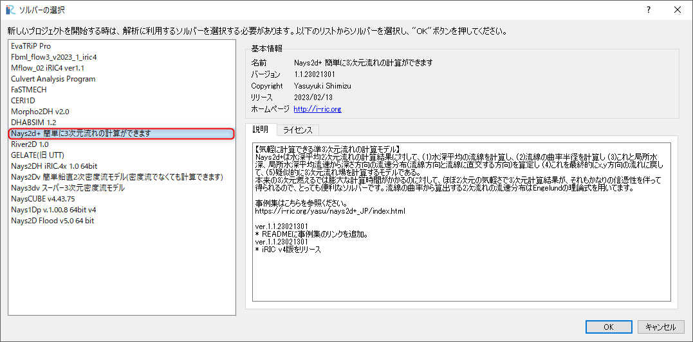

   : Solver Selection

Import Geometric Data and Making Computational Grid
-----------------------------------------------------------

Importing River Bed Elevation Data
^^^^^^^^^^^^^^^^^^^^^^^^^^^^^^^^^^^^^^^^^

From the main menu, select [Import]->[Geographic Data]->[Bed Elevation(m)] as
:numref:`03_002`, and read "tikei.tpo (Point Claud Data)" as shown in 
:numref:`03_003`. 

.. _03_002:

.. figure:: images/03/Nays2D+/002.png
   :align: center
   :width: 100%

   : Import River Bed Data File

.. _03_003:

.. figure:: images/03/Nays2D+/003.png
   :align: center
   :width: 600pt

   : Selecting a tpo file

While reading the data, you need to set filtering value as 
:numref:`03_004`.  In this example, choose [1] just for without filtering.

.. _03_004:

.. figure:: images/03/Nays2D+/004.png
   :align: center
   :width: 400pt

   : Input Filtering Value

The geometric data (ground elevation data) is shown as 
:numref:`03_005`.

.. _03_005:

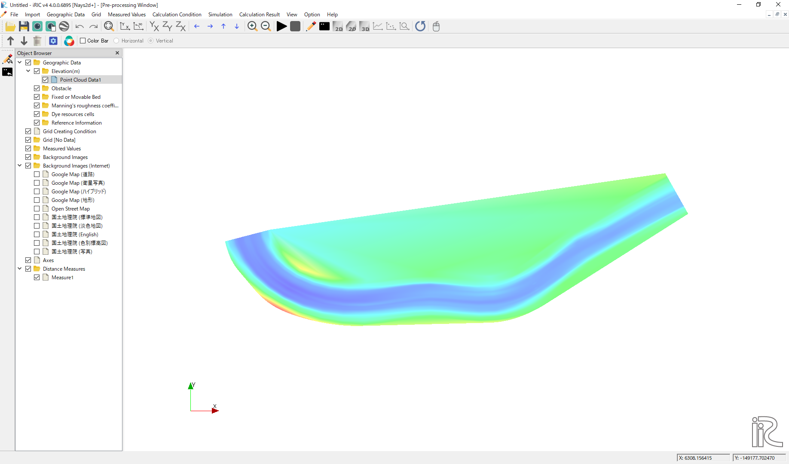

   : Geometric Data

Setup Background image
^^^^^^^^^^^^^^^^^^^^^^^^^^^^^^^

From the main menu, select [File]->[Property], and press [Edit] button at
[Coordinate System:] information as :numref:`03_006`.

.. _03_006:

.. figure:: images/03/Nays2D+/006.png
   :align: center
   :width: 400pt

   : Project Property

in the [Select Coordinate System] window, type "Japan" at [Search:] box, and select 
[EPSG ..... Japan .... IV] from the list below the [Search:] box, and press [OK] as
:numref:`03_007`.  Then close the [Project Property] window by pressing [Close].

.. _03_007:

.. figure:: images/03/Nays2D+/007.png
   :align: center
   :width: 400pt

   : Select Coordinate System

In the [Object Browser], put check marks at [Background Images (Internet)]
->[国土地理院(標準地図)] as :numref:`03_008`.

.. _03_008:

.. figure:: images/03/Nays2D+/008.png
   :align: center
   :width: 100%

   :Select Background Image 

Grid Creation
^^^^^^^^^^^^^^^^^^^^^^^^^

From the main menu, select [Grid]->[Select Algorithm to Create Grid], and
select [Create grid from polygonal line and width] in the next window
(:numref:`03_009`)

.. _03_009:

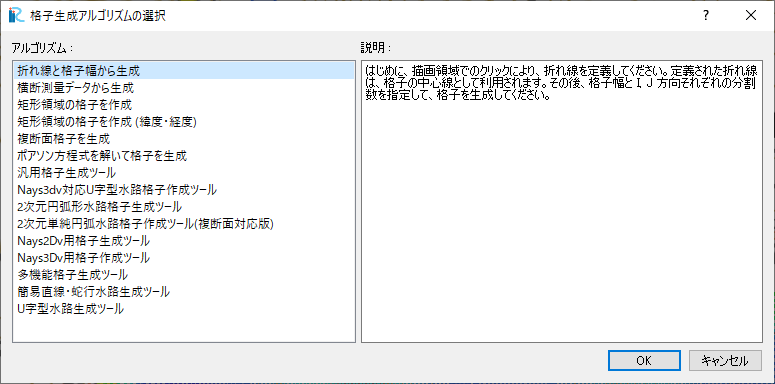

   : Select Grid Creating Algorithm

Assign channel center points from the upstream side to down stream side as :numref:`03_010`.

.. _03_010:

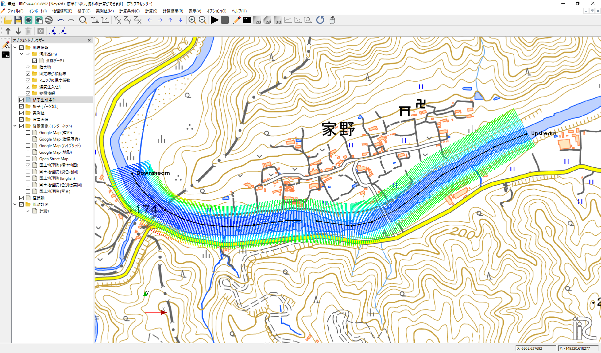

   : Assign Center Points 

In the [Grid Creation] window, :numref:`03_011`, input values as Ni=290, Nj=56 and W=140, then the grid size becomes about 2.5mx5.0 m as :numref:`03_012`.

.. _03_011:

.. figure:: images/03/Nays2D+/011.png
   :align: center
   :width: 400pt

   : Grid Creation

.. _03_012:

.. figure:: images/03/Nays2D+/012.png
   :align: center
   :width: 100%

   : Created Grid Shape

Setup for Bridge Piers
^^^^^^^^^^^^^^^^^^^^^^^^^

From the [Object Browser] in the left side of the window, hide the [Point Cloud Data 1] by removing 
the check mark.  Right click [Obstacles], select [Add]->[Polygons], and make polygons by clicking the 
outer edge of the piers, and assign them as [Obstacle] (:numref:`03_013`)
Surround all the cells in one polygon and assign it as [Normal Cell].  Note that the [Normal Cell] 
polygon has to be located at lower layer than the [Obstacle] polygons (:numref:`03_014`).

.. _03_013:

.. figure:: images/03/Nays2D+/013.png
   :align: center
   :width: 100%

   :Obstacle Cells for Bridge Piers

.. _03_014:

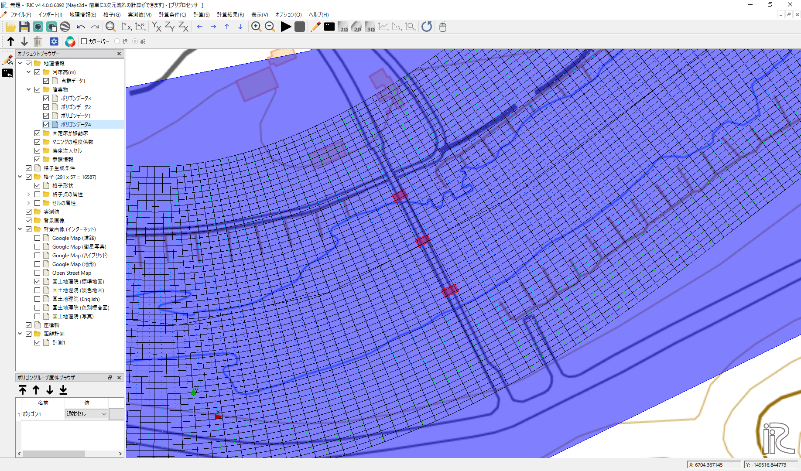

   :Normal Cells for All the Area

Set Manning's Roughness Coefficient
^^^^^^^^^^^^^^^^^^^^^^^^^^^^^^^^^^^^^^^

In the [Object Browser] under the group of [Geographic Data], right click 
[Manning's roughness coefficient] and select [Add]->[Polygons], and 
make a polygon covering all the grid domain, and input n=0.030
(:numref:`03_015`).

.. _03_015:

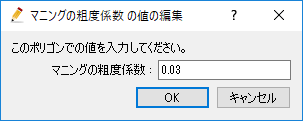

   :Set Manning's Roughness Coefficient

Attributes Mapping
^^^^^^^^^^^^^^^^^^^^^^^^^

From the main menu, select [Grid]->[Attributes Mapping]->[Execute]
(:numref:`03_016`).

.. _03_016:

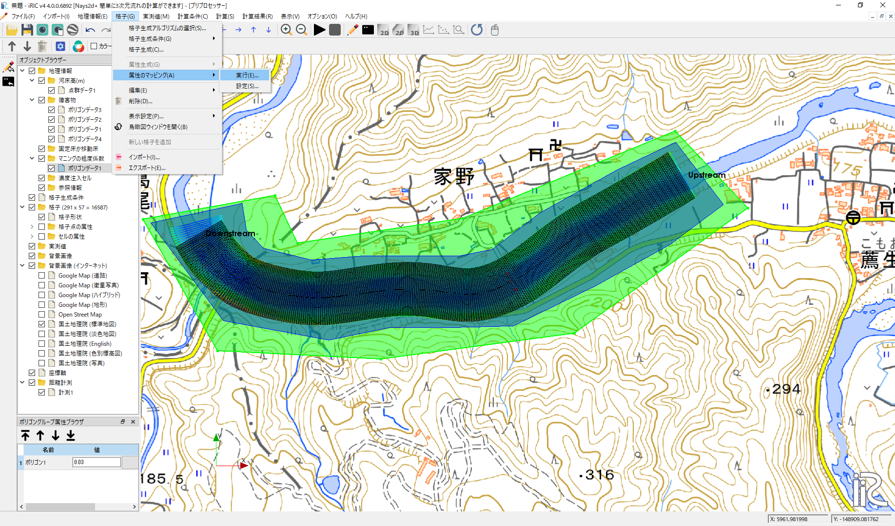

   :Select Attributes Mapping

Put check marks at [Elevation(m)], [Obstacle] and  [Maninng's roughness coefficient] in
the [Attribute Mapping] window as :numref:`03_017`, and press [OK] to execute mapping.

.. _03_017:

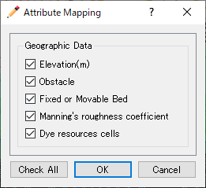

   :Choose Mapping Items and Execute Mapping

Set Calculation Condition
-----------------------------
                                 
From the main menu, select [calculation Condition]->[Setting], and
input parameters in the [Calculation Condition] window as the following figures of
:numref:`03_018`, :numref:`03_019`,  :numref:`03_020`,  :numref:`03_021`,  :numref:`03_022`
and :numref:`03_023`.  When you finished to input parameters, press [OK].

.. _03_018:

.. figure:: images/03/Nays2D+/018.png
   :align: center
   :width: 100%

   :Discharge and downstream water surface elevation settings

.. _03_019:
   
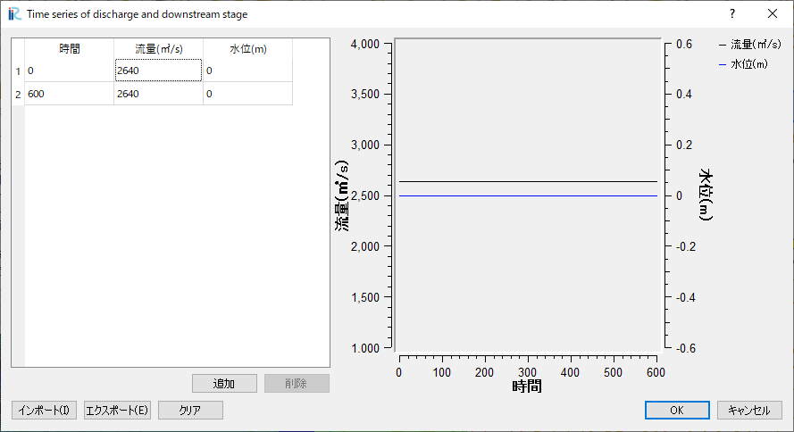

   :Time series of discharge and downstream stage                             

.. _03_020:  

.. figure:: images/03/Nays2D+/020.png
   :align: center
   :width: 100%

   :Time and bed erosion parameters     

.. _03_021:
   
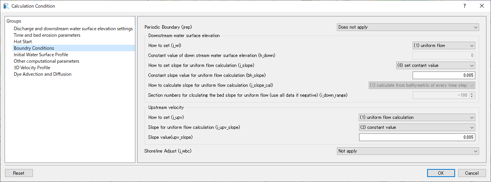

   :Boundary Condition      

.. _03_022:
   
.. figure:: images/03/Nays2D+/022.png
   :align: center
   :width: 100%

   :Other computational condition     

.. _03_023:
   
.. figure:: images/03/Nays2D+/023.png
   :align: center
   :width: 100%

   :3D Velocity Profile     

Execute a Solver
---------------------

Save the project with some name, and run the solver by [Simulation]->[Run].
When the simulation finished, save the results and close the project.

Tracer Tracking Simulation by GELATO
========================================================================================================================

Launching GELATO and Importing Grid
------------------------------------------------------------------------------------------------------------------------

From the iRIC startup screen, select [New Project], choose "GELATO ver2.x" from the solver selection screen, and click "OK".

.. figure:: images/01/GELATO/kido.png
   :width: 800pt

   : Selecting and Launching GELATO

The GELATO session starts, and a dialog for selecting the input CGNS file appears.

.. figure:: images/01/GELATO/openning.png
   :width: 100%

   : Launching GELATO
  
Click the `...` button to open the file selection dialog, and select the CGNS file of the Nays2d+Flow calculation result.

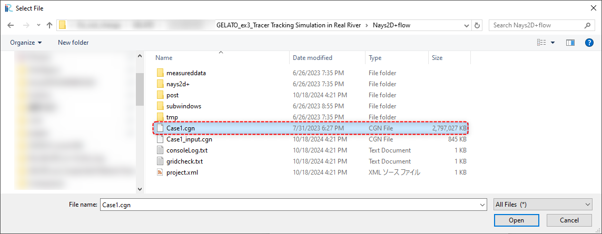

   : Selecting the Calculation Result CGNS File

The information of the selected CGNS file is displayed in the dialog, click `OK`.

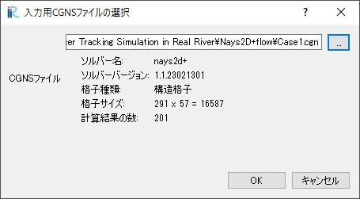

   : Selecting the Calculation Result CGNS File

A dialog asking whether to import the grid appears, click `Yes`.

.. figure:: images/01/GELATO/import_grid_3.png
   :width: 30%

   : Importing Grid

An error like the one below appears, but this always happens when trying to read the grid of a different solver, so just click `Yes`.

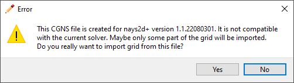

   : Importing Grid

When the import is complete, the imported grid is displayed as shown below.

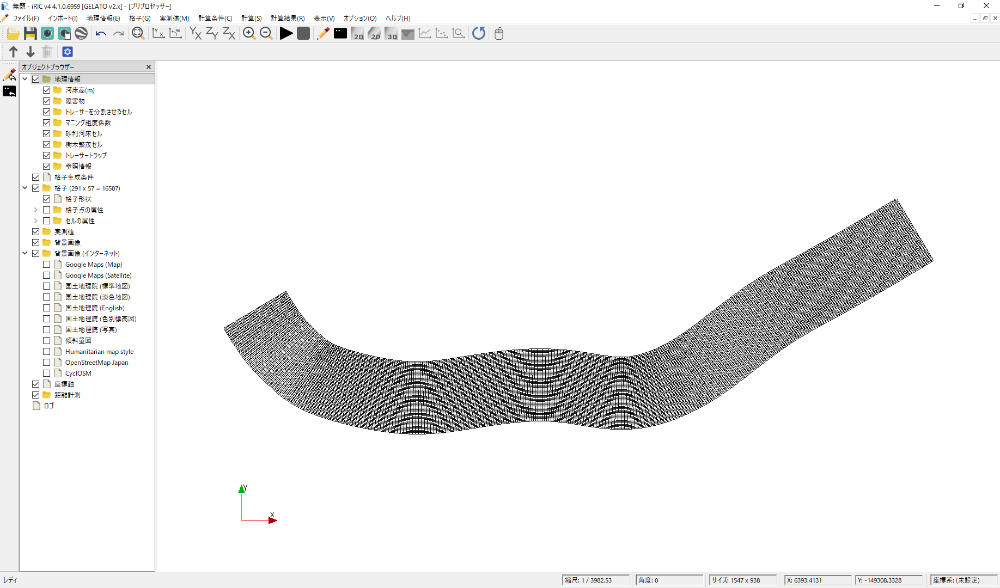

   : Grid Import Complete

Checking Terrain Data
------------------------------------------------------------------------------------------------------------------------
| Set the coordinate system and display the background map.
| From the menu bar, select :menuselection:`File(F) --> Property(P)` to open the project property screen.

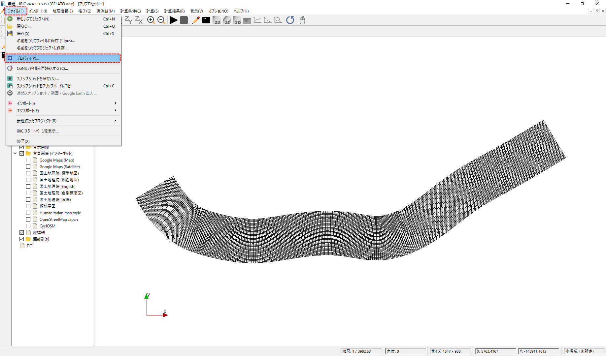

   : Selecting Property

From the project property screen, select `Edit` for the coordinate system.

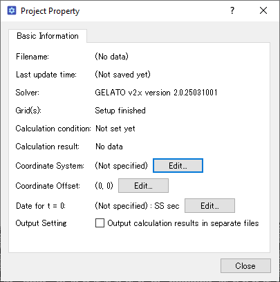

   : Project Property

In the coordinate system selection screen, type [japan] in the search box, select [EPSG:6674:JGD2011 / Japan Plane Rectangular CS VI], and click `OK`, then close the project property screen.

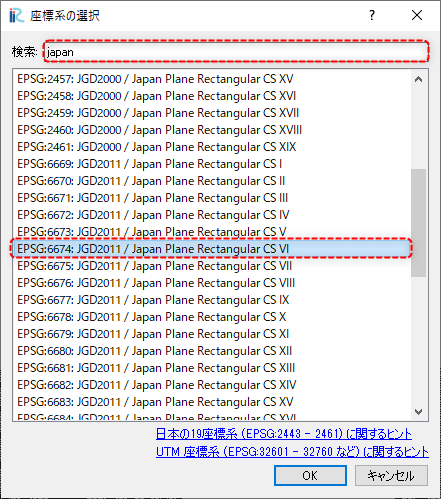

   : Selecting Coordinate System

From the object browser, select the background image (Internet) of the Geospatial Information Authority of Japan (standard map).

.. _03_030:

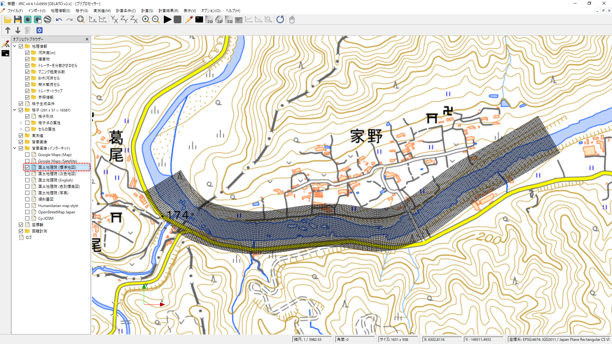

   : Background Image

Tracer Tracking Simulation by GELATO
------------------------------------------------------------------------------------------------------------------------

Setting Calculation Conditions
^^^^^^^^^^^^^^^^^^^^^^^^^^^^^^^^^^^^^^^^^^^^^^^^^^^^^^^^^^^^^^^^^^^^^^^^^^^^^^^^^^^^^^^^^^^^^^^^^^^^^^^^^^^^^^^^^^^^^^^^
| From the menu bar, select :menuselection:`Calculation Conditions(C) --> Settings(S)` to open the calculation condition setting window, and set the parts surrounded by red frames as follows.
| Other calculation conditions can be left as default.

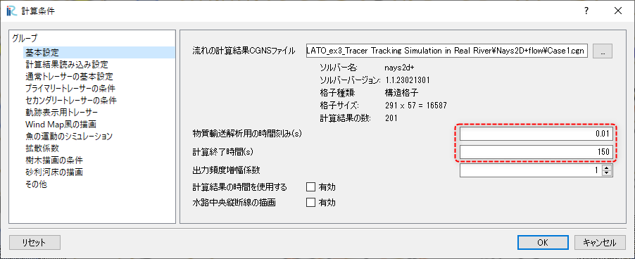

   : Setting Calculation Conditions_1
   
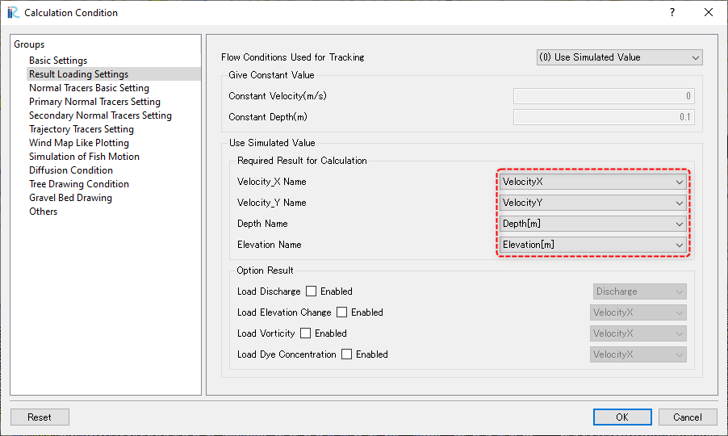

   : Setting Calculation Conditions_2

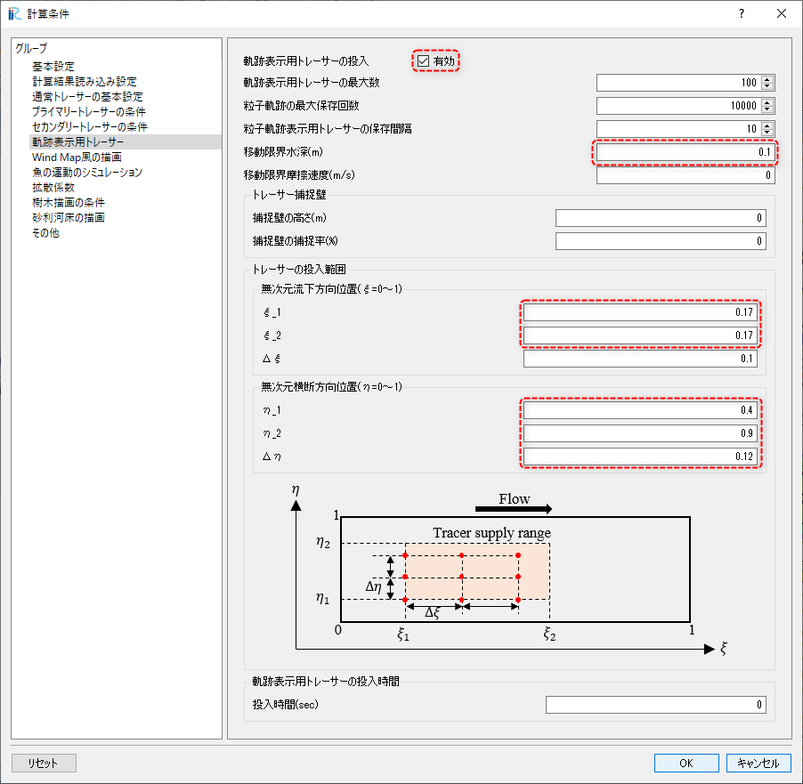

   : Setting Calculation Conditions_3

Executing the Calculation
^^^^^^^^^^^^^^^^^^^^^^^^^^^^^^^^^^^^^^^^^^^^^^^^^^^^^^^^^^^^^^^^^^^^^^^^^^^^^^^^^^^^^^^^^^^^^^^^^^^^^^^^^^^^^^^^^^^^^^^^
| From the menu bar, select :menuselection:`Calculation(C) --> Run(R)`, a warning appears, save with an appropriate name.
| The save format can be either [Save to file (ipro)] or [Save as project].
| When the calculation is complete, a dialog saying "Solver calculation is complete." appears, click `OK`.

Displaying Calculation Results
^^^^^^^^^^^^^^^^^^^^^^^^^^^^^^^^^^^^^^^^^^^^^^^^^^^^^^^^^^^^^^^^^^^^^^^^^^^^^^^^^^^^^^^^^^^^^^^^^^^^^^^^^^^^^^^^^^^^^^^^
| From the main menu, select :menuselection:`Calculation Results(R) --> Open New Visualization Window (2D)` to display the 2D visualization window.
| From the object browser, right-click [Trajectory] under [Polygon], and select [Properties].

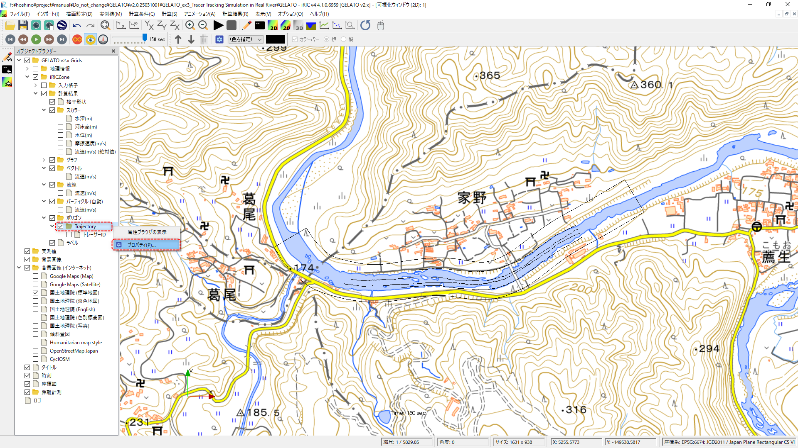

   : Polygon Properties

| In the polygon setting screen, set [Line Width] to 3.

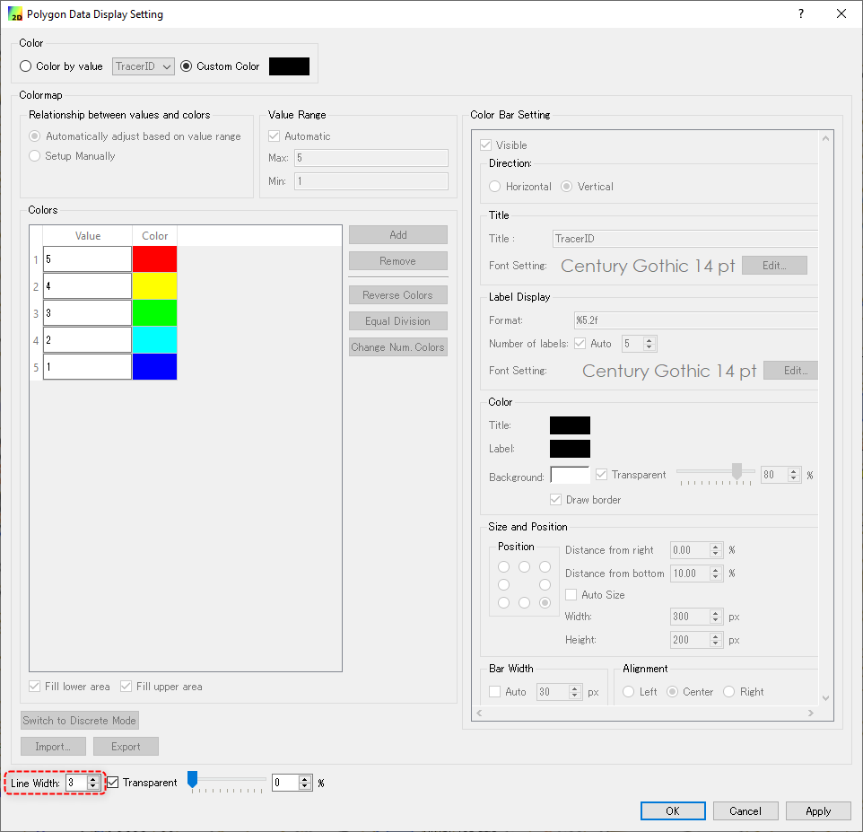

   : Polygon Settings

| Similarly, from the object browser, select [Velocity (m/s) (Magnitude)] under [Scalar (Grid Point)], right-click and select [Properties].
| In the scalar setting screen, enter values as shown below, and uncheck [Draw below minimum value].

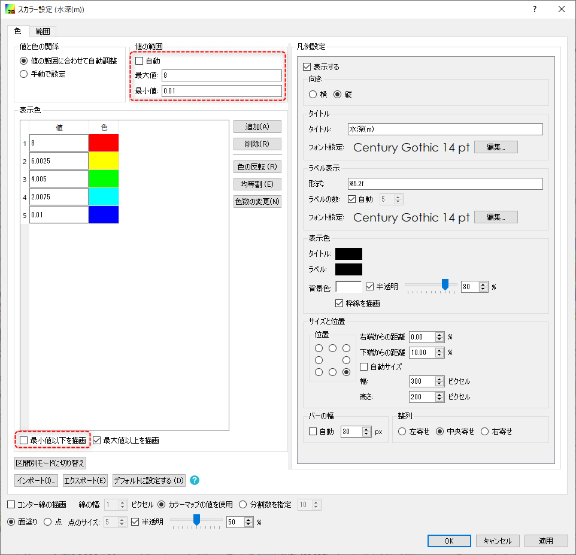

   : Scalar Settings

| After completing the visualization settings, return the time step to the beginning, and select :menuselection:`Animation(A) --> Start/Stop(S)` from the main menu to play the animation.
| This result shows the calculation result of the trajectory of the tracer dropped from the float drop machine.

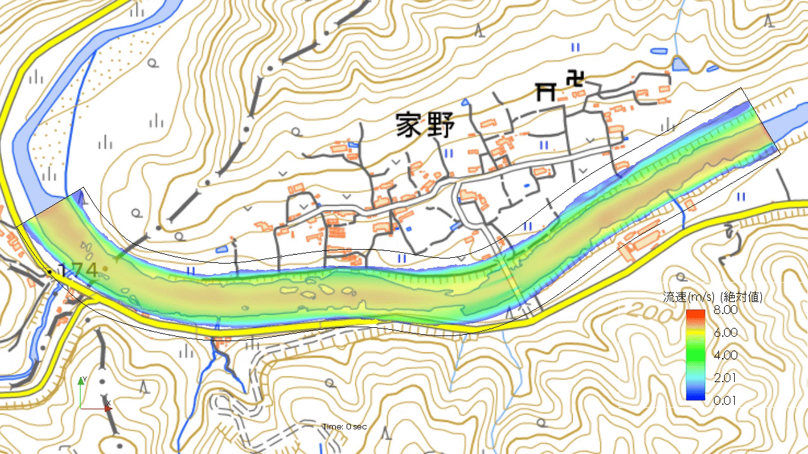

   : Trajectory Animation
