GELATO Ver2.xにおける更新点
========================================================================================================================

GELATO Ver2.xでは以下の点が従来までのGELATOと比較して更新されている。
なお、GELATO Ver2.xはiRICのインストーラーに同梱されていたGELATOのほか、派生したバージョンを統合し書き直したものである。

仕様変更
------------------------------------------------------------------------------------------------------------------------

タイムステップの扱い
^^^^^^^^^^^^^^^^^^^^^^^^^^^^^^^^^^^^^^^^^^^^^^^^^^^^^^^^^^^^^^^^^^^^^^^^^^^^^^^^^^^^^^^^^^^^^^^^^^^^^^^^^^^^^^^^^^^^^^^^
| に従来までのGELATOのタイムステップの扱いのイメージを示す。
| 上部の目盛が流れの計算結果で出力されたタイムステップ刻み及びその時刻、下部の目盛がGELATOでの出力タイムステップ刻み及びその時刻を示している。

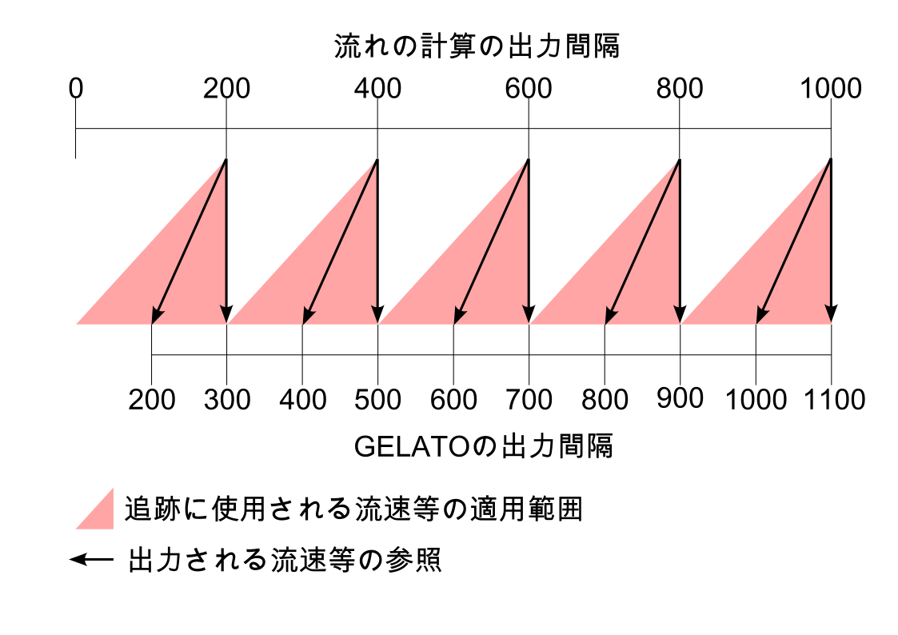

   : 従来のGELATOでのタイムステップの扱い

| 図で示すよう、GELATOでは出力頻度増幅係数により読み込んだ計算結果のタイムステップよりも細かいタイムステップで結果を出力することが可能であるが、以下のような問題があった。

- 読み込んだ計算結果の初期タイムステップを出力していなかった。
- 出力頻度増幅係数を変更すると、読み込んだ計算結果のタイムステップとGELATOのタイムステップが一致しなくなる。

| 上記の仕様によりGELATO側のトレーサーの出力間隔がズレてしまい、出力頻度増幅係数を変更するとトレーサーの追跡結果が異なるということが確認されていた。

| そこでGELATO ver2.xでは、上記の問題を解決するために初期状態も出力できるように変更し、出力頻度増幅係数を変更してもトレーサーの追跡結果が変わらないように改良されている。
| GELATO ver2.xでのタイムステップの扱いのイメージを以下に示す。
| ピンク色の三角形は、GELATOでの物質輸送追跡計算に使用される流れの計算結果がどのタイムステップのものを使用しているかを示している。

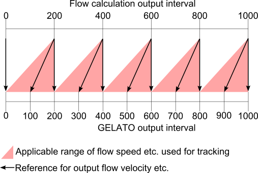

   : GELATO ver2.xでのタイムステップの扱い

| また、GELATO ver2.xでは出力の際に読み込み元のオリジナルの時刻で出力する機能が追加されている。
| 例えば、読み込む計算結果で最初の時刻が200secの場合、GELATOでの出力する時間は0secからスタートするか200secからスタートするかを選択することが可能となっている。
| なお、オリジナルの時刻を使用する場合はトレーサー散布時間や計算終了時間などもオリジナルの時刻で設定する必要がある。

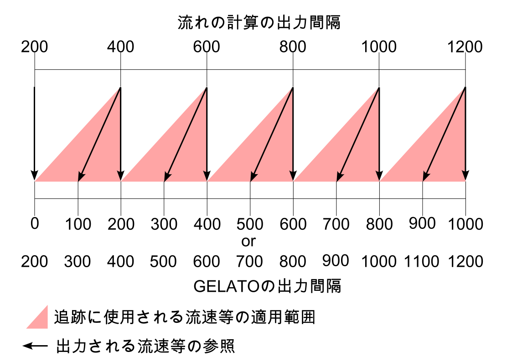

   : 出力時の時刻の設定

流れの計算結果の読み込み
^^^^^^^^^^^^^^^^^^^^^^^^^^^^^^^^^^^^^^^^^^^^^^^^^^^^^^^^^^^^^^^^^^^^^^^^^^^^^^^^^^^^^^^^^^^^^^^^^^^^^^^^^^^^^^^^^^^^^^^^
| 従来まではソルバーを起動後、ユーザーが格子のインポート及び、計算結果ダイアログで読み込む計算結果のパスを指定する仕様となっていた。
| GELATO ver2.xではソルバー起動時に表示されるダイアログから直接計算結果のパスを指定することが可能となっている。これにより格子のインポート及び計算結果の読み込みが容易になっている。
| また、この変更により読み込み対象の計算結果がどのソルバーで計算されたかなどの情報を計算結果ダイアログで確認できるようになっている

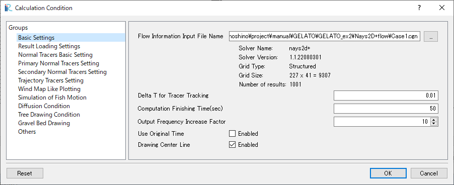

   : 計算条件ダイアログで表示される情報

| さらに、従来では流速や水深を計算結果から読み込む際に、計算結果名がGELATO内で設定されているものと異なる場合にエラーが発生していた。

.. note::
   例えば、水深に関しては :guilabel:`Depth(m)`、:guilabel:`Depth[m]`、:guilabel:`Depth`、:guilabel:`depth(m)` のいずれかの名前で出力されているソルバーでなければ読み込むことができなかった。

| そこでGELATO ver2.xでは、読み込む計算結果のCGNSファイルの中にどういった名前の計算結果があるかを確認し、ユーザーが対象を選択する仕様に変更した。
| これにより、従来のように自動で読み込んではくれないが、流速、水深、河床高が出力されているCGNSファイルであれば、どのソルバーで計算されたものであっても読み込むことが可能となっている。

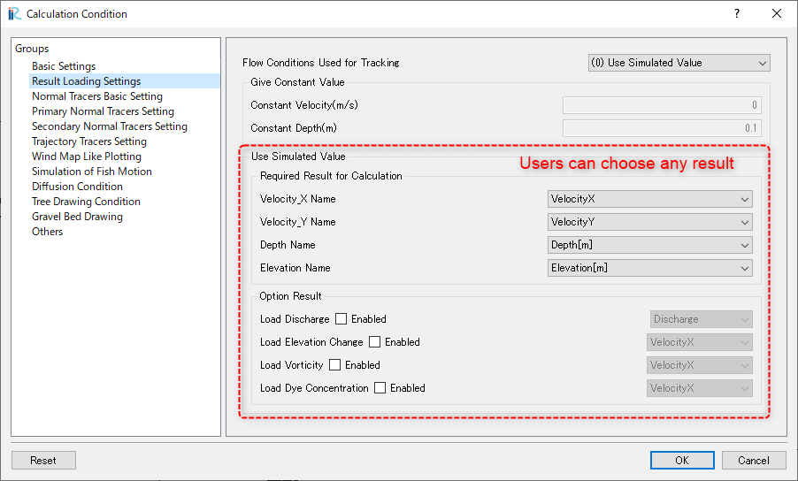

   : 計算結果の選択

.. _魚のシミュレーションにおけるパラメーターの設定方法:

魚のシミュレーションにおけるパラメーターの設定方法
^^^^^^^^^^^^^^^^^^^^^^^^^^^^^^^^^^^^^^^^^^^^^^^^^^^^^^^^^^^^^^^^^^^^^^^^^^^^^^^^^^^^^^^^^^^^^^^^^^^^^^^^^^^^^^^^^^^^^^^^
| GELATO ver2.xでは魚の遊泳パラメーター設定方法が従来から大きく変更されている。
| 従来までは魚の代表的な体長から3パターンの範囲内でランダムな体長を設定し、遊泳速度などにも体長を基準としたバリエーションを持たせる仕様となっていた。
| しかし、この方法では魚の体長や遊泳速度などのパラメーターがランダムに設定されるため、任意のパラメーターを持つ魚のグループを複数作成する事が難しいという問題があった。

| そこでGELATO ver2.xではiRICの新機能を用いて魚のグループ毎に任意のパラメーターを設定可能とした。それに伴い、魚の設定ダイアログも大幅に変更されている。

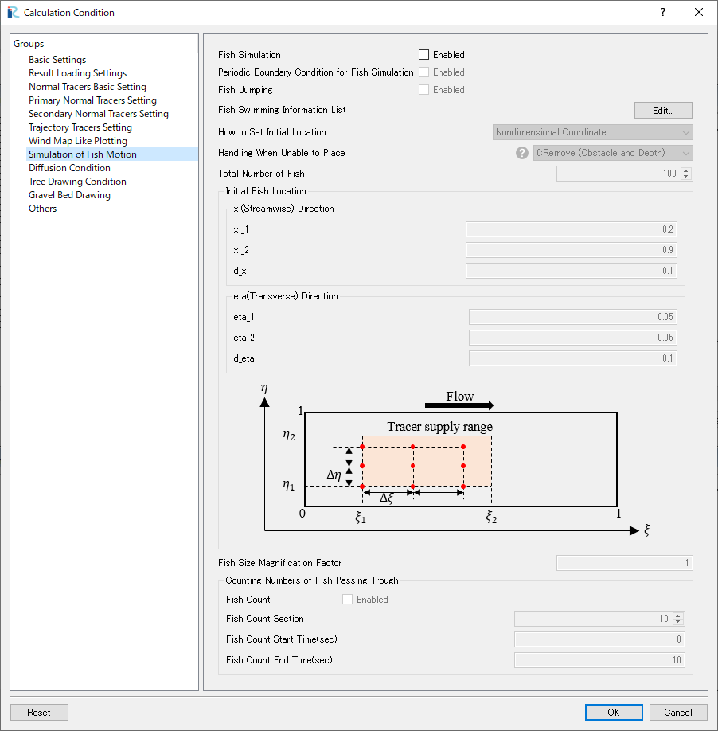

   : GELATO ver2.xでの魚の設定ダイアログ

| ユーザーはiRICの計算条件ダイアログで魚のグループを作成し、各グループ毎に体長、遊泳速度、遊泳方向などのパラメーターを設定することになるが、グループ毎のリスト表示モード、各グループのパラメーターを一覧で確認できる表形式の2つの入力モードが使用できる。

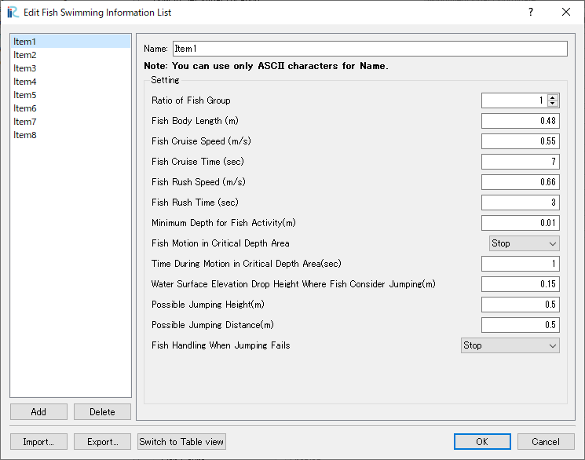

   : GELATO ver2.xでの魚の設定ダイアログ（リスト表示モード）

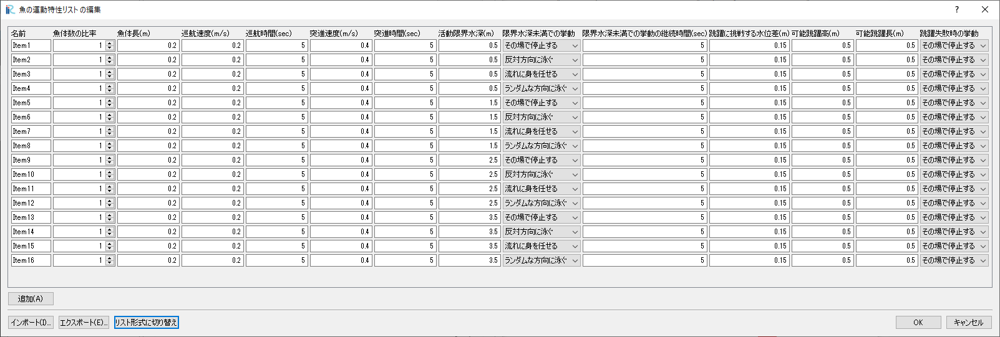

   : GELATO ver2.xでの魚の設定ダイアログ（表形式表示モード）

| また、この新機能を用いたパラメーター入力ダイアログでは、各魚のグループのパラメーターをcsvにて入出力可能となっており、Excel等で作成したパラメーターを一括で読み込むことが可能となっている。

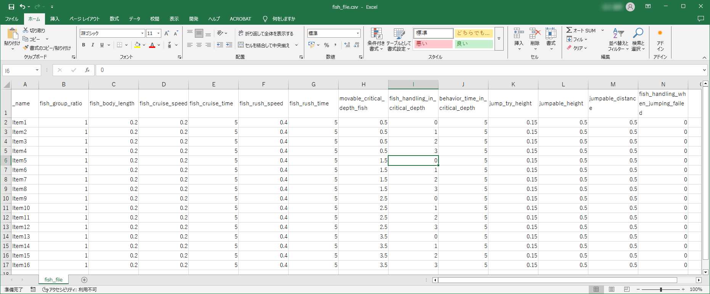

   : 魚のパラメーターのcsvの例

| この変更に併せて、魚の設定ファイル(\*.csv)を簡便に作成できるMicrosoft Excel用のマクロを作成した。このマクロを使用することで、従来までの基準となる体長を定めランダムでパラメーターを設定することができるほか、指定した体長の範囲内を等間隔で体長を設定することも可能となっている。
| このマクロは `こちら <https://i-ric.org/download/gelato_fishfilemaker/>`_ からダウンロード可能である。

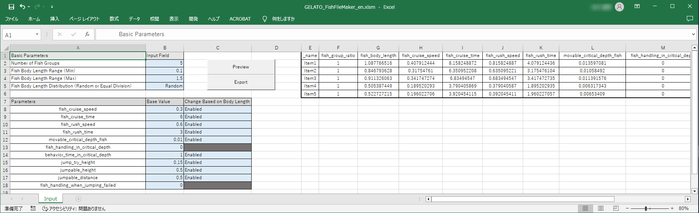

   : 魚のパラメーターのマクロ

機能追加
------------------------------------------------------------------------------------------------------------------------

マニングの粗度係数の設定
^^^^^^^^^^^^^^^^^^^^^^^^^^^^^^^^^^^^^^^^^^^^^^^^^^^^^^^^^^^^^^^^^^^^^^^^^^^^^^^^^^^^^^^^^^^^^^^^^^^^^^^^^^^^^^^^^^^^^^^^
従来まではGELATO内での計算に使用するマニングの粗度係数がプログラム内で決定された一律の値となっていたが、ユーザーが任意の一定値を与える機能および、計算格子にマッピングした値を使用する機能が追加されている。

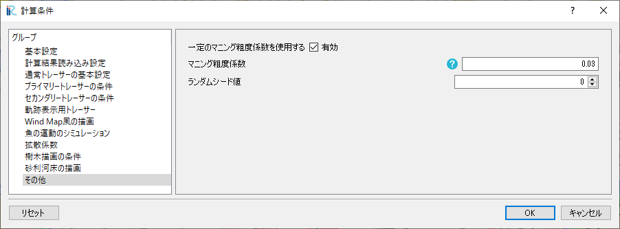

   : マニングの粗度係数の設定

トレーサーの総数の追加機能
^^^^^^^^^^^^^^^^^^^^^^^^^^^^^^^^^^^^^^^^^^^^^^^^^^^^^^^^^^^^^^^^^^^^^^^^^^^^^^^^^^^^^^^^^^^^^^^^^^^^^^^^^^^^^^^^^^^^^^^^
| GELATO ver2.xでは、タイムステップ毎に計算範囲内に何個のトレーサーが存在しているかを出力する機能が追加されている。
| iRICのグラフ機能やラベル機能を使用することで、トレーサーの総数の時間的変化を簡単に確認することが可能となっている。
| また、この機能は通常トレーサーの他、軌跡追跡トレーサー、魚にも適用されている。

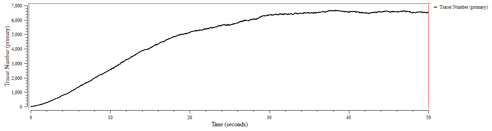

   : トレーサーの総数の時間的変化

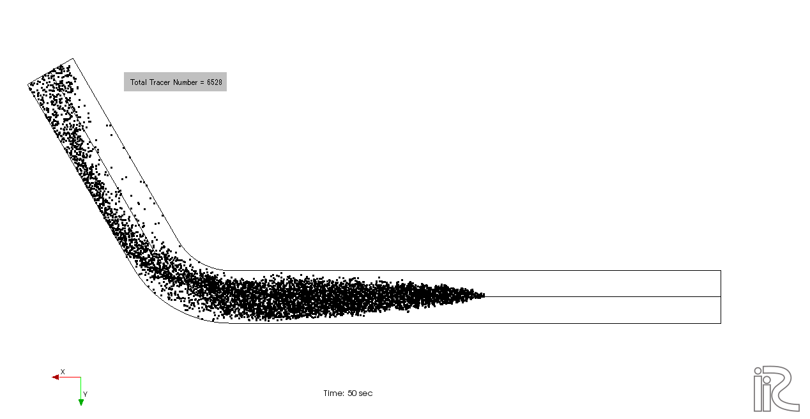

   : トレーサーの総数のラベル表示

魚の活動限界水深未満の場合の処理
^^^^^^^^^^^^^^^^^^^^^^^^^^^^^^^^^^^^^^^^^^^^^^^^^^^^^^^^^^^^^^^^^^^^^^^^^^^^^^^^^^^^^^^^^^^^^^^^^^^^^^^^^^^^^^^^^^^^^^^^
| 従来のGELATOでは、水位の変化や魚の移動により魚が活動限界水深未満の箇所に侵入した場合、その魚はその時点で消滅する仕様となっていた。
| ver2.xでは、魚が活動限界水深未満の箇所に侵入した場合、魚の位置を移動前の箇所に一度戻し、以下の選択肢の処理を実行するように変更されている。
| なお、再移動後に再度活動限界水深未満の箇所に侵入した場合は再移動は行われない。

- その場で停止する(移動前の位置で停止する)
- 反対方向に泳ぐ
- 流れに身をまかせる
- ランダムな方向に泳ぐ
- 除去される

魚のもつ情報の追加
^^^^^^^^^^^^^^^^^^^^^^^^^^^^^^^^^^^^^^^^^^^^^^^^^^^^^^^^^^^^^^^^^^^^^^^^^^^^^^^^^^^^^^^^^^^^^^^^^^^^^^^^^^^^^^^^^^^^^^^^
| 従来までは魚のポリゴンに出力されている情報はTypeのみで、同じ体長の魚のグループを識別するための情報しか持っておらず、さらにジャンプ機能を有効にするとtypeはジャンプ中か否かという情報に置き換わってしまっていた。
| そこでver2.xでは、魚のポリゴンに出力される情報に以下の情報が追加されている。

- 魚の所属するグループのインデックス
- 魚のインデックス
- 跳躍状況（タイムステップ間に跳躍していたか否か）
- 巡行状態（巡行状態か突進状態か）
- 限界水深未満モード（出力時に限界水深未満での処理が行われる期間内にいるかどうか）

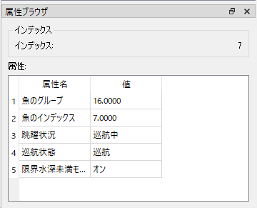

   : 魚に付加される情報

トレーサーの補足機能の追加
^^^^^^^^^^^^^^^^^^^^^^^^^^^^^^^^^^^^^^^^^^^^^^^^^^^^^^^^^^^^^^^^^^^^^^^^^^^^^^^^^^^^^^^^^^^^^^^^^^^^^^^^^^^^^^^^^^^^^^^^
| 計算格子のセル属性にセルの属性として「トレーサーの捕捉」という属性が追加されました。
| そのセルに 捕捉率を割り当てることによりそのセルに入ったトレーサーが設定された捕捉率で捕捉されて移動を停止する機能が追加されています。

樹木・礫ポリゴンの描画
^^^^^^^^^^^^^^^^^^^^^^^^^^^^^^^^^^^^^^^^^^^^^^^^^^^^^^^^^^^^^^^^^^^^^^^^^^^^^^^^^^^^^^^^^^^^^^^^^^^^^^^^^^^^^^^^^^^^^^^^
| 従来までは指定した各描画範囲内に1つの樹木・礫ポリゴンをランダムに配置する機能しかなかったが、GELATO ver2.xでは指定した範囲内に複数の樹木・礫ポリゴンを配置する機能が追加されている。
| また、樹木ポリゴンの描画はY軸方向を上にした描画しか出来ていなかったが、GELATO ver2.xでは描画する際のアングルをユーザーが指定できるようになっている。

異なる乱数パターンの発生
^^^^^^^^^^^^^^^^^^^^^^^^^^^^^^^^^^^^^^^^^^^^^^^^^^^^^^^^^^^^^^^^^^^^^^^^^^^^^^^^^^^^^^^^^^^^^^^^^^^^^^^^^^^^^^^^^^^^^^^^
| 従来までは乱数の発生パターンが固定だったため、同じ計算条件では何度計算しなおしてもランダムウォークによる移動などが同じパターンでしか出力されなかった。
| そこで、計算条件は同じままでも異なる乱数パターンで計算を行うため、乱数のシード値を変更する機能が追加されている。

詳細は :ref:`ランダムシード値` 

不具合修正
------------------------------------------------------------------------------------------------------------------------

トレーサーの投入範囲、期間の調整
^^^^^^^^^^^^^^^^^^^^^^^^^^^^^^^^^^^^^^^^^^^^^^^^^^^^^^^^^^^^^^^^^^^^^^^^^^^^^^^^^^^^^^^^^^^^^^^^^^^^^^^^^^^^^^^^^^^^^^^^
| 従来までは、トレーサー等を追加する範囲や期間について、小数点誤差によりズレが生じることが原因で境界となる位置や時間が対象に含まれないことがあった。
| GELATO ver2.xでは、小数点誤差によるズレを修正し、正確な個数が追加されるようになっている。

| 例として、:math:`10.0\leq t \leq20.0` の範囲に :math:`Δt=0.1` で追加する場合、従来までは :math:`t=10.0` や :math:`t=20.0` の境界でトレーサー追加されないことがあったが、GELATO ver2.xでは安定して境界の値も範囲に含まれるようになっている。
| なお、最小値と最大値に同じ値を設定した場合はその値のみが対象となる。( :math:`10.0\leq t \leq10.0` と設定した場合、間隔の値に因らず :math:`t=10.0` のタイミングで一度だけトレーサーが追加される。)

| これにより、通常トレーサーを任意の時間にのみ追加する場合などにおいて、パラメーターの設定が容易になっている。

「すべての空白セルにトレーサーを発生させる場合の割引係数」の不具合修正
^^^^^^^^^^^^^^^^^^^^^^^^^^^^^^^^^^^^^^^^^^^^^^^^^^^^^^^^^^^^^^^^^^^^^^^^^^^^^^^^^^^^^^^^^^^^^^^^^^^^^^^^^^^^^^^^^^^^^^^^
| 従来までは、割引係数を2以上に設定した場合に、セルの総数を割引係数で割ったあまりが、次のトレーサー発生の際に影響し、トレーサーが発生する位置が毎回ずれていくという不具合があった。
| GELATO ver2.xでは、セルの総数を割引係数で割ったあまりが次のトレーサー発生に影響しないように修正されている。

バックグラウンドの流れの条件
^^^^^^^^^^^^^^^^^^^^^^^^^^^^^^^^^^^^^^^^^^^^^^^^^^^^^^^^^^^^^^^^^^^^^^^^^^^^^^^^^^^^^^^^^^^^^^^^^^^^^^^^^^^^^^^^^^^^^^^^
| GELATOではトレーサーの追跡にGUIで入力した流速を用いる機能があるが、この機能を使用する際に渦動粘性係数の計算が行われていなかった不具合を修正した。

粒子結合機能
^^^^^^^^^^^^^^^^^^^^^^^^^^^^^^^^^^^^^^^^^^^^^^^^^^^^^^^^^^^^^^^^^^^^^^^^^^^^^^^^^^^^^^^^^^^^^^^^^^^^^^^^^^^^^^^^^^^^^^^^
| 従来のGELATOで正常に結合機能が動作していないことが確認されていたため、GELATO ver2.0では粒子結合機能を搭載していない。

Windmapの表示
^^^^^^^^^^^^^^^^^^^^^^^^^^^^^^^^^^^^^^^^^^^^^^^^^^^^^^^^^^^^^^^^^^^^^^^^^^^^^^^^^^^^^^^^^^^^^^^^^^^^^^^^^^^^^^^^^^^^^^^^
| Windmapの属性として出力されていた :guilabel:`Windmap lines` の値は本来0~1の範囲の一般化された流速の値であるが、正常な値が出力されていなかった不具合を修正した。
| GELATO ver2.xではwindmapのラインの長さである :guilabel:`Length` と、一般化された速度の :guilabel:`Normalized Velocity` の2つの属性が出力されるようになっている。

樹木・礫ポリゴンの描画
^^^^^^^^^^^^^^^^^^^^^^^^^^^^^^^^^^^^^^^^^^^^^^^^^^^^^^^^^^^^^^^^^^^^^^^^^^^^^^^^^^^^^^^^^^^^^^^^^^^^^^^^^^^^^^^^^^^^^^^^
- 樹木・礫のポリゴンの位置が指定された水深よりも深い場合でも描画されていた不具合が修正された。
- 樹木・礫のポリゴンが格子の範囲外に描画されていた不具合が修正された。
